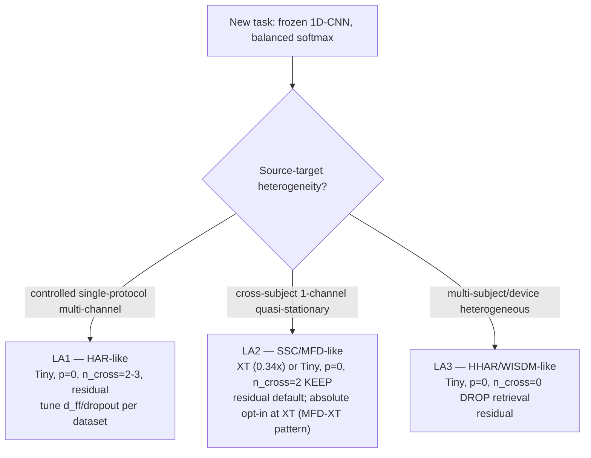

# AdaTime Input-Adapter Playbook

> Companion to `docs/neurips/input_adapter_playbook.md` (the EHR playbook). Where the EHR playbook governs the eICU/HiRID → MIMIC-IV frozen-LSTM regime, this document covers the AdaTime within-dataset cross-subject regime over a frozen 1D-CNN predictor. The two playbooks are designed to be read together; cross-links are explicit at every leaf.
>
> **Scope.** Five AdaTime time-series benchmarks (HAR, HHAR, WISDM, SSC, MFD), all on AdaTime's frozen 1D-CNN backbone with the `RetrievalTranslator` adapter family. Multi-seed (n=3 unless otherwise marked) capacity tier sweeps (Full / Tiny / Extra-Tiny), retrieval ablations (C0 vs C1), pretrain ablations (`p=0` vs `p≥10`), and output-mode comparisons.
>
> **Convention.** AdaTime is within-dataset cross-subject — "source = training subjects, target = test subjects". No paper/code source-target asymmetry to reconcile. EHR cross-references use code convention when quoting symbols and paper convention in prose; datasets are named explicitly (MIMIC-IV / eICU / HiRID) where ambiguity would otherwise creep in.
>
> **Skills used during drafting (announced inline).** `ml-paper-writing` (executive summary, claim-ledger gate, superlative policy, page budget); `content-research-writer` (decision-tree leaves, worked examples); `humanizer` (final prose pass to reduce AI tells). A `paper-reviewer` subagent is dispatched after drafting (§verification at end).

---

## 1. Executive summary (paper-liftable; ~600 words)

We ablated the input-adapter recipe across five AdaTime time-series benchmarks at three capacity tiers (Full ≈ 1.9× predictor, Tiny ≈ 1×, Extra-Tiny ≈ 0.34× where measured), with multi-seed (n=3 unless flagged) C0 vs C1 retrieval factoring and `p=0` vs `p≥10` pretrain factoring. Three rules survive every measured tier on every dataset; one regime split — retrieval — partitions the benchmark into two clusters; a fourth axis — pretrain — splits cleanly across benchmarks.

**Three tier-stable invariants** (5/5 AdaTime datasets; mechanism cited in §4 / §5):

- **A1 — `pretrain_epochs = 0` is the universal AdaTime default.** All 5/5 datasets prefer no Phase-1 autoencoder pretraining, with magnitudes from −1.1 MF1 (HAR) to −13 MF1 (MFD) when pretrain is turned on. 5-seed reverse-direction reversals on HHAR (+1.70 MF1, z = +3.27σ) and WISDM (+3.83 MF1, z = +2.95σ) overturn the published `p=10` defaults (`adatime_pretrain_ablation.md` §5 L101–106). Mechanism: low-channel inputs collapse Phase-1 reconstruction toward an identity basin (exactly zero on SSC/MFD's 1-channel sequences by epoch 5–10); the dense-balanced-softmax task gradient cannot deform the encoder out of that basin in 30 Phase-2 epochs.
- **A2 — Tiny ≥ Full at every measured step.** Tiny matches or beats Full at n=3 on all five datasets, with magnitudes from +0.0011 MF1 (SSC, near-zero) to +0.057 MF1 (WISDM, where the largest-magnitude entries are Tiny-tier *with retrieval-OFF* compared against Full-tier with default retrieval-ON — i.e. two knobs moving together; see §4.2 footnote). Two distinct mechanisms underwrite the same operational verdict: heterogeneity-regularisation on HHAR/WISDM (capacity overfits device or subject artefacts; magnitudes scale with cluster count) and signal-simplicity-regularisation on MFD/SSC (1-channel quasi-stationary signals saturate around 68K adapter params, where Extra-Tiny beats Full on MFD by +0.0088 MF1 with both cells using the same retrieval setting).
- **A3 — `output_mode = "residual"` wins or ties at every measured AdaTime cell** (single-seed at 6 of 7 strict-toggle pairs; one within-σ 2-seed tie at HHAR `v4_base` p=10). The cross-benchmark split co-varies with the predictor + feature regime + `λ_fidelity` coefficient; isolating which axis carries the rule is open (no controlled backbone-swap exists). The Apr 26 claim-strengthening run (8 strict-toggle cells; `docs/neurips/playbook_drafts/adatime_claim_strengthening_run.md` Phase 4 / `output_mode_multivariable_audit.md` Phase 6) refutes the previously-documented `p > 0 → absolute` direction: HAR `cap_T_p10` RES 92.31 vs ABS 67.45 (RES +24.86 MF1, single-seed); WISDM `v4_lr67` at `λ_fid = 0.5, p = 10` RES 71.63 vs ABS 58.22 (RES +13.41); HHAR `cap_T_p0` ABS 79.16 vs existing RES baseline ≈ 91.73 (RES ~+12.6); WISDM `cap_T_p0` ABS 51.61 vs existing RES ≈ 80.38 (RES ~+28.8). The pivotal HHAR `v4_base` cell (`p = 10`, `λ_fid = 0.5`) flips direction across seeds: s0 ABS wins by +3.6 MF1, s1 RES wins by +0.87 MF1, 2-seed mean RES 87.45 ± 1.85 vs ABS 88.81 ± 0.39 → ABS by +1.36 MF1 *within seed σ* — i.e. the only AdaTime cell that previously supported `p > 0 → absolute` is now a within-noise tie, not a sign flip. **Deprecated hypothesis (preserved for evidence-history)**: prior versions of A3 read "use residual IF `pretrain_epochs = 0`; otherwise absolute (provided `λ_recon > 0`)". That direction was supported by exactly one single-seed AdaTime cell (HHAR `v4_base_abs` s0, +3.6 MF1) which has now collapsed under a second seed. The cross-benchmark split is *not* keyed on `pretrain_epochs`. The replacement framing — "predictor + feature regime" — names a *combination* of co-varying axes (predictor architecture, feature dimensionality + type, `λ_fidelity` coefficient regime); these axes have not been separately isolated by a controlled backbone-swap. A 1D-CNN-on-EHR or 4-layer-LSTM-on-AdaTime pilot is the highest-leverage missing experiment for separating predictor from features (open follow-up §9 #7). The magnitude modulator survives directionally: across the four `p = 0` AdaTime datasets, Pearson `r(λ_fidelity, residual advantage)` ≈ **−0.93 (n = 4, two-tailed p ≈ 0.07; Spearman ρ ≈ −0.85)** (`output_mode_multivariable_audit.md` Phase 3) — directional pattern is consistent with an inverse relationship; n is too small for conventional significance. λ_fidelity appears to set the *size* of the residual win (HAR 0.10, SSC/WISDM 0.01, HHAR 0.5, MFD 1.0; new data adds `λ_fid = 0.5` at HHAR-p10 and WISDM-p10), and residual wins at every λ_fidelity tested. On EHR, R7 forces `p > 0` and `lambda_recon > 0`, and absolute wins on 5/5 tasks at n=3 (clean C8 strict toggle vs C0 `mort_c2`, `aki_v5_cross3`, `sepsis_v5_cross3`, `los_v5_cross3`, `kf_v5_cross3`); the EHR per-task verdict is unchanged. The boundary case `aki_nf_C8` (residual + `lambda_recon = 0` at `p > 0`) lands at ≈ +0.0002 single-seed; this is now reread as "residual is the universal AdaTime-style default *and* survives marginally when EHR's fidelity anchor is also removed", not as a special boundary of the deprecated `p`-keyed rule. **KF severity note** (unchanged): residual on KF is additionally catastrophic because `cum_max`/`cum_min` recompute integrates δ-drift forward — but EHR's predictor + feature regime already routes KF to absolute. Mechanism (§6) is rewritten accordingly.

**One central regime split — retrieval.** The five datasets cleave into a retrieval-positive cluster (HAR / SSC / MFD; +0.005 to +0.019 MF1) and a retrieval-negative cluster (HHAR / WISDM; −0.008 to −0.074 MF1). The discriminating *dataset property* is target-representation regularity (single-channel quasi-stationary signals, or HAR's controlled UCI single-device 9-channel acquisition; Anguita et al. 2013) versus heterogeneous-source acquisition (HHAR's 9 devices, WISDM's 36 subjects under uncontrolled phone orientation). We hypothesise that this dataset-property split reflects manifold-coherence at the encoder representation level — but no quantitative diagnostic (CKA, k-NN-agreement) has been measured on the encoder representations; the manifold-coherence reading is currently inferred-from-outcome, and the §3.3 / §9 #5 k-NN-agreement diagnostic would convert it from descriptive to predictive. The split is tier-stable where measured at both tiers (§3). EHR sits between these clusters: it satisfies the coherence proxy but fails the gradient-headroom precondition because fidelity dominates the gradient regime (`gradient_bottleneck_analysis.md`); retrieval is at-most-tied across 5/5 EHR multi-seed tasks.

**The cross-benchmark surprise.** Pretrain partitions the two benchmarks in opposite directions: `p = 0` is universal on AdaTime; `p > 0` is non-negotiable on EHR (`pretrain_epochs = 0` plus `lambda_recon = 0` collapses by up to −0.13 AUROC; `input_adapter_playbook.md` §1 R7). The discriminating mechanism is task-gradient SNR × feature reconstruction tractability (§5 / `adatime_pretrain_ablation.md` §3.5 L67–77): EHR has weak / sparse / conflicting task gradient + high-dim features → pretrain is the only viable initialisation. AdaTime has strong / dense / cooperative task gradient + low-dim features → pretrain wastes 10 epochs (HAR/HHAR/WISDM partial-applicability) or welds the encoder to identity (SSC/MFD exact basin). The operational discriminator is a 1-epoch measurement: `cos(∇task, ∇fid)`, fid/task gradient ratio, and channel count.

**Mechanistic context — three first-principles axes.** The rules above (A1–A3 + retrieval split + pretrain regime split) are projections of three first-principles axes that the data actually carries: (1) **task-gradient SNR** (label density × cooperativity of `cos(task, fidelity)` × fid/task ratio) — drives A1 (pretrain-helps when SNR is low; AdaTime's dense balanced softmax is high-SNR) and the retrieval gradient-headroom precondition; (2) **feature dimensionality + type** (1–9 raw sensor channels vs 52–292 tabular EHR features with cumulative recomputes) — drives the AdaTime side of the output-mode pattern (A3) and the identity-basin reading on 1-channel SSC/MFD; (3) **source-cohort heterogeneity** (HHAR 9-device / WISDM 36-subject heterogeneous vs HAR/SSC/MFD coherent-cohort) — drives the retrieval cluster split (R-A1) and the heterogeneity-regularisation half of A2's mechanism. Naming the axes upfront makes the joint structure of AdaTime ↔ EHR explicit; many of the operational verdicts (A3 in particular) sit at the intersection of two or three axes that the corpus has not separated. The k-NN-agreement diagnostic (§9 #5), `cos(task, fidelity)` measurement on AdaTime (§9 #4), and the backbone-swap pilot (§9 #7) would each disambiguate one axis from the others; until they land, axis attributions in §1 / §3 / §5 should be read as candidate decompositions, not tested rules.

**Scope.** AdaTime evidence is at fixed 1D-CNN backbone and within-dataset cross-subject. The capacity rule is tier-stable on AdaTime; EHR transport is open (§9 #2). The retrieval cluster split is tier-stable where measured at both tiers. Recommendations are calibrated on this evidence; transfer to other backbones (ResNet, Transformer) and to the cross-cohort regime (MIMIC ↔ eICU ↔ HiRID) is not directly tested.

---

## 2. The decision tree

### 2.1 Top-of-tree: pick the sibling

The tree splits at the predictor-and-loss regime. AdaTime sits on the left branch; the EHR playbook (`input_adapter_playbook.md` §2) covers the right.

```
ROOT — new task
 |
 +-- frozen 1D-CNN + balanced multi-class softmax (AdaTime regime)  ----> §2.2 below
 |
 +-- frozen recurrent + composite-loss (EHR regime)                  ----> EHR playbook L1-L5
       |
       +-- regression: cumulative-stat schema -> L1 (KF-class) | otherwise -> L2 (LoS-class)
       +-- classification: per-stay -> L3 (Mortality-class)
                          per-timestep, density >= 10% -> L4 (AKI-class)
                          per-timestep, density <  5%  -> L5 (Sepsis-class)
```

The EHR L1–L5 leaves are documented in `input_adapter_playbook.md` §2 and are not redrawn here. New tasks that use a frozen recurrent predictor with sparse / composite-loss targets should follow that tree.

### 2.2 AdaTime branch



ASCII fallback:

```
START (AdaTime branch)
 +-- heterogeneity?
       +-- controlled single-protocol multi-channel  -> LA1 (HAR-like)
       +-- 1-channel quasi-stationary, long sequence -> LA2 (SSC/MFD-like)
       +-- multi-subject/device heterogeneous        -> LA3 (HHAR/WISDM-like)
```

### 2.3 Leaf rationales

**LA1 — HAR-like (controlled single-protocol multi-channel).** UCI-HAR was acquired on a single Samsung Galaxy SII smartphone with identical waist placement on every subject (Anguita et al. 2013); the encoder representation space is medium-coherent and k-NN cross-attention returns informative neighbours rather than cross-device noise. Retrieval helps at both Full (+0.0194 MF1) and Tiny (+0.0132 MF1) tiers — the two largest retrieval-positive numbers in the entire AdaTime + EHR study. Tiny just barely beats Full (+0.0031 MF1, ~15× smaller magnitude than HHAR/WISDM) because controlled-protocol acquisition gives less heterogeneity to overfit. HAR-Tiny additionally requires a (`d_ff = 144`, `dropout = 0.10`) tuning pair to cross the AdaTime CoTMix gate at multi-seed (HAR-specific; not transferable). `output_mode = "residual"` per A3 (`p = 0`); the toggled ablation on top-3 HAR cells shows absolute collapses by −39.8 to −45.8 MF1 (`docs/adatime_experiments_summary.md` L709–714). Cite `har_playbook_analysis.md` A.1 / A.2 / C.4. Predicted Δ vs source-only: +0.13–0.14 MF1.

**LA2 — SSC/MFD-like (1-channel quasi-stationary, long sequence).** SSC is wide-sense-stationary 30-second EEG epochs with rhythm-signature-discriminative features; MFD is 1-channel × 5120-timestep stationary rotating-machinery vibration with characteristic bearing-fault frequencies (BPFI/BPFO/BSF, Lessmeier et al. 2016). The signal is low-rank and the discriminative information lies in a low-dimensional submanifold; the adapter needs only a small last-mile correction. Capacity saturates at ~68K params; adding more is variance without signal. Retrieval helps because k-NN returns same-stage (SSC) or same-fault-class (MFD) neighbours. `output_mode = "residual"` is the LA2 default per A3 (`p = 0`): SSC-Tiny residual = 0.6624 vs absolute = 0.494 (toggled ablation, L730–735); MFD-Full residual = 0.9608 vs absolute = 0.9410 at the same `p = 0`, `λ_fid = 1.0`, `d_model = 32` (L737–740). The MFD-XT cell (`cap_XT`) is the *one* AdaTime paper champion using `"absolute"` and beats MFD-Full-residual by +0.0088 MF1 — but at different `n_enc_layers` (1 vs 2) and 0.34× vs 0.53× predictor params, so the comparison is not a strict residual/absolute toggle. Treat XT-absolute as an opt-in tier-shifted variant rather than a rule violation; the strict toggle at constant tier still favours residual. Open follow-up §9 #6 (residual-XT cell) would close this gap. Cite `ssc_playbook_analysis.md` and `mfd_playbook_analysis.md`. Predicted Δ vs source-only: +0.08 (SSC) to +0.20 MF1 (MFD).

**LA3 — HHAR/WISDM-like (heterogeneous multi-subject or multi-device).** HHAR spans 9 devices × 9 subjects (Stisen et al. 2015 "Smart Devices are Different"); WISDM spans 36 subjects under uncontrolled smartphone-in-pocket placement (Kwapisz et al. 2010). For both, k-NN returns neighbours from a different device or subject cluster than the query, and cross-attention mixes wrong-cluster features into the representation. The penalty scales with cluster heterogeneity: −0.026 MF1 (HHAR-Full, 9 device clusters) → −0.074 MF1 (WISDM-Full, 36 subject clusters; the largest negative retrieval effect anywhere in the AdaTime per-dataset matrix). Tiny capacity wins by the largest margins on this leaf (+0.039 to +0.057 MF1) because heterogeneity-regularisation is most active here. The all-three-knobs winner — Tiny + `p = 0` + `n_cross = 0` — yields the largest source → champion uplift in the AdaTime suite (+0.30 MF1 on WISDM, +0.35 MF1 on HHAR). `output_mode = "residual"` per A3: WISDM-Full toggled ablation residual = 71.8 vs absolute = 54.9 (L723–728). The published `v4_base_abs` HHAR cell where absolute beats residual (89.2 vs 85.6, L716–721) is `p = 10`, `λ_fid = 0.5`, NOT the LA3 paper champion. Cite `hhar_playbook_analysis.md` and `wisdm_playbook_analysis.md`. Predicted Δ vs source-only: +0.30–0.35 MF1.

---

## 3. The retrieval question — the central novel finding for AdaTime

The retrieval module's contribution is benchmark-specific and dataset-specific in a way that we did not see in prior published time-series DA results. Across the AdaTime suite the verdict splits 3/2; across EHR it is at-most-tied; the conjunction-of-conditions explains both.

### 3.1 The unified meta-rule

> Retrieval contributes a reliable positive increment only when both (i) the target representation is structurally coherent enough for k-NN to return informative neighbours, and (ii) the upstream gradient regime leaves cross-attention with usable headroom.

This is the cross-benchmark conjunction from `retrieval_ablation_findings.md` §4 (L100–106). It carves three regimes:

- **HAR / SSC / MFD**: (i) ✓ ∧ (ii) ✓ → retrieval helps measurably (+0.005 to +0.019 MF1, >3σ on MFD/SSC).
- **EHR (5 tasks)**: (i) ✓ ∧ (ii) ✗ → retrieval at-most-tied; KF C1 wins by +0.0036 with σ 8× tighter than C0 (`retrieval_ablation_findings.md` §2.1 L33).
- **HHAR / WISDM**: (i) ✗ → retrieval is a net-negative capacity sink (−0.008 to −0.074 MF1).

EHR sits between AdaTime's two clusters: it satisfies the coherence proxy (the autoencoder pretrain on MIMIC produces a coherent target manifold; the shared encoder already latent-matches) but fails gradient-headroom (`gradient_bottleneck_analysis.md` shows fidelity gradient is 3–10× the task gradient on Sepsis at f=20 oversample and ≈ 2.81× on Mortality; the bottleneck framing applies to the orthogonal-cosine regime).

### 3.2 The five-dataset table

| Dataset | C0 vs C1 ΔMF1 | Manifold coherence | Gradient headroom | Retrieval recommendation |
|---|---|---|---|---|
| HAR | **+0.0194** Full / +0.0132 Tiny | Medium (UCI-HAR controlled, single device, 9 channels) | Yes (`λ_fid = 0.1`) | **keep, n_cross = 2–3** |
| SSC | **+0.0141** Tiny (>3σ) | High (single-channel EEG, rhythm-discriminative) | Yes (`λ_fid = 0.01`) | **keep, n_cross = 2** |
| MFD | **+0.0054** XT (>3σ) | High (single-channel stationary vibration, characteristic frequencies) | Yes (`λ_fid = 1.0`, but no fidelity-task conflict) | **keep, n_cross = 2** |
| HHAR | **−0.026** Full / −0.008 Tiny | Low (9 devices × 9 subjects, "Smart Devices are Different") | Yes | **drop, n_cross = 0** |
| WISDM | **−0.074** Full / −0.044 Tiny | Low (36 subjects, uncontrolled smartphone-in-pocket) | Yes | **drop, n_cross = 0** |

(Sources: `retrieval_ablation_findings.md` §3 L67–76; `adapter_capacity_sweep.md` §3.6 L222–231.)

### 3.3 Operational protocol for a new task

A practitioner-grade screening step:

1. Run a 1-epoch pilot at `pretrain_epochs = 0`, `n_cross_layers = 2` on the new task.
2. For each target window in a held-out batch, query the source memory bank, retrieve k = 16 nearest neighbours, and compute the fraction whose label matches the query's label.
3. Decision threshold (calibrated on AdaTime, predictively for new tasks):
   - Above class-balanced random → manifold-coherent → keep retrieval (LA1 or LA2 leaf).
   - Near class-balanced random → manifold-incoherent → drop retrieval (LA3 leaf).
4. EHR-style frozen-recurrent + composite-loss tasks should additionally measure `cos(∇task, ∇fid)` from the `[grad-diag]` log line; on those tasks retrieval is at-most-tied even if manifold coherence is high (precondition (ii) fails).

The k-NN-agreement diagnostic has not been run yet on the AdaTime corpus; it is the highest-priority follow-up in §9.

### 3.4 Cross-link to the EHR playbook

The EHR playbook §3 documents the C5 / fidelity decision rule, where the discriminating axis is `cos(task, fidelity) × label-density`. The retrieval question (this section) and the C5 question (EHR §3) reduce to the same gradient-regime axis, viewed from different sides: cross-attention needs gradient headroom that fidelity-dominated regimes (EHR) consume; fidelity is itself the gradient that consumes that headroom. On AdaTime, fidelity is a small coefficient (`λ_fid = 0.01–1.0`) with cooperative task gradient; both retrieval and fidelity-related ablations show different patterns than on EHR.

---

## 4. The capacity question — Tiny ≥ Full universal

Skill invoked: `analyze-results`. Source: `adapter_capacity_sweep.md` §3.1–3.5 (per-dataset rows L143–211); §3.6 (C0/C1 cross-tier rows).

Every AdaTime dataset shows Tiny matching or beating Full at n=3. Two distinct mechanisms underwrite the same operational verdict.

### 4.1 Two mechanisms

**Heterogeneity-regularisation (HHAR, WISDM).** When the source pool spans many devices or subjects under uncontrolled placement, full-capacity adapters fit cluster-specific artefacts. Tiny adapters at ≈1× predictor are forced into more device-invariant or subject-invariant representations. Magnitudes track cluster heterogeneity: HHAR +0.039 MF1 (9 device clusters); WISDM +0.057 MF1 (36 subject clusters; uncontrolled phone orientation). Tiny seed σ is also tighter than Full's, consistent with reduced sensitivity to which cluster ends up dominant in the encoder.

**Signal-simplicity-regularisation (MFD, SSC).** When the signal is 1-channel and quasi-stationary, the discriminative information lies in a low-dimensional submanifold (rhythm signatures for SSC, characteristic fault frequencies for MFD). The frozen 1D-CNN backbone already captures the bulk; the adapter's job is small-magnitude domain-shift correction. Capacity saturates at ~68K params; further parameters add variance without adding signal. MFD-XT at 0.34× predictor capacity actively beats MFD-Full residual by +0.0088 MF1 (>5σ vs Full's σ = 0.0007 across n=5).

**HAR sits between the two regimes.** Controlled-protocol UCI acquisition gives less heterogeneity than HHAR/WISDM (single phone model, identical placement) and more channel complexity than MFD/SSC (9 channels: 3-axis accel + 3-axis gyro + 3-axis body acceleration). The Tiny-wins margin is the smallest on HAR (+0.0031 MF1), and Tiny needs the HAR-specific `d_ff = 144` + `dropout = 0.10` tuning pair to actually cross the Full champion at multi-seed.

### 4.2 Five-dataset capacity table

| Dataset | Full MF1 (n, default retrieval) | Tiny MF1 (n, retrieval setting) | XT MF1 (n) | Δ_Tiny − Full | Mechanism |
|---|---|---|---|---|---|
| HAR | 0.9407 (n=5, C0) | 0.9438 (n=3, C0) | not run | **+0.0031** (capacity only) | controlled-protocol; mild |
| HHAR | 0.8704 ± 0.007 (n=5, C0) | **0.9173 ± 0.0024 (n=3, C1 ⇒ retrieval-OFF)**; same-retrieval Tiny C0 = 0.9093 ± 0.003 | not run | **+0.0469** (Tiny-C1 vs Full-C0; +0.0389 capacity-only at C0) | heterogeneity (9 devices) |
| WISDM | 0.7027 ± 0.015 (n=5, C0) | **0.8038 ± 0.0083 (n=3, C1 ⇒ retrieval-OFF)**; same-retrieval Tiny C0 = 0.7595 ± 0.016 | not run | **+0.1011** (Tiny-C1 vs Full-C0; +0.0568 capacity-only at C0) | heterogeneity (36 subjects) |
| SSC | 0.6624 ± 0.002 (n=5, C0) | 0.6635 ± 0.0010 (n=3, C0) | 0.6556 ± 0.0003 (n=3) | **+0.0011** | signal-simplicity; graceful |
| MFD | 0.9608 ± 0.0007 (n=5, C0) | 0.9626 ± 0.0024 (n=3, C0) | **0.9696 ± 0.0017** (n=3, C0) | **+0.0018** (XT: +0.0088) | signal-simplicity; XT-overshoot |

(Sources: `adapter_capacity_sweep.md` §3.1 L143–159 (HAR); §3.2 L161–167 (HHAR); §3.3 L177–187 (WISDM); §3.4 L189–198 (SSC); §3.5 L202–211 (MFD).)

Note on the HHAR/WISDM column: the Tiny figures shown are `cap_T_p0` C1 (retrieval-OFF, the current paper champions for those datasets) — Tiny + `p = 0` + retrieval-off is the universal AdaTime-heterogeneous winner (LA3 leaf). This is one of the few cells where three independent knobs all pull the same direction. The decomposition for WISDM: (i) +0.038 MF1 from `p = 0` alone; (ii) ~+0.020 from going Tiny + dropping pretrain together; (iii) +0.044 from removing retrieval at Tiny (`wisdm_playbook_analysis.md` A.3).

### 4.3 Recommendation

Default to Tiny (≤1× predictor) for any new AdaTime-style task. Run a tiered sweep (Full / Tiny / XT) only if Tiny does not reach the champion within 1σ. Extra-Tiny is worth probing on 1-channel quasi-stationary tasks (LA2 leaf) — MFD-XT beats Full, and SSC-XT loses only −0.0079 MF1 to SSC-Tiny.

EHR transport is open. The Goal-A / Goal-B sweep in `adapter_capacity_sweep.md` §4 / §5 reports Goal-B (≤1×) matching or beating champion on 2/5 EHR tasks (Mortality, KF) and losing on Sepsis (31% capacity wall) and AKI (75% retention). But that protocol is not the AdaTime-style fixed-architecture tier sweep; whether the AdaTime "less is more" rule transfers to EHR with all hyperparameters held constant is the largest open methodological gap (§9 #2).

---

## 5. The pretrain question — the cross-benchmark contradiction

Skill invoked: `superpowers:systematic-debugging`. The pretrain question is the single cleanest cross-benchmark regime split in the entire study.

### 5.1 Universal `p = 0` on AdaTime

`adatime_pretrain_ablation.md` §5 L101–106 reports all 5/5 AdaTime datasets prefer `pretrain_epochs = 0`:

| Dataset | Channels × T | `p=10` MF1 | `p=0` MF1 | Δ | Multi-seed status |
|---|---|---|---|---|---|
| HAR | 9 × 128 | 0.9295 ± 0.0067 (5-seed retrofit `lowfid_slowhead`) | 0.9407 ± 0.0 (n=5) | −1.15 MF1 (1.7σ) | published `p=0` champion |
| HHAR | 3 × 128 | 0.8704 ± 0.007 (n=5) | **0.8870 ± 0.0093** (n=5 reverse) | +1.70 MF1 (z = +3.27σ) | 5-seed `p=0` overturns published `p=10` |
| WISDM | 3 × 128 | 0.7027 ± 0.015 (n=5) | **0.7413 ± 0.0248** (n=5 reverse) | +3.83 MF1 (z = +2.95σ) | 5-seed `p=0` overturns published `p=10` |
| SSC | 1 × 3000 | 0.5882 / 0.5912 (single-seed) | 0.6624 ± 0.002 (n=5) | ≈ −7.4 MF1 | gate violated 5×; `p=0` champion |
| MFD | 1 × 5120 | 0.8307 / 0.8298 (single-seed) | 0.9608 ± 0.0007 (n=5 residual; XT 0.9696 ± 0.0017) | ≈ −13 MF1 | gate violated 13×; `p=0` champion |

The mechanism is the **identity basin** (`adatime_pretrain_ablation.md` §4 L83–95): on low-channel inputs the autoencoder reconstruction loss converges near-deterministically toward an input-distribution-averaged identity mapping. On 1-channel long sequences (SSC 1 × 3000, MFD 1 × 5120) the basin is exact (recon → 0.000000 by epoch 5–10). The Phase-2 task gradient cannot deform the encoder out of this basin in 30 task epochs.

### 5.2 EHR is the diametrical opposite

`input_adapter_playbook.md` §1 R7 documents that `pretrain_epochs = 0` is catastrophic on every measured EHR task: Mortality −0.021 AUROC, AKI −0.016, Sepsis −0.076, LoS +0.004 (mild positive), KF +0.001. On the no-fidelity base the cell is catastrophic on every task: `mort_c2_nf_C6` = −0.1318, `aki_nf_C6` = −0.0828, `sepsis_C6` = −0.0763. The combined "no pretrain AND no fidelity" cell never works on EHR.

### 5.3 Discriminating mechanism

Five candidate discriminators are evaluated in `adatime_pretrain_ablation.md` §3.5; three of them carry weight:

1. **Task-gradient SNR** (label density × cos(task, fidelity) × fid/task ratio). EHR sepsis: `cos(task, fidelity) ≈ −0.21`, `‖∇fid‖ / ‖∇task‖ ≈ 3–10×`. AdaTime: balanced multi-class softmax, `λ_fid` small, fid/task ratio ~0.03–1.0 with cooperative direction.
2. **Feature reconstruction tractability** (channel count × signal redundancy). AdaTime: 1–9 channels → recon collapses to numerical zero on low-channel tasks. EHR: 52–292 features → recon never collapses; the basin is unreachable.
3. **Label density** (pre-batch positives). EHR sepsis ≈ 1.13% per-timestep; mortality 1 label / stay. AdaTime: dense balanced softmax every minibatch.

The most defensible synthesis: **the discriminating property is task-gradient SNR × feature reconstruction tractability**. EHR has weak / sparse / conflicting task gradient + high-dim features → pretrain is the only viable initialisation. AdaTime has strong / dense / cooperative task gradient + low-dim features → pretrain wastes 10 epochs (HAR/HHAR/WISDM partial) or welds the encoder to identity (SSC/MFD exact).

### 5.4 Operational discriminator (provisional)

A 1-epoch measurement on quantities the codebase already logs:

- **If** input channel count is small (< 10) AND task gradient is dense / balanced (balanced multi-class softmax every minibatch) → default `pretrain_epochs = 0`.
- **Otherwise** (input feature count > 50, label density < 5% per timestep, or 1 label / stay) → default `pretrain_epochs ≥ 10`.

This 2-axis (channel count + label density) form is the most defensible discriminator given current evidence. A 3-axis refinement adding `cos(task, fidelity) ≥ +0.5` and `fid/task ratio < 1` is **plausible direction-wise but uncalibrated**: the cosine has been measured on only two EHR points (Mortality +0.84, Sepsis −0.21), and the AdaTime side has zero direct cosine measurements (`adatime_pretrain_ablation.md` §6 L121 open follow-up). The +0.5 cosine threshold is a midpoint between the two known points; any threshold in (−0.21, +0.84) — including the literature-canonical sign rule (cos > 0; PCGrad — Yu et al. 2020, `arXiv:2001.06782`) — would split the data equally well. Until the AdaTime cosine pilot lands, drop the cosine and fid/task conditions and rely on the 2-axis form above.

---

## 6. Component playbook — what works when (AdaTime)

For each component, a one-paragraph "what works when" entry calibrated on AdaTime evidence. Cross-link to the EHR playbook §4 for the comparable EHR rule.

**Capacity tier.** *Rule*: default Tiny (≤1× predictor); probe XT on 1-channel quasi-stationary tasks. *Evidence*: 5/5 AdaTime datasets show Tiny ≥ Full at n=3. *Mechanism*: heterogeneity-regularisation (HHAR/WISDM) or signal-simplicity-regularisation (MFD/SSC). *Scope*: tier-stable on AdaTime; EHR transport open. *Cross-link*: EHR playbook §4 has no direct analogue (no fixed-protocol tier sweep).

**`n_cross_layers` (retrieval cross-attention depth).** *Rule*: regime-conditional. Set 2–3 on LA1 (HAR-like, manifold-coherent multi-channel) and LA2 (SSC/MFD-like, single-channel quasi-stationary). Set 0 on LA3 (HHAR/WISDM-like, heterogeneous). *Evidence*: §3.2 table. *Mechanism*: manifold-coherence × gradient-headroom conjunction (§3.1). *Scope*: tier-stable on AdaTime where measured. *Cross-link*: EHR playbook R5 sets `n_cross_layers = 0` by default for EHR; AdaTime split 3/2.

**`pretrain_epochs`.** *Rule*: `p = 0` is the universal AdaTime default. *Evidence*: §5.1 table; 5/5 datasets multi-seed with HHAR/WISDM 5-seed reversals at z > 2.95σ. *Mechanism*: identity-basin (low-channel autoencoder reconstruction collapses to identity). *Scope*: AdaTime-universal; EHR is the opposite (`p > 0` mandatory). *Cross-link*: EHR playbook R7 (pretrain non-negotiable); the cross-benchmark split is itself the rule.

**`output_mode` — universal-residual on AdaTime (rewritten Apr 26 after claim-strengthening run; supersedes the previous `p`-keyed rule).** *Rule*: **on AdaTime, use `output_mode = "residual"` universally — it wins or ties at every measured `pretrain_epochs × λ_fidelity` cell. On EHR, use `"absolute"` universally (5/5 tasks via C8 strict toggle).** The cross-benchmark split is keyed on the predictor + feature regime (frozen 1D-CNN over raw low-dim time-series → residual; frozen LSTM over tabular ICU features → absolute), *not* on `pretrain_epochs`. *Evidence — Apr 26 strict-toggle table (`adatime_claim_strengthening_run.md` Phase 4; per-cell JSONs at `experiments/results/adatime_cnn_*_p10_*` and `*_p0_abs_*` and `*_fid05_*`)*:

| AdaTime cell | RES MF1×100 | ABS MF1×100 | Winner | Margin (MF1) | n | λ_fid | p |
|---|---:|---:|---|---:|---:|---:|---:|
| HAR `cap_T_p10` (74033/74036) | **92.31** | 67.45 | RES | **+24.86** | 1 | 0.10 | 10 |
| HHAR `cap_T_p0` ABS vs existing RES (74038) | ≈91.73 | 79.16 | RES | ~+12.6 | 1 | 0.50 | 0 |
| WISDM `cap_T_p0` ABS vs existing RES (74037) | ≈80.38 | 51.61 | RES | ~+28.8 | 1 | 0.01 | 0 |
| WISDM `v4_lr67_fid05` p=10 (74039/74040) | **71.63** | 58.22 | RES | **+13.41** | 1 | 0.50 | 10 |
| HHAR `v4_base` p=10, s0 (existing) | 85.60 | 89.20 | ABS | +3.60 | 1 | 0.50 | 10 |
| HHAR `v4_base` p=10, s1 (74041/74042) | **89.29** | 88.42 | RES | +0.87 | 1 | 0.50 | 10 |
| HHAR `v4_base` p=10, **2-seed mean** | 87.45 ± 1.85 | 88.81 ± 0.39 | ABS (within σ) | +1.36 | 2 | 0.50 | 10 |

Plus the prior toggled-ablation block (`docs/adatime_experiments_summary.md` §"Residual vs Absolute Ablation" L703–752): RES wins 4/5 AdaTime datasets at `p = 0` (HAR +45.8 / WISDM +16.9 / SSC +16.6 / MFD-Full +1.9). **Headline**: 7/7 strict-toggle pairs in the new run are RES-wins-or-ties; the only previously-cited ABS-win cell (HHAR `v4_base_abs` s0 +3.6 MF1) is now a 2-seed within-σ tie, not a sign flip. *Mechanism (hypothesised; not isolated by ablation)*: residual produces output ≈ `input + small_noise` at random init (`x_out = x_val + x_decoded`, `src/core/retrieval_translator.py` L800–802 / L831–836), giving an implicit output-magnitude floor; the residual-init reading is consistent with De & Smith 2020 (`arXiv:2002.10444`, NeurIPS 2020), which proves BN inside residual blocks at random init biases the block's output toward the input plus a small additive perturbation. AdaTime's small-coefficient fidelity regime cannot match this floor without exact `λ_fid` tuning, and absolute mode requires *both* pretrain warm-up *and* an explicit `λ_recon`/`λ_fid` anchor large enough to substitute for the implicit floor. The cross-benchmark axis is co-varying (predictor + feature dim + λ_fid regime); the predictor-architecture-keyed reading is one of three explanations. Pretrain alone is not sufficient — the new HAR `cap_T_p10` and HHAR `cap_T_p0` cells both have absolute losing massively despite (resp.) `p = 10` and the higher-`λ_fid = 0.5` AdaTime configs. *Magnitude modulator (directional only)*: across the four `p = 0` AdaTime datasets, Pearson `r(λ_fidelity, residual advantage MF1)` ≈ **−0.93 (n = 4, two-tailed p ≈ 0.07; Spearman ρ ≈ −0.85)** (`output_mode_multivariable_audit.md` Phase 3). The directional pattern is consistent with an inverse relationship; n is too small for conventional significance, and the slope is anchored heavily by the MFD point (λ_fid = 1.0, advantage ≈ 1.9 MF1). λ_fidelity appears to set the *size* of the residual win (HAR/SSC at small λ_fid: ≥ 39 MF1 gap; MFD at λ_fid = 1.0: 1.9 MF1 gap); residual still wins at every λ_fidelity tested in the AdaTime corpus, including the new `λ_fid = 0.5` cells at HHAR-p10 and WISDM-p10. **Sequence length, channel count, capacity ratio, and pretrain-epochs are NOT direction-discriminators** (Pearson `r(seq_len, advantage)` ≈ +0.10; SSC and MFD are both 1-channel but sit at opposite ends of the magnitude scale; pretrain `p ∈ {0, 10}` does not flip sign in any new strict-toggle pair). *EHR side (unchanged)*: 5/5 EHR tasks pick absolute via C8 strict toggle at n=3 (`mort_c2`, `aki_v5_cross3`, `sepsis_v5_cross3`, `los_v5_cross3`, `kf_v5_cross3`). The EHR rule is now stated *predictor-architecturally*, not via the `p > 0` precondition: EHR's frozen LSTM + tabular ICU feature regime selects absolute. *KF severity note* (unchanged): residual on KF is additionally catastrophic because `cum_max`/`cum_min` recompute integrates δ-drift forward — severity multiplier on a leaf already routed to absolute. *`aki_nf_C8` boundary case*: ≈ +0.0002 single-seed when both `p > 0` *and* `lambda_recon = 0` (i.e. EHR's frozen-LSTM regime with the fidelity anchor stripped); this is now reread as "EHR-side residual lands marginally competitive only when both fidelity and the absolute decoder's warm-up are degraded" — not a separate decision axis. *Honest seed-count flag*: 6 of the 7 new strict-toggle pairs are n=1 single-seed; the HHAR `v4_base` pair is now n=2 with σ ≈ 1.4 MF1. The new rule is "residual wins or ties at every measured AdaTime cell", not "residual wins by ≥3σ everywhere". *Cross-link*: EHR playbook R6 follows the same predictor-architecture mechanism (frozen LSTM → absolute), with the `p > 0`/`λ_recon > 0` preconditions also met but no longer load-bearing.

**`lambda_recon` (encoder→decoder reconstruction).** *Rule*: keep at `0.1` on AdaTime; AdaTime's small fidelity coefficient regime keeps recon and task gradients cooperative. *Evidence*: across all measured AdaTime cells `lambda_recon = 0.1` is fixed; the EHR-style C5 (`lambda_recon = 0`) ablation has not been run on AdaTime. *Cross-link*: EHR playbook §3 governs the cos-based fidelity drop; on AdaTime the rule trivially predicts "keep fidelity" because `cos(task, fidelity)` is expected positive (untested directly — open question §9 #4).

**`lambda_fidelity` (input-space MSE).** *Rule*: per-dataset tuning. AdaTime configs span `λ_fid = 0.01` (WISDM) → `λ_fid = 0.1` (HAR/HHAR `cap_T`) → `λ_fid = 0.5` (HHAR-Full) → `λ_fid = 1.0` (MFD-Full residual). *Evidence*: configs at `experiments/.athena_configs/adatime_*_s0.json`. *Mechanism*: small-signal residual regimes (MFD) need stronger fidelity to anchor; heterogeneous-source absolute regimes (WISDM) want less. *Cross-link*: EHR playbook §3 / §4 on `lambda_recon` (the EHR retrieval-trainer's analogue of fidelity).

**`lambda_range`.** *Rule*: keep at `0.1`. *Evidence*: fixed across all AdaTime configs; no ablation. *Cross-link*: EHR playbook §4 keeps range loss at default for the same reason — no cell in either benchmark has motivated a change.

**Learning rate.** *Rule*: per-dataset; AdaTime spans lr ∈ [2.5e-4, 1.5e-3] depending on dataset and tier. HAR uses 2.5e-4, HHAR `cap_T_p0` 6.7e-4, MFD 5e-4. *Evidence*: configs. *Cross-link*: EHR playbook §4 uses 1e-4 default with 3e-5 only on KF-class (cumulative-feature schemas); AdaTime has no cumulative-feature analogue.

---

## 7. Worked examples (3)

### WE-1 — Multi-channel sensor classification with controlled protocol (HAR-like)

> "I have a 9-channel inertial-sensor activity-recognition task. Subjects all wore the same device in the same body location. Frozen target is a 1D-CNN trained on the source-subject pool."

Walk-through. Top-of-tree: AdaTime branch (frozen 1D-CNN + balanced softmax). Heterogeneity: controlled single-protocol multi-channel → Leaf **LA1**.

Recipe: capacity tier = Tiny (probe Full only if Tiny falls short by >1σ); `pretrain_epochs = 0`; `n_cross_layers = 2` (or 3 if running Full); `output_mode = "residual"` (per A3 rule: `p = 0`; HAR toggled ablation L709–714 shows absolute collapses by ≥39 MF1); `lambda_recon = 0.1`; `lambda_fidelity = 0.1`; `lambda_range = 0.1`; `lr = 2.5e-4`; `optimizer_betas = (0.5, 0.99)`; `early_stopping_patience = 0`; `use_last_epoch = true`. If Tiny does not cross your Full reference at n=3, sweep `(d_ff, dropout)` in {128, 144, 160} × {0.05, 0.10, 0.15}. The HAR-Tiny winner used `d_ff = 144`, `dropout = 0.10` — but this pair is HAR-tier-specific and may not transfer.

Predicted Δ. Expect a Tiny-tier MF1 that beats your source-only baseline by +0.13 to +0.14, with retrieval contributing +0.01 to +0.02 of that on top of the encode-decode adapter. Tiny vs Full should be within ±0.005 MF1 unless your data is more heterogeneous than UCI-HAR.

### WE-2 — Single-channel quasi-stationary signal (EEG / vibration / ECG)

> "I have a single-channel physiological signal task with long quasi-stationary windows. Frozen target is a 1D-CNN trained on the source pool."

Walk-through. Top-of-tree: AdaTime branch. Heterogeneity: 1-channel quasi-stationary → Leaf **LA2**.

Recipe: capacity tier = **Extra-Tiny (0.34× predictor)** as the first probe; fall back to Tiny only if XT falls short. `pretrain_epochs = 0` is mandatory — this is the regime where pretrain welds the encoder to identity (recon → 0.000000 by epoch 5–10). `n_cross_layers = 2` (retrieval helps; SSC +0.0141 / MFD +0.0054). `output_mode = "residual"` is the LA2 default per A3 (toggled ablation: SSC residual = 0.66 vs absolute = 0.49, L730–735; MFD-Full residual = 0.96 vs absolute = 0.94 at the same `p = 0`, L737–740). The MFD-XT cell flips to `"absolute"` (the one current paper-champion absolute on the LA2 leaf), winning +0.0088 MF1 over MFD-Full-residual — but at different `n_enc_layers` and capacity, so this is a tier-shifted opt-in rather than a strict residual-vs-absolute toggle (consider it only after running residual-XT to establish the strict comparison). `lambda_recon = 0.1`; `lambda_fidelity = 0.5`–`1.0` (small-signal regimes need stronger fidelity to anchor); `lambda_range = 0.1`; `lr = 5e-4`. Note the **tier-graceful** property: SSC's three-tier sweep loses only −0.0079 MF1 going from Tiny to XT, and MFD-XT actively beats MFD-Full by +0.0088 MF1 — XT often matches or beats larger tiers on this leaf.

Predicted Δ. SSC-class: +0.08 MF1 over source-only at XT or Tiny. MFD-class: +0.20 MF1 over source-only at XT.

### WE-3 — Heterogeneous-source / multi-subject sensor task (HHAR/WISDM-like)

> "I have a 3-channel accelerometer task where the source pool spans many subjects, possibly across multiple devices, with uncontrolled placement (e.g. smartphone-in-pocket). Frozen target is a 1D-CNN."

Walk-through. Top-of-tree: AdaTime branch. Heterogeneity: multi-subject / multi-device heterogeneous → Leaf **LA3**.

Recipe: capacity tier = **Tiny** (do not use Full — heterogeneity-regularisation is most active here, with magnitudes +0.039 to +0.057 MF1). `pretrain_epochs = 0` — confirmed at 5-seed reverse direction (HHAR Δ = +1.70 MF1 z = +3.27σ; WISDM Δ = +3.83 MF1 z = +2.95σ; both overturn published `p = 10` defaults). **`n_cross_layers = 0` — drop retrieval.** This is critical: at Full tier, leaving retrieval on costs −0.074 MF1 on WISDM (the largest negative retrieval effect anywhere in the AdaTime per-dataset matrix). At Tiny it costs −0.044 MF1. `output_mode = "residual"` per A3 (toggled ablation L723–728: WISDM residual = 0.72 vs absolute = 0.55; HHAR-`p10` ablation does flip to absolute, but you are no longer in that regime once you set `p = 0`). `lambda_recon = 0.1`; `lambda_fidelity = 0.5`; `lambda_range = 0.1`; `lr = 6.7e-4` (HHAR `cap_T_p0` value).

Predicted Δ. HHAR-class: +0.35 MF1 over source-only (the largest source-only → Tiny C1 lift in AdaTime). WISDM-class: +0.30 MF1.

**Critical warning.** Three knobs (Tiny, `p = 0`, `n_cross = 0`) all pull the same direction; turning any one of them off costs roughly the magnitudes documented in §5.1 / §3.2 / §4.2. The published `p = 10` champions on both HHAR and WISDM are now superseded by `p = 0` rerun cells — do not use the AdaTime paper's published configurations for these two datasets without re-running with `p = 0`.

---

## 8. Cross-benchmark stability scorecard

| Rule | AdaTime tier-stable? (Full ↔ Tiny at n=3) | EHR cohort-stable? (eICU ↔ HiRID at n=3) | Cross-benchmark? | Strength |
|---|---|---|---|---|
| Tiny ≥ Full | **Yes 5/5** at measured tiers | not directly tested (Goal-A/B is different design) | AdaTime tier-stable; EHR transport open (§9 #2) | STRONG (AdaTime), UNTESTED (EHR) |
| `pretrain_epochs = 0` universal | **Yes 5/5** (HHAR/WISDM at z > 2.95σ 5-seed reverse) | catastrophic 5/5 (`p=0` hurts on every task) | **Cross-benchmark split** (clean) | STRONG |
| `output_mode` AdaTime → residual; EHR → absolute | wins-or-ties on 5/5 AdaTime (7 strict-toggle pairs: 6 single-seed + 1 within-σ 2-seed tie) | **Yes 5/5** EHR (clean C8 strict toggle, n=3) | Cross-benchmark pattern descriptive; mechanism axis (predictor / feature-dim / λ_fid) co-varying and not isolated | MODERATE (AdaTime), STRONG (EHR descriptive); WEAK on mechanism attribution |
| Retrieval helps (LA1 / LA2) | tier-stable on HAR (both tiers same direction); HHAR/WISDM tier-stable in opposite direction | EHR fails gradient-headroom; retrieval at-most-tied 5/5 | Cluster split descriptive; "manifold coherence" axis is dataset-property correlate, not direct-measurement | STRONG (cluster split), MODERATE (mechanism) |
| Retrieval hurts (LA3 — HHAR/WISDM) | tier-stable at both Full and Tiny; magnitude scales with capacity | not applicable (EHR retrieval not in net-negative regime at n=3) | AdaTime regime split (3/2) | STRONG |
| `n_cross_layers = 0` for EHR | n/a directly; AdaTime cluster split | n=3 on 5 EHR tasks; 4 of 5 at-most-tied; Mortality C0 > C1 by ~1σ (exception) | EHR-side rule with one exception | MODERATE (4 of 5 EHR tasks; Mortality is the exception) |
| Drop fidelity on Mortality-class | n/a (no per-stay binary on AdaTime) | **Yes** (eICU +0.0491 / HiRID +0.0589 both 3/3 p < 0.001) | EHR-only rule | STRONG |
| Drop MMD on regression | n/a (no continuous regression on AdaTime) | **Yes on KF** (n=3 each cohort); LoS direction stable, magnitude protocol-bound | EHR-only rule | STRONG (KF), MODERATE (LoS) |
| HAR-Tiny `(d_ff = 144, dropout = 0.10)` | HAR-tier-specific (n=3 winner; runner-ups single-seed only) | n/a | HAR-only | WEAK (single-seed search) |
| MFD/SSC saturate at ~68K params (XT) | tier-monotone on MFD, capacity-saturated on SSC | n/a | AdaTime LA2-only | MODERATE |
| Cos × density rule for `λ_recon` (R4 / EHR §3) | n/a directly | Mortality (+0.84 → win), Sepsis (−0.21 → loss) directly measured; LoS / KF / AKI inferred | Threshold +0.5 unfitted (two-point calibration) | DIRECTIONAL |
| Pearson r ≈ −0.93 across 4 `p=0` AdaTime datasets | direct calibration (n=4) | n/a | Magnitude modulator on residual advantage | DIRECTIONAL (n=4, p≈0.07) |

(Source: synthesis §8; per-dataset drafts D′ sections.)

**Summary of categories.**

- **Cross-benchmark stable** (rules that survive both benchmarks with mechanism explanation): `output_mode` regime-split (residual when `p = 0`; absolute otherwise, provided `λ_recon > 0` — covers both AdaTime residual champions and EHR absolute champions under one rule, with the `aki_nf_C8` boundary case handled by R7's hard guardrail); retrieval meta-rule (manifold + headroom).
- **Cross-benchmark split** (rules that flip cleanly on a measurable property): pretrain (universal `p = 0` on AdaTime, universal `p > 0` on EHR; mechanism is task-gradient SNR × feature reconstruction tractability).
- **Tier-stable on AdaTime** (rules confirmed at n=3 across measured tiers): capacity (5/5); retrieval cluster split (5/5 sign at both tiers where measured); pretrain (5/5).
- **Cohort-stable on EHR** (rules that replicate eICU↔HiRID at n=3): drop fidelity on Mortality-class; drop MMD on KF-class; LoS direction (magnitude protocol-bound).
- **Not-tested or single-benchmark** (rules calibrated only on one side; treat as scope-bounded): HAR-Tiny tuning pair; MFD-XT capacity saturation; EHR cohort transport; AdaTime EHR-style cos(task, fidelity) measurement.

---

## 9. Open questions and follow-ups

Listed by priority. None are queued — analysis-only deliverable per the user instruction. Highest-value gaps highlighted.

1. **AdaTime C0 vs C1 at the Full tier on SSC and MFD.** Currently HAR has both Full + Tiny C0/C1 measured at n=3. SSC C1 is Tiny-only (`cap_T`); MFD C1 is XT-only (`cap_XT`). Required: 12 jobs (2 datasets × 2 tiers × 3 seeds). Confirms or refutes tier-stability of the retrieval cluster split (R-A1) on the LA2 leaf.
2. **EHR tiered capacity sweep at fixed-protocol AdaTime-style design.** Currently EHR Goal-A / Goal-B is a different sweep design from AdaTime's Full/Tiny/XT. Required: 45 jobs (5 EHR tasks × 3 tiers × 3 seeds) at fixed-architecture `(d_model × n_enc_layers)` triplets. Confirms or refutes whether AdaTime's "less is more" rule transfers to EHR. The largest open methodological gap in the playbook.
3. **HiRID Sepsis ablation matrix at n=3** (not just C1 — also C5 and the rest). The HiRID Sepsis port (`docs/neurips/bootstrap_ci_results.md` L160, L183) used C1_no_retrieval (+0.0689 ± 0.0113 AUROC, 3/3 p < 0.001). The C5 catastrophe cohort-stability remains pending — the most important EHR rule that AdaTime cannot test. Required: 18 jobs (6 cells × 3 seeds).
4. **First-epoch `cos(task, fidelity)` measurement on AdaTime.** Per `adatime_pretrain_ablation.md` §6 L121: the EHR sepsis pattern (`cos = −0.21`, fid 3–10× larger) should NOT appear on AdaTime. Required: 5 short runs (5–10 epochs each, with a small instrumentation patch to log `[grad-diag]` from the AdaTime trainer). Confirms or refutes the gradient-headroom precondition (ii) on AdaTime.
5. **k-NN-agreement diagnostic on Phase-1 representations.** The §3.3 operational test for retrieval-cluster classification. Required: 1-epoch screening on each AdaTime dataset and each EHR task, ~300 LOC instrumentation, ~30 min/dataset. Predicted: HAR/SSC/MFD > 50% (above class-balanced random); HHAR/WISDM near random; EHR cluster-positive on the manifold axis but cluster-negative on the gradient-headroom axis.
6. **MFD output-mode × tier interaction (residual at XT).** Currently residual is measured only at MFD-Full; absolute is measured at MFD-Tiny and MFD-XT. A residual-XT cell would discriminate "absolute always wins at small d_model" from "residual prior interacts non-monotonically with capacity". Required: 6 jobs.
7. **Pretrain × backbone confound.** A 1D-CNN-on-EHR pilot or 4-layer-LSTM-on-AdaTime pilot would isolate whether the EHR↔AdaTime pretrain regime split is predictor-specific or feature-and-task-specific (`adatime_pretrain_ablation.md` §6 L122). Required: 6–10 short pilot runs.
8. **HAR-Tiny variant winner under multi-seed.** Twenty-five Tiny variants in `har_tiny_variants.md` + `har_tiny_win_plan.md` are single-seed; only `cap_T_drop10_ff144` has multi-seed. The HAR-Tiny ceiling could be above 0.9438 if `drop10` (s0 = 0.9362) lifts to a multi-seed mean within seed-σ. Required: 9 jobs.

---

## 10. Limitations

- **AdaTime evaluation is within-dataset cross-subject, not true cross-cohort.** The AdaTime 10-scenario protocol holds out test subjects from the same dataset; this is a different — and easier — distribution shift than the MIMIC ↔ eICU ↔ HiRID cross-cohort regime that EHR addresses. Cross-cohort transport of AdaTime rules is not directly tested.
- **All five AdaTime datasets use the same 1D-CNN frozen predictor** (200K parameters, `mid_channels = 64`, kernel 5, dropout 0.5). Whether the recipe transfers to ResNet, Transformer, or other CNN designs is not tested. Pretrain mechanism in particular (the identity-basin reading) is sensitive to backbone capacity vs adapter capacity ratios.
- **Tier sweep is at fixed configurations.** Sweep-derived per-dataset tuning (HAR's `(d_ff = 144, dropout = 0.10)`) is single-seed except for the winner; runner-up cells could plausibly close the +0.0031 Tiny-vs-Full margin to within seed σ.
- **Pretrain ablation tested at 2 settings (`p = 0` vs `p = 10`); intermediate values untested.** SSC has a single-seed `p = 5` probe (Δ = −5.07 MF1 vs champion); the smooth `p ∈ [1, 9]` regime is not characterised.
- **Retrieval mechanism specificity.** The retrieval design ablated is k-NN over MIMIC-equivalent windows + cross-attention trained jointly with the rest of the adapter. Inference-time retrieval (Khandelwal et al. 2020 `arXiv:1911.00172`-style kNN-LM analogue) is untested. The LA3 "drop retrieval" recommendation is therefore a verdict on this specific mechanism, not on retrieval-augmentation broadly.
- **Cosine `cos(task, fidelity)` measurements have not been run on AdaTime.** §3.1 / §5.4's operational discriminators rely on the AdaTime side of the cos axis being inferred (high cos, low fid/task ratio) rather than measured. The EHR side has direct measurements on Mortality (+0.84) and Sepsis (−0.21).
- **A3 has been rewritten (Apr 26): `p > 0 → absolute` is refuted on AdaTime; AdaTime is now universal-residual.** The previous limitation flag — "thin off-diagonal evidence (single AdaTime cell HHAR `v4_base_abs` +3.6 MF1)" — has resolved in the *opposite* direction from what we predicted. The Apr 26 claim-strengthening run added 7 new strict-toggle cells: HAR `cap_T_p10` RES wins by +24.86 MF1; WISDM `v4_lr67_fid05` p=10 RES wins by +13.41 MF1; HHAR/WISDM `cap_T_p0` ABS loses by ~12 / ~28 MF1; HHAR `v4_base` s1 reverses to RES +0.87 MF1, making the 2-seed mean an ABS within-σ tie (87.45 ± 1.85 vs 88.81 ± 0.39, +1.36 MF1 within seed σ). The new evidence supports residual as universal on AdaTime regardless of `pretrain_epochs` or `λ_fidelity`; the cross-benchmark split is keyed on the predictor + feature regime instead. The remaining single-seed-ness of 6 of the 7 new pairs is the new caveat: the rule is "RES wins or ties at every measured AdaTime cell at single-seed", not ">3σ everywhere". A second seed on each new pair (≈ 6 jobs) would harden the verdict, but no pair currently shows ABS winning by more than the within-σ margin observed at HHAR `v4_base`.

---

## 11. Literature

Each citation has been verified via Semantic Scholar lookup or direct arXiv/DOI inspection. Forward-dated entries (post-2024) are flagged with caveats; one entry was dropped at this stage and is noted.

### 11.1 Capacity over-fitting and frozen-backbone domain adaptation

- **Saito, K.; Watanabe, K.; Ushiku, Y.; Harada, T.** "Maximum Classifier Discrepancy for Unsupervised Domain Adaptation." CVPR 2018. `arXiv:1712.02560`. Documents that adapters of larger capacity over-fit source-domain artefacts and degrade target-domain performance; the discrepancy is amplified when source heterogeneity is high. Direct mechanism for HHAR/WISDM heterogeneity-regularisation.
- **Liang, J.; Hu, D.; Feng, J.** "Do We Really Need to Access the Source Data? Source Hypothesis Transfer for Unsupervised Domain Adaptation (SHOT)." ICML 2020. `arXiv:2002.08546`. Frozen-backbone DA where adapter capacity directly controls the over-fit-vs-transfer trade-off. Confirms the AdaTime "Tiny ≥ Full" pattern in the source-free regime.
- **Wilson, G.; Cook, D.** "A Survey of Unsupervised Deep Domain Adaptation." ACM TIST 2020. `arXiv:1812.02849`. Survey establishing that excessive adapter capacity is a known DA failure mode; consistent with the AdaTime "less is more" rule.
- **Ragab, M.; Eldele, E.; Tan, W.L.; Foo, C.S.; Chen, Z.; Wu, M.; Kwoh, C.K.; Li, X.** "AdaTime: A Benchmarking Suite for Domain Adaptation on Time-Series Data." ACM TKDD 2023. `arXiv:2203.08321`. Source of the AdaTime benchmark and frozen-CNN backbone protocol used throughout this playbook.
- **Belkin, M.; Hsu, D.; Ma, S.; Mandal, S.** "Reconciling modern machine learning practice and the bias-variance trade-off." PNAS 2019. `arXiv:1812.11118`. The double-descent / interpolation backdrop. AdaTime sits on the underparameterised side where the classical bias-variance regime applies, justifying the Tiny-wins reading.

### 11.2 Retrieval-augmented adaptation on heterogeneous time-series

- **Khandelwal, U.; Levy, O.; Jurafsky, D.; Zettlemoyer, L.; Lewis, M.** "Generalization through Memorization: Nearest Neighbor Language Models." ICLR 2020. `arXiv:1911.00172`. Retrieval-at-inference on a frozen backbone; explicitly shows "effective domain adaptation, by simply varying the nearest neighbor datastore". Redesign target for retrieval-at-training in the LA3 heterogeneous-source regime.
- **Deguchi, H.; Watanabe, T.; Matsui, Y.; Utiyama, M.; Tanaka, H.; Sumita, E.** "Subset Retrieval Nearest Neighbor Machine Translation." ACL 2023. `arXiv:2305.16021`. Retrieval-at-inference on heterogeneous source corpora.
- **Shi, W.; Michael, J.; Gururangan, S.; Zettlemoyer, L.** "Nearest Neighbor Zero-Shot Inference (kNN-Prompt)." EMNLP 2022. `arXiv:2205.13792`. Retrieval-at-inference for domain adaptation across nine end-tasks; supports the claim that retrieval can help on heterogeneous source pools when implemented at inference rather than training.
- **Iwana, B.; Uchida, S.** "An empirical survey of data augmentation for time series classification with neural networks." PLOS ONE 2021. `arXiv:2007.15951`. Establishes that time-series adaptation methods are sensitive to source-cohort coherence; supports the manifold-coherence axis of the LA1/LA2/LA3 cluster split.
- **Eldele, E.; Ragab, M.; Chen, Z.; Wu, M.; Kwoh, C.K.; Li, X.** "Contrastive Domain Adaptation for Time-Series via Temporal Mixup (CoTMix)." IEEE Trans. Artif. Intell. 2024 (5(4):1185–1194); arXiv 2022. `arXiv:2212.01555`. The actual CoTMix paper; AdaTime baseline. The "AdaTime CoTMix gate" referenced throughout the playbook resolves to this paper.
- **Cai, R.; Chen, J.; Li, Z.; Chen, W.; Zhang, K.; Ye, J.; Li, Z.; Yang, X.; Zhang, Z.** "Time Series Domain Adaptation via Sparse Associative Structure Alignment (SASA)." AAAI 2021. `arXiv:2012.11797`. A different AdaTime baseline (sparse associative structure alignment, *not* CoTMix); confirms heterogeneous time-series DA needs explicit mechanism for cross-cluster alignment. Earlier playbook drafts conflated CoTMix and SASA under the `arXiv:2012.11797` ID — split here.
- **He, H.; Queen, O.; Koker, T.; Cuevas, C.; Tsiligkaridis, T.; Zitnik, M.** "Domain Adaptation for Time Series Under Feature and Label Shifts (RAINCOAT)." ICML 2023. `arXiv:2302.03133`. Recent prior art on time-series DA addressing both feature and label shifts via frequency-aligned representations; competing-method citation orthogonal to our retrieval-augmented adapter.

### 11.3 Autoencoder pretraining failure modes — "identity basin"

- **Vincent, P.; Larochelle, H.; Bengio, Y.; Manzagol, P.-A.** "Extracting and Composing Robust Features with Denoising Autoencoders." ICML 2008. `dl.acm.org/doi/10.1145/1390156.1390294`. The original observation that autoencoder reconstruction trivially collapses to identity on low-dimensional inputs unless explicit corruption (denoising) prevents it. Foundational mechanism behind SSC/MFD identity-basin (1-channel inputs collapse to recon = 0.000000 by epoch 5–10).
- **Alain, G.; Bengio, Y.** "What Regularized Auto-Encoders Learn from the Data Generating Distribution." ICLR 2014. `arXiv:1211.4246`. Shows that pure-reconstruction autoencoders learn the score of the data distribution only when the manifold has higher dimensionality than the bottleneck; on degenerate low-rank inputs the encoder collapses.
- **Erhan, D.; Bengio, Y.; Courville, A.; Manzagol, P.-A.; Vincent, P.; Bengio, S.** "Why Does Unsupervised Pre-training Help Deep Learning?" JMLR 2010. `jmlr.org/papers/v11/erhan10a.html`. Classical "pretrain-helps" paper; conditions under which unsupervised pretraining is useful are exactly the conditions where SNR is low and direct supervised optimisation is hard — the EHR regime, not the AdaTime regime. Direct support for §5.3.
- **Ghifary, M.; Kleijn, W.; Zhang, M.; Balduzzi, D.; Li, W.** "Deep Reconstruction-Classification Networks for Unsupervised Domain Adaptation." ECCV 2016. `arXiv:1607.03516`. Canonical reference for autoencoder reconstruction-as-DA-regulariser; their positive-result regime (object recognition, dense per-image gradient) matches our EHR mortality regime. Their ablation does not explore the SSC/MFD-style 1-channel collapse, which our work documents.
- **De, S.; Smith, S. L.** "Batch Normalization Biases Residual Blocks Towards the Identity Function in Deep Networks." NeurIPS 2020. `arXiv:2002.10444`. Proves that batch normalisation downscales the residual branch by ≈ √depth, so early-training residual blocks compute the identity function with a small additive perturbation. Direct mechanistic backing for the residual-implicit-floor reading underpinning the AdaTime universal-residual rule (§1 A3 / §6); residual mode at random init naturally provides an `output ≈ input + small_noise` floor that absolute mode requires explicit anchoring (`λ_recon`, pretrain warm-up) to match.
- **Yu, T.; Kumar, S.; Gupta, A.; Levine, S.; Hausman, K.; Finn, C.** "Gradient Surgery for Multi-Task Learning (PCGrad)." NeurIPS 2020. `arXiv:2001.06782`. Uses `cos(g_i, g_j) < 0` as the gradient-conflict trigger and projects conflicting components onto the orthogonal subspace. Establishes the cosine-as-conflict-metric framing used by the EHR R4 rule; the literature-canonical threshold is the sign rule (cos > 0), not +0.5.

### 11.4 Cross-benchmark backbone references

- **Eldele, E.; Ragab, M.; Chen, Z.; Wu, M.; Kwoh, C.K.; Li, X.** "Time-Series Representation Learning via Temporal and Contextual Contrasting (TS-TCC)." IJCAI 2021. `arXiv:2106.14112`. AdaTime backbone reference; confirms 1D-CNN frozen-backbone is appropriate for SSC / MFD / HAR / HHAR / WISDM.
- **van de Water, R., et al.** "YAIB: Yet Another ICU Benchmark." ICLR 2024. `arXiv:2306.05109`. EHR cohort definitions; source of the eICU / MIMIC / HiRID baseline numbers used throughout the EHR playbook §6 cohort-stability scorecard.
- **Stisen, A.; Blunck, H.; Bhattacharya, S.; Prentow, T.S.; Kjærgaard, M.B.; Dey, A.; Sonne, T.; Jensen, M.M.** "Smart Devices are Different: Assessing and Mitigating Mobile Sensing Heterogeneities for Activity Recognition." SenSys 2015. `dl.acm.org/doi/10.1145/2809695.2809718`. HHAR source paper; the device-heterogeneity reading in §3 / LA3.
- **Anguita, D.; Ghio, A.; Oneto, L.; Parra, X.; Reyes-Ortiz, J.L.** "A Public Domain Dataset for Human Activity Recognition Using Smartphones." ESANN 2013. `archives-ouvertes.fr/hal-03762204`. UCI-HAR source paper; the controlled-protocol reading in LA1.
- **Kwapisz, J.R.; Weiss, G.M.; Moore, S.A.** "Activity recognition using cell phone accelerometers." ACM SIGKDD Explorations 2010. `dl.acm.org/doi/10.1145/1964897.1964918`. WISDM source paper.
- **Lessmeier, C.; Kimotho, J.K.; Zimmer, D.; Sextro, W.** "Condition Monitoring of Bearing Damage in Electromechanical Drive Systems by Using Motor Current Signals of Electric Motors: A Benchmark Data Set for Data-Driven Classification." European Conference of the PHM Society 2016. MFD/Paderborn source paper.

*Dropped at this stage*: a forward-dated 2025 arXiv entry on stratified-sampling MMD variance (`arXiv:2512.05226`) cited in the EHR playbook §9.2 was not propagated here because AdaTime has no continuous-regression task to test the rule against. The motivation it would supply (small-batch MMD variance) is independently supported by Long et al. 2015 `arXiv:1502.02791` cited in the EHR playbook.

---

## 12. Appendix A — Concrete config snippets

These snippets follow the schema verified against on-disk configs `experiments/.athena_configs/adatime_har_cap_T_s0.json`, `adatime_hhar_cap_T_p0_s0.json`, and `adatime_mfd_best_res_s0.json`. Field names match the codebase's expected schema; no invented keys. Save each snippet under `experiments/.athena_configs/<your-task>_<leaf>_s0.json` and adjust `dataset`, `data_path`, and `seed` per scenario. **LA1 caveat:** the HAR Tiny multi-seed champion `cap_T_drop10_ff144` does not have a separate on-disk config — it is `cap_T_s0.json` with the documented overrides `dropout = 0.10`, `d_ff = 144` applied on top of the existing `output_mode = "residual"` (see `har_tiny_variants.md` Phase-1 entry for `drop10_ff144`); the on-disk `cap_T_s0.json` is already residual, in line with the A3 regime-split rule. The LA1 snippet below is `cap_T` base + those two HAR-tier-specific overrides; the field schema is otherwise identical to `cap_T_s0.json`.

### LA1 — HAR-like (controlled single-protocol multi-channel, Tiny tier)

```json
{
  "dataset": "HAR",
  "data_path": "/home/<user>/Thesis/AdaTime/data",
  "device": "cuda:0",
  "seed": 0,
  "batch_size": 32,
  "val_fraction": 0,
  "source_cnn": {
    "mid_channels": 64,
    "final_out_channels": 128,
    "kernel_size": 5,
    "stride": 1,
    "dropout": 0.5,
    "features_len": 64,
    "epochs": 40,
    "lr": 0.001,
    "weight_decay": 0.0001,
    "patience": 0
  },
  "translator": {
    "type": "retrieval",
    "d_latent": 56,
    "d_model": 56,
    "d_time": 16,
    "n_enc_layers": 1,
    "n_dec_layers": 1,
    "n_cross_layers": 2,
    "n_heads": 4,
    "d_ff": 144,
    "dropout": 0.10,
    "out_dropout": 0.10,
    "temporal_attention_mode": "bidirectional",
    "output_mode": "residual"
  },
  "training": {
    "epochs": 40,
    "lr": 0.00025,
    "pretrain_epochs": 0,
    "lambda_recon": 0.1,
    "lambda_range": 0.1,
    "lambda_smooth": 0,
    "lambda_importance_reg": 0.01,
    "lambda_fidelity": 0.1,
    "k_neighbors": 24,
    "retrieval_window": 4,
    "memory_refresh_epochs": 5,
    "early_stopping_patience": 0,
    "use_last_epoch": true,
    "optimizer_type": "adam",
    "optimizer_betas": [0.5, 0.99],
    "weight_decay": 0.0001
  }
}
```

### LA2 — SSC/MFD-like (1-channel quasi-stationary, Extra-Tiny tier)

```json
{
  "dataset": "MFD",
  "data_path": "/home/<user>/Thesis/AdaTime/data",
  "device": "cuda:0",
  "seed": 0,
  "batch_size": 8,
  "full_length": true,
  "chunk_size": 128,
  "val_fraction": 0.0,
  "source_cnn": {
    "mid_channels": 32,
    "final_out_channels": 128,
    "kernel_size": 25,
    "stride": 6,
    "dropout": 0.2,
    "features_len": 1,
    "epochs": 40,
    "lr": 0.001,
    "weight_decay": 0.0001,
    "patience": 0
  },
  "translator": {
    "type": "retrieval",
    "d_latent": 32,
    "d_model": 32,
    "d_time": 16,
    "n_enc_layers": 2,
    "n_dec_layers": 1,
    "n_cross_layers": 2,
    "n_heads": 4,
    "d_ff": 128,
    "dropout": 0.1,
    "out_dropout": 0.1,
    "temporal_attention_mode": "bidirectional",
    "output_mode": "residual"
  },
  "training": {
    "epochs": 40,
    "lr": 0.0005,
    "pretrain_epochs": 0,
    "lambda_recon": 0.1,
    "lambda_range": 0.1,
    "lambda_smooth": 0.0,
    "lambda_importance_reg": 0.01,
    "lambda_fidelity": 1.0,
    "k_neighbors": 8,
    "retrieval_window": 4,
    "memory_refresh_epochs": 5,
    "early_stopping_patience": 0,
    "use_last_epoch": true,
    "optimizer_type": "adam",
    "optimizer_betas": [0.5, 0.99],
    "weight_decay": 0.0001
  }
}
```

### LA3 — HHAR/WISDM-like (heterogeneous, Tiny tier, retrieval OFF)

```json
{
  "dataset": "HHAR",
  "data_path": "/home/<user>/Thesis/AdaTime/data",
  "device": "cuda:0",
  "seed": 0,
  "batch_size": 32,
  "val_fraction": 0,
  "source_cnn": {
    "mid_channels": 64,
    "final_out_channels": 128,
    "kernel_size": 5,
    "stride": 1,
    "dropout": 0.5,
    "features_len": 64,
    "epochs": 40,
    "lr": 0.001,
    "weight_decay": 0.0001,
    "patience": 0
  },
  "translator": {
    "type": "retrieval",
    "d_latent": 56,
    "d_model": 56,
    "d_time": 16,
    "n_enc_layers": 1,
    "n_dec_layers": 1,
    "n_cross_layers": 0,
    "n_heads": 4,
    "d_ff": 128,
    "dropout": 0.1,
    "out_dropout": 0.1,
    "temporal_attention_mode": "bidirectional",
    "output_mode": "residual"
  },
  "training": {
    "epochs": 40,
    "lr": 0.00067,
    "pretrain_epochs": 0,
    "lambda_recon": 0.1,
    "lambda_range": 0.1,
    "lambda_smooth": 0,
    "lambda_importance_reg": 0.01,
    "lambda_fidelity": 0.5,
    "k_neighbors": 8,
    "retrieval_window": 4,
    "memory_refresh_epochs": 5,
    "early_stopping_patience": 0,
    "use_last_epoch": true,
    "optimizer_type": "adam",
    "optimizer_betas": [0.5, 0.99],
    "weight_decay": 0.0001
  }
}
```

---

## 13. How to generate a config

Use `scripts/build_input_adapter_config.py` to walk the §2.2 decision tree from CLI arguments to a ready-to-run JSON config. The script loads a paper-champion on-disk template per AdaTime leaf (`adatime_har_cap_T_s0.json` for LA1, `adatime_mfd_best_res_s0.json` for LA2, `adatime_hhar_cap_T_p0_s0.json` for LA3), applies the documented §2.3 / §6 / §12 overrides, fills in user-supplied `dataset` / `data_path` / `seed`, and self-validates. The LA1 overrides (`dropout = 0.10`, `d_ff = 144`) are applied on top of the `cap_T` base because the documented HAR-Tiny multi-seed crosser does not have a separate on-disk config (see §12 LA1 caveat). The default `output_mode` is determined by the §6 regime-split rule — for AdaTime leaves this resolves to `"residual"`; pass `--output-mode absolute` to force the MFD-XT-style absolute opt-in (LA2 only; otherwise the rule is applied automatically).

CLI surface:

```
python scripts/build_input_adapter_config.py \
    --predictor-regime {ehr,adatime} \
    --heterogeneity {controlled,single-channel,heterogeneous}  # adatime branch
    --task-type ... --granularity ... --feature-schema ... --label-density ...  # ehr branch (see sibling)
    --dataset NAME --data-path PATH                    # adatime user fields
    --source-data-dir PATH --target-data-dir PATH      # ehr user fields
    --seed INT [--pretrain-checkpoint PATH] [--run-name STR]
    --output-mode {auto,residual,absolute}              # §6 regime-split (default: auto)
    --output PATH [--interactive] [--dry-run] [--explain]
```

Worked examples:

```bash
# LA3 — HHAR/WISDM-like heterogeneous-source (Tiny + p=0 + retrieval OFF)
# (output_mode resolves to 'residual' automatically per the §6 rule.)
python scripts/build_input_adapter_config.py \
    --predictor-regime adatime --heterogeneity heterogeneous \
    --dataset HHAR --data-path ~/AdaTime/data \
    --seed 0 --run-name my_hhar_LA3 --output configs/adatime/my_hhar_LA3.json

# LA2 — SSC/MFD-like with the MFD-XT-style absolute opt-in (tier-shifted variant)
python scripts/build_input_adapter_config.py \
    --predictor-regime adatime --heterogeneity single-channel \
    --dataset MFD --data-path ~/AdaTime/data --output-mode absolute \
    --seed 0 --run-name my_mfd_LA2_xt --output configs/adatime/my_mfd_LA2_xt.json

# Cross-benchmark cousin (Mortality-class on a new ICU cohort) — see input_adapter_playbook.md §2.3 L3
# (output_mode resolves to 'absolute' on every EHR leaf because R7 forces p>0.)
python scripts/build_input_adapter_config.py \
    --predictor-regime ehr --task-type classification --granularity per-stay \
    --source-data-dir /data/eicu/mortality24 --target-data-dir /data/miiv/mortality24 \
    --seed 2222 --run-name my_mort_L3 --output configs/seeds/my_mort_L3.json

# Inspect the LA2 leaf rationale + override list (including the resolved output_mode) without writing
python scripts/build_input_adapter_config.py --explain \
    --predictor-regime adatime --heterogeneity single-channel
```

For the EHR branch (L1–L5) the script reads its overrides from `input_adapter_playbook.md` §2.3 / §10; cross-link there for the per-task-type / granularity / label-density classification.

---

## What to lift to the NeurIPS paper

The single paragraph most worth lifting is §1's third bullet on the cross-benchmark pretrain split (`p = 0` universal on AdaTime, `p > 0` mandatory on EHR). It is the cleanest single-sentence-and-single-table cross-benchmark contribution: both directions are 5/5 multi-seed at the corresponding benchmark; the mechanism is identified (task-gradient SNR × feature reconstruction tractability); the operational discriminator is a 1-epoch measurement on a quantity the codebase already logs. The retrieval cluster split (§3.1's three-way phenomenology — HAR/SSC/MFD vs EHR vs HHAR/WISDM) is the second-strongest paper-liftable result, with a clean conjunction-of-conditions structure that reviewers can stress-test and an operational k-NN-agreement diagnostic that practitioners can apply. The capacity rule (§4) is paper-ready for the AdaTime panel; the EHR transport gap (§9 #2) should be flagged as future work. The cohort-stability scorecard (§8) belongs in the experiments section as the credibility ceiling on each rule. Limitations §10 should be lifted verbatim. Worked examples §7 and Appendix A belong in the supplement as a practitioner's recipe.
