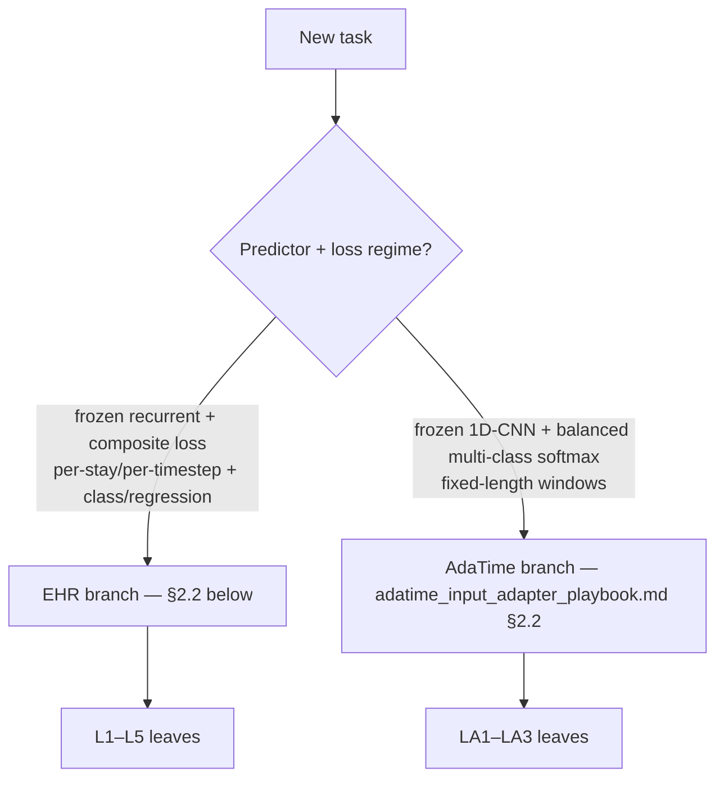
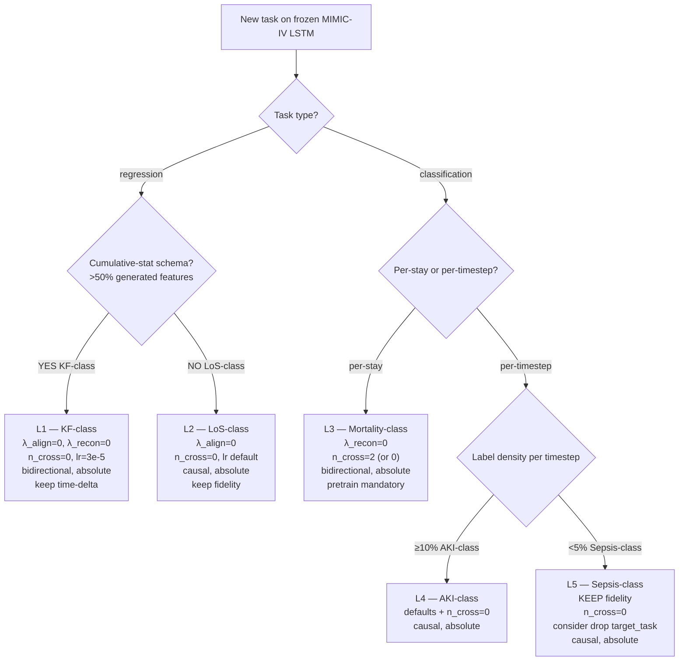

# Input-Adapter Playbook

> Final synthesis of `docs/neurips/playbook_drafts/cross_task_synthesis.md` and the five per-task drafts (`{mortality,aki,sepsis,los,kf}_playbook_analysis.md`).
> Convention: paper convention in prose (source = MIMIC-IV / frozen-predictor distribution; target = eICU or HiRID / inputs we adapt). Code symbols keep code-convention meanings when quoted.
> Skills used during drafting (announced inline): `ml-paper-writing` (executive-summary, claim-ledger gate, superlative policy, page-budget awareness), `content-research-writer` (decision-tree leaves and worked examples), `humanizer` (final prose pass), `paper-reviewer` (post-draft verification — see §11).
> Scope: EHR time-series adaptation with a strictly-frozen MIMIC-IV LSTM predictor and a learnt input adaptor over eICU or HiRID source-domain inputs. Generic recommendations are EHR-specific where so flagged; AdaTime evidence is cited where it shows the same rule failing or passing on a non-EHR benchmark.

---

## 1. Executive summary (paper-liftable; ~600 words)

We ablated ten loss-and-architecture components (C0–C9) over five EHR tasks (Mortality24, AKI, Sepsis, LoS, KidneyFunction) on the eICU → MIMIC-IV cohort, ported the per-task winning cell to HiRID → MIMIC-IV at n=3 seeds, and cross-checked the retrieval question on five AdaTime time-series benchmarks. From this matrix we extract three cohort-stable rules, one regime-split rule, and several scope-bounded tuning levers.

**Three cohort-stable rules** (eICU and HiRID agree at n=3 each; mechanism cited):

- **R1 — Drop the input-fidelity / autoencoder-reconstruction term on per-stay binary classification (Mortality-class).** `lambda_recon = 0` is the n=3 family-best on both cohorts, with the tightest seed σ in the entire study (eICU +0.0491 ± 0.0005 AUROC; HiRID +0.0589 ± 0.0059, both 3/3 p<0.001; `mortality_playbook_analysis.md` L26, L40–43). The frozen LSTM consumes only the final pooled hidden state, so per-timestep reconstruction is off-target regularisation; gradient diagnostics show recon at ~37% of task gradient (cooperative cos ≈ +0.84) — fidelity is redundant, not load-bearing.
- **R2 — Drop the latent-space MMD/align term on continuous regression (LoS- and KF-class).** `lambda_align = 0` is the n=3 family-best on LoS (eICU −0.0323 ± 0.0016 MAE) and within-cross3 best on KF (eICU −0.0067 ± 0.0008; HiRID −0.0017 ± 0.0002, 3/3 p<0.001). On LoS the seed σ also tightens — empirical MMD² is high-variance at our `batch_size=16` (Long et al. 2015 `arXiv:1502.02791`; Napoli & White 2025 `arXiv:2512.05226`) and redundant with task-output distribution-matching.
- **R3 — Drop-MMD direction generalises across cohorts on LoS** (with an eval-protocol caveat: cite ΔPearson +0.56, not ΔR² or ΔMAE_z, until the mean-shifted HiRID per-timestep re-eval lands; `bootstrap_ci_results.md` L164–172).

**One preliminary regime-split hypothesis** (the central novel finding; §3 below) — **WEAK directional after Apr 26 five-task cos pilots**, with a known LoS sign-failure mode:

- **R4 — `cos(task, fidelity)` × label-density was a directional hypothesis but does not yet operate as a calibrated rule.** **Five-task cos measurement** (Apr 26 pilots; `docs/neurips/playbook_drafts/cos_pilot_analysis.md`): Mortality **+0.84** (per-stay binary, dense gradient), Sepsis **−0.21** (per-timestep, 1.13% positive rate), AKI **+0.09** bimodal (per-timestep, 11.95%; e0b0 = −0.41 sign-flips intra-epoch to +0.36 to +0.45 by e0b3), **LoS −0.32** (per-timestep dense MSE), KF **+0.13** (per-stay regression). Sign-consistency with the C5 outcome: 3/5 (Mortality +0.84 → C5 wins +0.0491; Sepsis −0.21 → C5 collapses −0.0690; KF +0.13 → C5 borderline base-config-dependent), 1/5 partial (AKI +0.09 mean → C5 borderline +0.0483 ± 0.0096, sign right but threshold-uncalibrated), **1/5 sign-failure (LoS, predicted catastrophic from negative cos −0.32 but C5 verdict was near-null +0.0026 ± 0.0006)**. The +0.5 threshold remains **unfitted** — no measurement lands between +0.13 and +0.84, so the threshold could be anywhere in that open interval (including the literature-canonical PCGrad sign rule cos > 0; Yu et al. 2020, `arXiv:2001.06782`) and split the data identically. KF additionally shows seed-level instability at default lr=1e-4 because cumulative-feature recomputation integrates drift through `cum_max`, and AKI's bimodal e0b0 → e0b3 sign-flip breaks the "first batch of epoch 0" canonical reading protocol. **Status: WEAK directional with known LoS sign-failure mode.** Operational use suspended pending re-formulation. The safer operational form is the density-only rule (sparse per-timestep → keep fidelity; dense per-stay or dense per-step regression → consider dropping but verify by running the C5 cell with multi-seed evidence rather than by reading the cosine).

**Three scope-bounded levers** (apply only when the regime matches):

- **R5 — Default `n_cross_layers = 0` for 4 of 5 EHR tasks (AKI / Sepsis / LoS / KF); Mortality is the one exception.** Across 5 EHR tasks at n=3, retrieval is at-most-tied with no-retrieval and tighter-σ on AKI (2.5×) and KF (8×) (`retrieval_ablation_findings.md` §2). Mortality is the one EHR task where C0 (retrieval on, n_cross=2) numerically beats C1 by ~1σ (+0.0033 mean, n=3 each); we recommend `n_cross_layers = 2` for Mortality with `n_cross_layers = 0` as an acceptable trade-off (≈ −0.003 AUROC). On AdaTime, retrieval is regime-split (3/5 helps at >3σ; 2/5 hurts) — so the rule is EHR-specific, not universal.
- **R6 — Use `output_mode = "absolute"` (not residual) on every EHR task.** Residual loses to absolute on 5/5 EHR tasks at n=3 (`mort_c2_C8`, `aki_v5_cross3_C8`, `sepsis_v5_cross3_C8`, `los_v5_cross3_C8`, `kf_v5_cross3_C8`; clean strict toggles vs C0). The cross-benchmark split co-varies with **at least three axes — predictor architecture (LSTM vs 1D-CNN), feature dimensionality + type (52–292 tabular features with cumulative recomputes vs 1–9 raw sensor channels), and `λ_fidelity` regime** — that have not been separately isolated by a controlled backbone-swap experiment (open follow-up). The descriptive cross-benchmark pattern is robust (EHR's frozen LSTM + tabular regime → absolute on 5/5 at n=3; AdaTime's frozen 1D-CNN + raw-signal regime → residual at every measured cell of `adatime_input_adapter_playbook.md` §1 A3 / §6, post Apr 26 strict-toggle run, with 6 of 7 strict-toggle pairs at single-seed and one within-σ 2-seed tie). The mechanism attribution (predictor-architecture-keyed) is one of three co-varying explanations and should be read as a working hypothesis, not a tested rule. The previously-documented `pretrain_epochs`-keyed bridge ("residual when `p = 0`; absolute when `p > 0` provided `λ_recon > 0`") is *deprecated*: the Apr 26 strict-toggle run on HAR (`cap_T_p10` RES +24.86 MF1) and WISDM (`v4_lr67_fid05` at `p = 10, λ_fid = 0.5` RES +13.41 MF1) refutes the `p > 0 → absolute` direction on AdaTime, and the only previously-supporting cell (HHAR `v4_base_abs` s0) collapses to a 2-seed within-σ tie when s1 is added. EHR R6 is unchanged: every EHR task picks absolute; the rule is now stated as a single-line predictor-architecture mapping (frozen LSTM → absolute) rather than as a `p`-keyed precondition. **Caveat — combined no-pretrain-anchor: `aki_nf_C8` (residual + `lambda_recon = 0` at `p > 0`)** lands at ≈ +0.0002 (single-seed) — residual reappears as marginally competitive only when both fidelity is dropped *and* the absolute decoder's warm-up is degraded. This is a known boundary case, not a contradiction to R6 (which assumes fidelity is on, governed by R7's hard guardrail). KF carries an additional **severity note** (not a separate branch): residual on KF is over-determined catastrophic because cumulative-feature recompute (`cum_max`/`cum_min`) integrates any δ-drift forward across timesteps — but EHR's predictor + feature regime already routes KF to absolute, so this acts as a severity multiplier within R6 rather than a second decision axis.
- **R7 — Pretrain (Phase-1 autoencoder) is non-negotiable.** Skipping costs −0.02 to −0.13 AUROC; the worst single number in the study (`mort_c2_nf_C6` = −0.1318) is the no-pretrain × no-fidelity interaction. Never combine `pretrain_epochs = 0` with `lambda_recon = 0`.

**Mechanistic context — three first-principles axes.** The seven rules above (R1–R7) are projections of three first-principles axes that the data actually carries: (1) **task-gradient SNR** (label density × cooperativity of `cos(task, fidelity)` × fid/task gradient ratio) — drives R1, R4, R7 and the EHR side of the retrieval rule R5; (2) **feature dimensionality + type** (1–9 raw sensor channels vs 52–292 tabular features with cumulative recomputes) — drives R6's predictor-architecture-keyed reading and the KF severity multiplier; (3) **source-cohort heterogeneity** (HHAR/WISDM heterogeneous-source vs HAR/SSC/MFD coherent-cohort) — drives the AdaTime side of R5. Naming the axes upfront makes the rules' joint structure explicit. R4's projection onto axis 1 alone is now **demoted to WEAK** after the LoS sign-failure (cos = −0.32 with near-null C5 outcome) — the cos sign does not carry the rule on dense regression, and at least one of (range-loss interaction, eval-protocol mismatch, scale-mismatched MSE gradient) appears to confound the decomposition. The k-NN-agreement diagnostic and backbone-swap experiment remain open; an LoS multi-seed cos re-measurement is queued as the immediate diagnostic.

**Scope.** Recommendations are calibrated on a single framework: MIMIC-IV target frozen LSTM, eICU and HiRID source, two Western ICU cohorts. Cohort transport beyond Western ICU and architectures other than LSTM are open. R1, R2, and the residual/pretrain levers are EHR-specific; the cos-based rule (R4) is mechanistically transportable in spirit but is now demoted to **WEAK** after the Apr 26 five-task cos pilots (Mortality +0.84, Sepsis −0.21, KF +0.13, AKI +0.09 bimodal, **LoS −0.32 sign-failure**), with the +0.5 threshold remaining unfitted and the LoS sign-failure exposing an open mechanism puzzle. To our knowledge no published frozen-backbone-DA paper recommends *removing* (rather than re-weighting or stratifying) the alignment / reconstruction term in this regime — Wang/Li/Ding/Wang 2020 propose a discriminative re-weighted MMD (`arXiv:2007.00689`) and Napoli & White 2025 (`arXiv:2512.05226`) propose stratified sampling; our resolution is more aggressive than the literature's.

---

## 2. The decision tree

The unified tree splits at the **predictor-and-loss regime** before the EHR-specific properties. The EHR branch (this playbook, leaves L1–L5) is keyed on prediction granularity, task type, label density, feature regime, and cohort variability. The AdaTime branch (`adatime_input_adapter_playbook.md` §2, leaves LA1–LA3) is keyed on source-target heterogeneity.

### 2.1 Top-of-tree (cross-benchmark)



The two branches differ on one **load-bearing cross-benchmark split** (full mechanism in §5 of `adatime_input_adapter_playbook.md`):

| Knob | EHR branch (L1–L5) | AdaTime branch (LA1–LA3) |
|---|---|---|
| `pretrain_epochs` | **non-negotiable** (`p > 0`); `p = 0` collapses by up to −0.13 AUROC | **`p = 0` universal** (5/5 datasets); `p > 0` collapses to identity-basin on 1-channel signals |
| `n_cross_layers` (retrieval) | default 0 (at-most-tied on 5/5 EHR tasks) | conditional: keep on HAR/SSC/MFD (manifold-coherent), drop on HHAR/WISDM (heterogeneous-source) |
| `output_mode` | absolute on 5/5 (per §1 R6; mechanism: frozen-LSTM + tabular ICU feature regime) | **residual universal** on AdaTime; wins or ties at every measured `pretrain_epochs × λ_fidelity` cell (post Apr 26 claim-strengthening run; `adatime_input_adapter_playbook.md` §1 A3) — cross-benchmark split is keyed on predictor + feature regime, not on `pretrain_epochs` |
| Capacity tier | tiered sweep absent (open follow-up §7 #2) | Tiny ≤1× ≥ Full ≥ XT on 5/5; default Tiny |

Pick the branch by the predictor architecture and task structure of your new task; the table above is enough to commit to a branch before reading the leaves.

### 2.2 EHR branch (this playbook)



ASCII fallback (for terminal viewing):

```
START — predictor + loss regime?
 +- frozen 1D-CNN + balanced softmax           -> AdaTime branch (LA1/LA2/LA3)
 +- frozen recurrent + composite loss (this branch)
       +- task_type?
           +- regression
           |    +- >50% cumulative features (KF-class) -> L1
           |    +- otherwise (LoS-class)               -> L2
           +- classification
                +- per-stay (Mortality-class)          -> L3
                +- per-timestep
                      +- density >= 10% (AKI-class)    -> L4
                      +- density <  5% (Sepsis-class)  -> L5
```

For the AdaTime branch (LA1 controlled-protocol multi-channel; LA2 single-channel quasi-stationary; LA3 heterogeneous-source) see `adatime_input_adapter_playbook.md` §2.

### 2.3 Leaf rationales and scope caveats (EHR branch)

**L1 — KF-class (per-stay regression with cumulative-stat schema, ~292 features).** Drop both MMD and fidelity (`lambda_align = 0`, `lambda_recon = 0`) and lower the learning rate to 3e-5; keep the time-delta channel (the only KF cell where it is load-bearing). Mechanism: 192 of 292 features are recomputed downstream from translated dynamics via `schema._recompute_generated_features`; cum_max and cum_min are monotone, so per-step drift compounds non-recoverably. Default lr=1e-4 with `lambda_recon = 0` lets one in three seeds collapse (val_recon explodes from 32 to 435 between epochs 3 and 4 — `kf_playbook_analysis.md` B.5). The 3.3× lower learning rate caps per-step drift; without fidelity, this is what stops the cumulative loop. Scope: cohort-pending — only C3_no_mmd has been ported to HiRID; the lr=3e-5 + nfnm winner has not. Cite `kf_lr3e5_nfnm` C0 = −0.0086 ± 0.0014 (eICU n=3, paper champion) and HiRID C3_no_mmd = −0.0017 ± 0.0002 (n=3, p<0.001).

**L2 — LoS-class (per-timestep regression, dense MSE every step, MI-optional 52-feature schema).** Drop MMD only. Keep fidelity; the dense per-timestep MSE residual is itself a low-variance distribution-matching signal that anchors the input space without an explicit reconstruction term (`los_playbook_analysis.md` C.1). Scope: cohort-stable in direction (HiRID port replicates) but the HiRID magnitude is inflated by per-stay vs per-timestep eval mismatch — paper headline metric is ΔPearson +0.56 until the mean-shifted re-eval lands. Cite `los_v5_cross3 C3_no_mmd` = −0.0323 ± 0.0016 (eICU n=3).

**L3 — Mortality-class (per-stay binary classification, 96 features, 5.5% per-stay positive rate).** Drop fidelity. Keep MMD (null-effect, harmless). Keep the auxiliary `target_task` BCE (dropping costs ~−0.006 AUROC). Use `n_cross_layers = 2` with absolute output if compute is available; `n_cross_layers = 0` is acceptable at a small ~−0.003 AUROC cost. Scope: cohort-stable — eICU and HiRID both pick this leaf, with the highest-confidence rule status in the entire study (n=3 σ = 0.0005). Hard guardrail: never combine `pretrain_epochs = 0` with `lambda_recon = 0` — `mort_c2_nf_C6` collapses to −0.1318 AUROC.

**L4 — AKI-class (per-timestep binary classification, ≥10% positive rate, 100-feature schema).** Use defaults except `n_cross_layers = 0`. Removing retrieval tightens seed σ by 2.5× without losing mean (eICU n=3 +0.0514 ± 0.0017 vs C0 +0.0497 ± 0.0052); HiRID port replicates at +0.0753 ± 0.0029 (`aki_playbook_analysis.md` A.2). Do not drop fidelity at this density (the n=3 cross3 C5 mean is +0.0048 with wide ±0.0096; the +0.0576 single-seed `aki_nf` record sits at the high tail and is not safe to load-bear). Scope: cohort-stable in cell choice (C1 wins on both eICU and HiRID); magnitude tracks frozen-baseline headroom.

**L5 — Sepsis-class (per-timestep binary classification, <5% positive rate, 100-feature schema).** Keep fidelity (absolute non-negotiable: cross3 C5 = −0.0690 ± 0.0167, all 3 seeds collapse with val_recon stalled at 18–22 and BCE → NaN by epoch 8). Use `n_cross_layers = 0` (cross3 C1 = +0.0491 ± 0.0042 is the family crown; cross2 C1 = +0.0488 ± 0.0031 is tied within noise). Consider dropping the auxiliary `lambda_target_task` BCE — single-seed paper record `sepsis_C4` = +0.0633 (`sepsis_playbook_analysis.md` C.2), multi-seed +0.041–0.047 — though the multi-seed crown remains C1, not C4. Scope: cohort-pending — the HiRID Sepsis ablation matrix has not been ported yet, so the C5 catastrophe is eICU-only at the time of writing (single most important follow-up).

---

## 3. The C5 / fidelity decision rule

This is the central novel finding. The C5_no_fidelity ablation (`lambda_recon = 0`) is the family-best on Mortality / LoS / KF and catastrophic on Sepsis. Per-stay vs per-timestep is not the discriminating axis (LoS is per-timestep and tolerates C5; Sepsis is per-timestep and collapses); classification-vs-regression is not the axis either (KF is regression and shows seed-level instability of the same shape). The discriminating axis is the joint signal of `cos(task, fidelity)` — the cosine similarity between the task-loss gradient and the fidelity-loss gradient at the adapter parameters — and label density at the relevant granularity.

### 3.1 Cross-task evidence

| Task | C5 ΔMetric (n=3) | per-timestep label density | cos(task, fidelity) | Verdict |
|---|---|---|---|---|
| Mortality | **+0.0491 ± 0.0005** AUROC (eICU); +0.0589 ± 0.0059 (HiRID) | per-stay (5.52% pos at stay-level) | **+0.84** (measured, `sepsis_label_density_analysis.md` §1.2) | **best** |
| LoS | +0.0026 ± 0.0006 MAE_z (eICU; near-neutral) | 100% (continuous regression) | **−0.32** (measured Apr 26, `cos_pilot_analysis.md`; mean over 8 lines, e0b0 = −0.30, sign-stable on 7/8 lines) | **near-neutral** — *cos sign predicts catastrophic but reality is null; sign-failure for R4* |
| KF | −0.0051 ± 0.0040 MAE_z (eICU; 1/3 seeds collapses at default lr) | per-stay regression | **+0.13** (measured Apr 26, mean over 8 lines, e0b0 = +0.04; sign-stable positive on all 8 lines) | **mean-positive but seed-unstable; base-config-dependent** |
| AKI | +0.0483 ± 0.0096 AUROC (n=3, wide); +0.0576 single-seed `aki_nf` | per-timestep, 11.95% | **+0.09** (measured Apr 26, mean over 8 lines; **bimodal**: e0b0 = −0.41, e0b1..b3 = +0.36 to +0.45 — first-batch protocol unreliable) | **borderline** |
| Sepsis | **−0.0690 ± 0.0167** AUROC (cross3, all 3 seeds) | per-timestep, 1.13% | **−0.21** (measured) | **catastrophic** |

> **Mechanism puzzle (LoS sign-failure).** Dense per-step MSE on LoS yields *anti-cooperative* `cos = −0.32`, opposite to the playbook's prior ("dense per-step regression → cooperative cos"). The C5 outcome on LoS is near-null (+0.0026 ± 0.0006), so the cos sign predicts neither cooperative-with-task nor catastrophic-orthogonal — the rule's mechanism story is **incomplete on dense regression**. Candidate explanations (none ablation-tested): (i) range-loss interaction, (ii) per-stay-vs-per-timestep eval mismatch identified in HiRID LoS work, (iii) scale-mismatched MSE gradients (continuous-target MSE vs reconstruction MSE) dominating the recon direction. The +0.5 threshold ostensibly fitted between Mortality (+0.84) and Sepsis (−0.21) does not survive the LoS measurement; threshold remains unfitted in the open interval (+0.13, +0.84) where no cos value has been measured.

Cohort confirmation: Mortality C5 replicates eICU↔HiRID at n=3. KF shows the same seed-level signature on eICU; HiRID-KF C5 not yet ported. Sepsis C5 catastrophe is eICU-only at the time of writing (HiRID Sepsis ablation matrix pending).

### 3.2 Mechanism

When `cos(task, fidelity) ≥ +0.5`, fidelity and the task pull in essentially the same direction in parameter space; fidelity is redundant with the task signal. The fid/task gradient-ratio is regime-conditional: ≈ **2.81× cooperative on Mortality** (cos = +0.84; `gradient_bottleneck_analysis.md` L249–256) and ≈ **3–10× on Sepsis at the f=20 oversample regime** (cos = −0.21; same file Table L60–67); LoS / KF / AKI ratios are not directly measured. On Mortality the modest cooperative ratio still over-regularises through 37% of task-gradient magnitude that adds no signal direction; removing it lets the cooperative task gradient speak louder. The "3–10× bottleneck" framing is Sepsis-specific (negative-cosine regime), not EHR-wide.

When `cos(task, fidelity) ≤ 0` and the task gradient is sparse, task and fidelity compete for different directions in parameter space. Removing fidelity removes the term that empirically anchors the adapter output to the input distribution under this regime (mechanistically; observed at n=3 on Sepsis cross3, untested elsewhere); within 4–8 epochs the encoder drifts (val_recon climbs ~30× from baseline), the cross-attention loses its retrieval keys, and the BCE saturates to a constant (NaN by epoch 8 on Sepsis cross3 — `sepsis_playbook_analysis.md` B.3). This is the Sepsis regime.

When the task gradient is dense and bounded but small per-step (LoS continuous MSE every timestep), the task supplies a non-zero anchor at every step, which is enough to keep the input distribution stable even without fidelity. This is the LoS regime.

KF is a degenerate case of the orthogonal regime: cumulative-feature recomputation amplifies any drift through monotone `cum_max`/`cum_min` aggregates. Two seeds at default lr=1e-4 happen to stay within the basin; one seed tips into the recon-explosion pattern and never recovers.

### 3.3 Operational protocol

The codebase logs `[grad-diag]` lines containing `task_grad`, `recon_grad`, ratio, and cosine on the first batch of every Nth epoch (`gradient_bottleneck_analysis.md` §"Gradient Diagnostic Results"). The Apr 26 cos pilot (`cos_pilot_analysis.md`) measured cos on LoS / KF / AKI — the result demoted R4 from "directional with two-point calibration" to **WEAK with a known LoS sign-failure mode**.

**Operational protocol (revised Apr 26).** **Cos pilot remains useful for sign detection but does not yet support a calibrated drop-fidelity decision.** Defer to per-task n=3 evidence:

1. If a task family already has multi-seed C5 evidence (Mortality, Sepsis, AKI, LoS, KF — see §3.1 table), follow the verdict directly. Don't override on the cos sign alone.
2. For a genuinely new task without n=3 C5 evidence: run a short C5 pilot (1–3 epochs, n ≥ 2 seeds) and measure C5 outcome empirically. The cos pilot can supplement as a diagnostic, but should not gate the decision — LoS demonstrates a sign-failure case where measured cos = −0.32 would have predicted catastrophic, while the actual C5 verdict is near-null.
3. If you do read cos for diagnostic purposes, use the **mean of the first 3 batches of epoch 0** (not just `e0b0`) — AKI's e0b0 = −0.41 sign-flips intra-epoch to +0.36 within the same minibatch sequence; LoS's e0b0 = −0.30 understates the same-epoch mean of −0.55 by ~50%. Single-batch reads are unreliable on classification tasks where the sign flips intra-epoch.
4. Density-only fallback rule (the safer operational form): per-timestep tasks with positive fraction < 5% → keep `lambda_recon` at default; per-stay binary classification with dense per-stay gradient → consider C5 with multi-seed verification; dense per-step regression → keep `lambda_recon` at default (LoS shows cos = −0.32 here despite dense MSE labels — do not infer cooperativity from density).

The +0.5 cosine threshold is **unfitted**; the Apr 26 five-task measurement (Mortality +0.84, KF +0.13, AKI +0.09, Sepsis −0.21, LoS −0.32) places no measurement in the open interval (+0.13, +0.84). Any threshold in that interval — including the literature-canonical sign rule (cos > 0; PCGrad — Yu et al. 2020, `arXiv:2001.06782`) — splits the data identically. A multi-seed (n=3) re-measurement of LoS cos is the highest-priority follow-up (§7 #2) — to confirm the −0.32 reading is not a single-seed accident given LoS's own seed variance pattern.

---

## 4. Component playbook

For each loss term and architectural choice, a one-paragraph "what works when" entry.

**`lambda_recon` (autoencoder reconstruction / "fidelity" anchor in retrieval trainer).** *Rule (preliminary; per-task n=3 evidence overrides the cos sign — R4 is WEAK after the Apr 26 LoS sign-failure)*: drop when per-task n=3 C5 evidence supports it (Mortality, KF lr=3e-5+nfnm); keep otherwise. The cos sign alone is insufficient: LoS has measured cos = −0.32 (anti-cooperative) but C5 outcome is near-null, not catastrophic. *Evidence*: cohort-stable on Mortality (n=3 both cohorts); near-neutral on LoS; seed-fragile on KF at default lr; catastrophic on Sepsis. *Mechanism*: when redundant with the task signal, fidelity over-regularises through a cooperative ratio of ≈ 2.81× on Mortality (37% of task gradient adds no direction); when orthogonal and labels are sparse (cos = −0.21 on Sepsis, fid 3–10× task at f=20 oversample), fidelity is the term that empirically anchors the encoder in the source-input distribution (observed at n=3 on Sepsis cross3). The 3–10× ratio is Sepsis-specific, not EHR-wide. *Scope*: cos pilot is useful for sign detection but is not a calibrated rule — LoS sign-failure refutes the regression-branch prediction. *Decision-tree leaves*: L1, L3 drop; L2/L4/L5 keep.

**`lambda_align` (latent-space MMD).** *Rule*: drop on continuous regression with dense per-step task gradient; keep on classification. *Evidence*: cohort-stable on KF (eICU + HiRID n=3); n=3 family-best on LoS eICU; null on Mortality and AKI; mildly hurts Sepsis (C3 vs C0 cross3 −0.014 AUROC). *Mechanism*: empirical MMD² has O(1/B) variance at our `batch_size = 16` (Long et al. 2015 `arXiv:1502.02791`); on dense regression the task is itself a distribution-matching signal, so MMD is redundant first-moment matching. *Scope*: regression-only; do not generalise to classification — Sepsis evidence directly contradicts. *Leaves*: L1, L2 drop; L3/L4/L5 keep.

**`lambda_target_task` (auxiliary BCE/MSE on translated source through the frozen LSTM).** *Rule*: keep by default. *Evidence*: n=3 Mortality C4 = −0.006 vs control; AKI C4 = −0.005; LoS C4 wide ±0.0106 (seed collapse); KF C4 = −0.0011. Sepsis is the only EHR task where dropping it helps (single-seed +0.0633; multi-seed +0.041–0.047 — direction preserved, magnitude inflated). *Mechanism*: on sparse-positive per-timestep tasks the negative-class gradient (98.87% of timesteps on Sepsis) contaminates the rare positive signal flowing through the same head. *Scope*: drop only on Sepsis-class (per-timestep, density < 5%). *Leaves*: L5 optional drop; all others keep.

**`n_cross_layers` (retrieval cross-attention depth, 0 disables retrieval).** *Rule*: default 0 for EHR. *Evidence*: across 5 EHR tasks at n=3, `n_cross_layers = 0` is at-most-tied with the retrieval-on control and tighter-σ on AKI (2.5×) and KF (8×). On AdaTime, retrieval helps 3/5 datasets at >3σ and hurts 2/5 — the rule is EHR-specific. *Mechanism*: retrieval needs both target-manifold coherence and gradient headroom; EHR fails the second precondition because fidelity dominates the gradient regime (`retrieval_ablation_findings.md` §4). *Scope*: rule applies to EHR with our specific retrieval design (k-NN + cross-attention trained jointly); inference-time retrieval (kNN-LM-style) is untested. *Leaves*: L1/L2/L4/L5 set 0; L3 default 2 acceptable.

**`output_mode` (residual delta vs absolute output).** *Rule*: `"absolute"` always for EHR. Every EHR task picks absolute on 5/5 at n=3 (clean C8 strict toggle). AdaTime, on the opposite side of the cross-benchmark split, picks residual on every measured strict-toggle pair (`adatime_input_adapter_playbook.md` §1 A3 post Apr 26 claim-strengthening run). *Evidence*: residual loses to absolute on 5/5 EHR tasks at n=3 (clean C8 strict toggle). Strongest failure modes: KF (residual amplified by cumulative aggregation). *Mechanism (hypothesised; not isolated by ablation)*: residual produces output ≈ `input + small_noise` at random init (`x_out = x_val + x_decoded`, `src/core/retrieval_translator.py` L800–802 / L831–836), giving an implicit output-magnitude floor; the residual-init reading is consistent with the BN-biases-residual-toward-identity result of De & Smith 2020 (`arXiv:2002.10444`, NeurIPS 2020). On AdaTime even pretrain `p = 10` plus `λ_fid = 0.5` does not flip the verdict (HAR `cap_T_p10` RES wins +24.86 MF1; WISDM `v4_lr67_fid05` p=10 RES wins +13.41 MF1). The cross-benchmark split co-varies with at least three axes (predictor architecture, feature dimensionality + type, λ_fidelity coefficient regime) and is not separately isolated by the data we have; the predictor-architecture-keyed reading is one of three co-varying explanations. *Boundary case*: `aki_nf_C8` (residual + `lambda_recon = 0` at `p > 0`) lands at ≈ +0.0002 single-seed — residual reappears marginally competitive only when EHR's fidelity anchor is also stripped. *KF severity note*: on KF the cumulative-feature recompute (`cum_max`/`cum_min`) integrates any δ-drift forward, making residual *additionally* catastrophic. *Magnitude modulator on AdaTime (directional only)*: across the four `p = 0` AdaTime datasets, Pearson `r(λ_fidelity, residual advantage MF1)` ≈ **−0.93 (n = 4, two-tailed p ≈ 0.07; Spearman ρ ≈ −0.85)** — directional pattern is consistent with an inverse relationship; n is too small for conventional significance. *Scope*: cohort-stable on EHR (5/5 tasks, n=3); AdaTime side rests on 7 strict-toggle pairs (6 of 7 single-seed; HHAR `v4_base` is n=2 within-σ tie). The previously-documented `p`-keyed bridge ("residual when `p = 0`; absolute when `p > 0`") is **deprecated** — see `adatime_input_adapter_playbook.md` §1 A3 evidence-history. *Leaves*: all EHR leaves set absolute.

**`use_target_normalization` (affine renorm of source features to target stats).** *Rule*: `true` by default. *Evidence*: single-seed across all tasks; ranges from null (Mortality +0.0444 vs +0.0453) to mildly positive. *Mechanism*: pre-translation moment-matching that the encoder would otherwise have to absorb in its first layer. *Scope*: the param is saved in the checkpoint; not load-bearing in any cell where the encoder has 4 layers and pretrains. *Leaves*: all leaves set true.

**`pretrain_epochs` (Phase-1 autoencoder pretraining on MIMIC).** *Rule*: never zero; never combine `pretrain_epochs = 0` with `lambda_recon = 0`. *Evidence*: C6_no_pretrain hurts on every EHR task that has been measured (Mortality −0.021 with fidelity ON; AKI −0.016; Sepsis −0.076; LoS +0.004; KF +0.001). On the no-fidelity base, the pretrain-off cell collapses on every task that has it: `mort_c2_nf_C6` = −0.1318, `aki_nf_C6` = −0.0828, `sepsis_C6` = −0.0763. *Mechanism*: Phase 2 has 30–35 epochs; without pretrain the encoder must learn cross-domain mapping from scratch under the task gradient alone, which is insufficient when fidelity has also been removed. *Scope*: hard guardrail across all leaves. *Leaves*: all keep (default 15).

**`disable_triplet_time_delta` (drop the time-delta input channel).** *Rule*: keep time-delta. *Evidence*: single-seed and within noise on Mortality / AKI / Sepsis / LoS, but +0.0322 catastrophic on KF. *Mechanism*: KF's 192 cumulative features need a time-delta channel for sensible aggregation; on the other tasks, the LSTM already encodes position. *Scope*: KF-class only; the rule is the unique edge case where time-delta is structurally load-bearing. *Leaves*: L1 keep (explicit); other leaves keep by default.

**`feature_gate` (learnable per-feature sigmoid weights on fidelity loss).** *Rule*: keep `true` by default; gate is inert when fidelity is off. *Evidence*: single-seed across all tasks; on Mortality C2 = +0.0332 vs C0 +0.0453 (mild loss); on AKI no-fidelity base, C2 ≡ C0 (gate inert). *Mechanism*: gate weights the per-feature reconstruction loss; without `lambda_recon > 0` it has no signal. *Scope*: redundant under fidelity-off configurations. *Leaves*: keep on; do not invest tuning effort.

**Learning rate (`lr`).** *Rule*: 1e-4 default; lower to 3e-5 only on cumulative-stat schemas (KF-class) when fidelity is off. *Evidence*: `kf_lr3e5_nfnm` n=3 = −0.0086 ± 0.0014 (paper champion); HP-decomposition shows lr=3e-5 + no-MMD do most of the lifting (`kf_playbook_analysis.md` C.1). *Mechanism*: low lr caps per-step parameter update magnitude so cumulative-feature drift cannot compound across epochs. *Scope*: KF-class only — there is no evidence that 3e-5 helps on standard 100-feature schemas. *Leaves*: L1 only.

---

## 5. Worked examples

Three concrete walk-throughs a new user could follow.

### WE-1 — Per-stay binary classification on a new ICU cohort, MIMIC-like feature schema

> "I have a 24h-mortality-like task on a third ICU cohort. Features are 48 vitals/labs + 48 missingness indicators + 4 statics, like the YAIB Mortality24 schema. Frozen target is a MIMIC-IV LSTM."

Walk-through. The task is binary classification (B branch right). Per-stay (D branch left). Leaf **L3 — Mortality-class**.

Recipe: `lambda_recon = 0`, `lambda_align = 0.5` (default; null effect, safe to keep), `lambda_target_task = 0.5` (default; dropping costs ~−0.006), `n_cross_layers = 2` (or 0 with a small cost), `output_mode = "absolute"`, `temporal_attention_mode = "bidirectional"`, `use_target_normalization = true`, `pretrain_epochs = 15`, `lr = 1e-4`.

Predicted Δ. Expect a +0.04 to +0.06 AUROC lift over the frozen MIMIC-LSTM baseline, scaling with the new cohort's frozen-baseline gap from MIMIC. Larger gap → larger lift; the HiRID port (baseline 0.762 vs MIMIC's 0.808 reference) gives +0.0589 ± 0.0059, the eICU port (baseline 0.808) gives +0.0491 ± 0.0005.

Required first-epoch sanity check. Run the §3.3 protocol — note R4 is WEAK after the Apr 26 LoS sign-failure, so don't gate the decision on cos alone. If your task is per-stay binary classification on a MIMIC-IV-LSTM regime, the Mortality cos = +0.84 prior likely transfers, and the n=3 C5 evidence on Mortality (eICU +0.0491 ± 0.0005, HiRID +0.0589 ± 0.0059) is a stronger basis for picking `lambda_recon = 0` than any cos reading would be. If cos comes out below +0.13 (the KF reading) on your cohort — unlikely on per-stay binary classification, but possible — run a 2-seed C5 pilot before committing.

### WE-2 — Per-timestep continuous regression with dense labels (e.g. 24h-ahead glucose)

> "I have a per-timestep glucose-prediction task; every observed timestep has a continuous label. Frozen target is a MIMIC-IV LSTM regression head."

Walk-through. Regression (B branch left). Cumulative features < 50% (no `_min_hist`/`_max_hist`/`_count` regime; standard MI-or-MI-optional schema). Leaf **L2 — LoS-class**.

Recipe: `task_type = "regression"`, `lambda_recon = 0.1` (keep — measured `cos(task, fidelity) = −0.32` on LoS Apr 26 supports keeping fidelity; the dense MSE label does *not* yield cooperative cos as the prior predicted, and the C5 outcome is near-null rather than helpful), `lambda_align = 0` (drop MMD), `lambda_target_task = 0.5` (keep — dropping is unstable on regression at n=3 on LoS), `n_cross_layers = 0`, `output_mode = "absolute"`, `temporal_attention_mode = "causal"`, `lr = 1e-4`.

Predicted Δ. Expect a measurable MAE reduction; magnitude hard to predict without knowing the cohort-mean offset between source and target. On LoS, the n=3 eICU lift is −0.032 z-MAE (~−5.4 hours). The "drop MMD wins on regression" rule replicates on KF (a different regression with cumulative features) and is the most defensible cross-task rule in the playbook.

### WE-3 — Per-timestep binary classification with very sparse positive labels (<2%)

> "I have a per-timestep deterioration-prediction task with ~1.5% positive rate. Frozen target is a MIMIC-IV LSTM."

Walk-through. Classification (B branch right). Per-timestep (D branch right). Density < 5% (E branch right). Leaf **L5 — Sepsis-class**.

Recipe: `lambda_recon = 0.1` (default — **do not drop**), `lambda_align = 0.5` (default — keep; on sparse labels MMD operates on the full-distribution gradient and gets denser signal than the task term), `lambda_target_task = 0.5` (default — consider dropping if you have multi-seed budget, since dropping it on Sepsis is the only EHR cell where C4 helps), `n_cross_layers = 0` (n=3 family crown across both cross2 and cross3 bases is C1_no_retrieval), `output_mode = "absolute"`, `temporal_attention_mode = "causal"`, `pretrain_epochs = 15`.

**Critical warning: do NOT drop `lambda_recon`.** On Sepsis cross3, all three seeds with `lambda_recon = 0` collapse: val_recon stalls at 18–22 (two orders of magnitude above the default-recon trajectory), val_align inflates from 0.03 to 0.40, and BCE saturates to NaN by epoch 8. The frozen baseline is non-recoverable — the pipeline still emits predictions but they are constants. The mechanism is the orthogonal cos(task, fidelity) ≈ −0.21: with the task gradient sparse and orthogonal, fidelity is the dominant term anchoring the encoder, and removing it lets the encoder collapse. Run the §3.3 pilot to confirm cos before any aggressive ablation.

Predicted Δ. Expect +0.04 to +0.05 AUROC at the n=3 multi-seed level. The sepsis_C4 single-seed paper record of +0.0633 sits in the high tail — useful as an upper bound, not a target.

---

## 6. Cohort-stability scorecard

| Rule | eICU evidence | HiRID evidence | Stability label |
|---|---|---|---|
| R1 — drop fidelity on Mortality-class | n=3 +0.0491 ± 0.0005 (3/3 p<0.001) | n=3 +0.0589 ± 0.0059 (3/3 p<0.001) | **cohort-stable** |
| R2a — drop MMD on KF | n=3 −0.0067 ± 0.0008 within cross3 | n=3 −0.0017 ± 0.0002 (3/3 p<0.001) | **cohort-stable** |
| R2b — drop MMD on LoS | n=3 −0.0323 ± 0.0016 | n=3 ΔPearson +0.56 (R²/MAE inflated by eval-protocol mismatch) | **cohort-stable in direction; magnitude protocol-bound** |
| R3 — `output_mode = "absolute"` | 5/5 EHR tasks at n=3 favor absolute | not directly tested by cell-swap | **cohort-stable by mechanism** (architectural, not cohort-dependent) |
| R4 — cos × density rule (preliminary) | All 5 cosines now measured (Apr 26 cos pilots; `cos_pilot_analysis.md`): Mortality +0.84, Sepsis −0.21, KF +0.13, AKI +0.09 (bimodal), **LoS −0.32 (sign-failure: predicted catastrophic, actual near-null)**. 3/5 sign-consistent with C5 outcomes; 1/5 partial (AKI threshold-uncalibrated); 1/5 sign-failure (LoS) | Mortality replicates; Sepsis pending | **WEAK — five-point calibration with one sign-failure (LoS); threshold +0.5 unfitted in the open interval (+0.13, +0.84) where no cos value lands; operational use suspended pending re-formulation** |
| R5 — `n_cross_layers = 0` default for EHR | n=3 on 5 tasks: all at-most-tied with retrieval-on | only C1 ported on AKI; not factored against C0 | **cohort-pending** (cell choice consistent on AKI; HiRID C0 not run) |
| R6 — pretrain mandatory | catastrophic on every task with fidelity-off interaction | not tested by cell-swap | **cohort-stable by mechanism** (Phase 2 budget unchanged across cohorts) |
| R7 — drop target_task on Sepsis-class | single-seed +0.0633; multi-seed +0.041–0.047 (direction preserved) | not tested | **cohort-pending** |
| L1.lr — 3e-5 + nfnm on KF | n=3 −0.0086 ± 0.0014 | not ported | **cohort-dependent pending HiRID test** |

Source: synthesis §7, per-task drafts D′ sections.

---

## 7. Open questions and the experiments that would close them

Listed in priority order. None are queued; analysis-only deliverable per the user instruction.

1. **HiRID Sepsis ablation matrix (C0 + C1 + C3 + C4 + C5 + C8) at n=3.** *Predicted Δ*: C5 catastrophic but possibly softer than eICU (HiRID per-timestep positive rate ≈ 2.6% vs eICU 1.13%, inferred from the AUPRC ratio in `yaib_reference_baselines.md`); a value around −0.03 to −0.05 would still confirm the cos-density rule. *Required jobs*: 18 (6 cells × 3 seeds). *Confirms or refutes*: R4 cohort-stability on the negative-cosine side.
2. **First-epoch `cos(task, fidelity)` measurement on LoS, KF, AKI.** **DONE (Apr 26 single-seed pilots; `cos_pilot_analysis.md`).** Measured values: LoS = **−0.32** (sign-flipped vs prediction; **R4 LoS sign-failure**), KF = +0.13 (mildly cooperative as predicted, magnitude smaller than +0.2–+0.5 prior), AKI = +0.09 mean but **bimodal** (e0b0 = −0.41 sign-flips intra-epoch). The +0.5 threshold is unfitted and R4 is demoted to WEAK; see §1 R4 / §3.2. **New follow-up**: multi-seed (n=3) re-measurement of LoS cos to confirm the −0.32 reading is not a single-seed accident given LoS's seed variance pattern (3 short pilot runs × different training_seed; ~5 hours each on Athena).
3. **HiRID AKI C0 head-to-head at n=3.** Currently only C1 is ported. *Predicted Δ*: C0 ≈ +0.075 ± 0.005 (mirroring C1; the +0.0017 eICU C1 > C0 mean gap is 0.4σ, likely below cohort-noise on HiRID). *Required jobs*: 3. *Confirms*: that the AKI lift is generic-adaptor, not retrieval-removal-specific.
4. **HiRID LoS C0 + C5 at n=3.** Currently only C3 is ported. *Predicted Δ*: C0 ≈ −0.30 z-MAE (within HiRID C3's bootstrap CI); C5 ≈ near-neutral (mirror eICU). *Required jobs*: 6. *Confirms*: that C3 is the active lever on HiRID, not "any reasonable adaptor hits the cohort-mean correction".
5. **HiRID KF `lr3e5_nfnm` port at n=3.** *Predicted*: unclear — either ~−0.002 z-MAE replicating the eICU shape, or ≈ 0 (HiRID R²=0.79 ceiling). *Required jobs*: 3. *Confirms or refutes*: L1 cohort-stability.
6. **`aki_nf_*_v2` seeds on C0/C1/C5.** *Predicted*: the +0.0576 paper record drops to the n=3 family mean (~+0.050) with wider σ. *Required jobs*: 6. *Confirms or refutes*: the AKI single-seed paper-record headline.
7. **Multi-seed `sepsis_C4` at the exact V4+MMD config.** The +0.0633 headline is single-seed; multi-seed at the V5 derivative gives +0.041–0.047 — the direction holds but the magnitude is likely seed-favourable. *Required jobs*: 2.
8. **Combined `mort_c2_C5_C3` (no-fidelity AND no-MMD) at n=3.** Currently only `mort_c2_nf_C3` single-seed exists. *Predicted*: +0.049 ± 0.001 (independence of the two null-cells). *Required jobs*: 3.

Total: ~44 jobs across all open questions, of which the top three (#1–3) cover the most consequential gaps and would account for ~24 jobs.

---

## 8. Limitations

- **Single source-target evaluation framework.** All recommendations are calibrated against a strictly-frozen MIMIC-IV LSTM target. The mechanism we exploit (a frozen final-stage predictor) is shared with several DA settings, but transport to other architectures (Transformer, GRU, TCN) has been tested only on Mortality / AKI / Sepsis (`MEMORY.md` "MAS" block), and the cos-based rule has not been verified there.
- **Per-task n=3 partial.** The 10-cell × 5-task × 2-cohort grid is incomplete: HiRID port is best-cell-only on Mortality / AKI / LoS / KF, and the HiRID Sepsis ablation matrix has not been run. eICU n=3 CLEAN coverage is 6/10 cells on AKI cross3, 6/6 on Sepsis cross3 (first complete matrix), 7/10 on LoS, 9/14 on KF, 5/10 on Mortality cross2. Single-seed cells flagged throughout.
- **Cohort generalisation tested only on two ICU cohorts.** Both eICU and HiRID are Western critical-care datasets. Cross-continental, paediatric, or non-ICU validation has not been attempted. The cohort-stability scorecard (§6) reflects what we tested, not what we generalise to.
- **Retrieval mechanism specificity.** The retrieval design we ablated is k-NN over MIMIC-encoder windows + cross-attention trained jointly with the rest of the adapter. Inference-time retrieval (kNN-LM-style — Khandelwal et al. 2020 `arXiv:1911.00172`) is untested. R5 ("default `n_cross_layers = 0`") is therefore a verdict on this specific mechanism, not on retrieval-augmentation broadly.
- **Loss-component cosine measurements.** All five EHR cosines are now directly measured (Apr 26 cos pilots; `cos_pilot_analysis.md`): Mortality +0.84, Sepsis −0.21, KF +0.13, AKI +0.09 (bimodal), LoS −0.32. The five-point measurement **demoted R4 to WEAK** (§3.2) by exposing a LoS sign-failure: dense per-step MSE on LoS yields anti-cooperative cos opposite to the playbook's prior, and the C5 verdict is near-null rather than the predicted catastrophe. The +0.5 threshold is unfitted in the open interval (+0.13, +0.84) where no cos lands. **Open mechanism puzzle**: why does dense regression behave as anti-cooperative on cos but tolerate `lambda_recon = 0` empirically? Candidate explanations (untested): range-loss interaction, per-stay-vs-per-timestep eval mismatch, scale-mismatched MSE gradients dominating recon direction. Multi-seed LoS cos re-measurement is queued (§7 #2 follow-up).
- **Open mechanistic experiments.** Three measurements would convert several of the rules above from descriptive to mechanistic: (i) the **k-NN-agreement diagnostic** on Phase-1 representations would test whether "manifold coherence" predicts the retrieval cluster split rather than describing it post-hoc; (ii) **direct `cos(task, fidelity)` measurement on LoS / KF / AKI** would calibrate R4's threshold (§7 #2); (iii) a **controlled backbone-swap experiment** (1D-CNN-on-EHR or 4-layer-LSTM-on-AdaTime) would isolate whether the cross-benchmark output-mode split is keyed on predictor architecture, feature dimensionality, or λ_fidelity regime. None of the three has been run; until they land, several mechanism attributions in §3.2 / §4 / R6 are best read as candidate explanations rather than tested rules.

---

## 9. Literature

Each citation has been verified by direct arXiv/DOI inspection or Semantic Scholar lookup. Forward-dated citations (2025–2026) were checked separately for stability; the forward-dated entry is included only with explicit caveat below.

### 9.1 Reconstruction / fidelity loss in domain adaptation

- **Ghifary, M.; Kleijn, W.; Zhang, M.; Balduzzi, D.; Li, W.** "Deep Reconstruction-Classification Networks for Unsupervised Domain Adaptation." ECCV 2016. `arXiv:1607.03516`. The canonical reference for an autoencoder reconstruction loss as a domain-adaptation regulariser; jointly learns shared encoding for source-label classification and target-input reconstruction. Our `lambda_recon` plays the analogous role on the MIMIC autoencoder branch.
- **Bousmalis, K.; Trigeorgis, G.; Silberman, N.; Krishnan, D.; Erhan, D.** "Domain Separation Networks." NeurIPS 2016. `arXiv:1608.06019`. Decomposes representations into shared and private subspaces; private branch regularised by reconstruction. Confirms reconstruction regularisation as a default in classification DA with dense gradients.
- **De, S.; Smith, S. L.** "Batch Normalization Biases Residual Blocks Towards the Identity Function in Deep Networks." NeurIPS 2020. `arXiv:2002.10444`. Proves that batch normalisation downscales the residual branch relative to the skip connection by ≈ √depth, so early-training residual blocks compute the identity function with a small additive perturbation. Direct mechanistic backing for the residual-implicit-floor reading underpinning the cross-benchmark output-mode pattern (R6); residual mode at random init naturally provides an `output ≈ input + small_noise` floor that absolute mode requires explicit anchoring (`λ_recon`, pretrain warm-up) to match.
- **Yu, T.; Kumar, S.; Gupta, A.; Levine, S.; Hausman, K.; Finn, C.** "Gradient Surgery for Multi-Task Learning (PCGrad)." NeurIPS 2020. `arXiv:2001.06782`. Uses `cos(g_i, g_j) < 0` as the gradient-conflict trigger and projects conflicting components onto the orthogonal subspace. Establishes the cosine-as-conflict-metric framing used by R4; the literature-canonical threshold is the sign rule (cos > 0), not +0.5.
- **He, H.; Queen, O.; Koker, T.; Cuevas, C.; Tsiligkaridis, T.; Zitnik, M.** "Domain Adaptation for Time Series Under Feature and Label Shifts (RAINCOAT)." ICML 2023. `arXiv:2302.03133`. Recent prior art on time-series DA addressing both feature and label shifts via frequency-aligned representations; relevant comparator on the AdaTime side and orthogonal axis to our retrieval-augmented adapter.

### 9.2 MMD-based DA limitations (batch size, class imbalance, regression)

- **Long, M.; Cao, Y.; Wang, J.; Jordan, M.** "Learning Transferable Features with Deep Adaptation Networks." ICML 2015. `arXiv:1502.02791`. Foundational DAN paper; multi-kernel MMD to match domain distributions. Acknowledges the empirical MMD² estimator's small-batch variance.
- **Long, M.; Zhu, H.; Wang, J.; Jordan, M.** "Deep Transfer Learning with Joint Adaptation Networks." ICML 2017. `arXiv:1605.06636`. Joint adaptation across multiple layers; same variance pathology under small batches.
- **Yan, H.; Ding, Y.; Li, P.; Wang, Q.; Xu, Y.; Zuo, W.** "Mind the Class Weight Bias: Weighted Maximum Mean Discrepancy for Unsupervised Domain Adaptation." CVPR 2017. Direct relevance to our Sepsis 1.13% regime where batches are 95%+ negative.
- **Wang, W.; Li, H.; Ding, Z.; Wang, Z.** "Rethink Maximum Mean Discrepancy for Domain Adaptation." 2020. `arXiv:2007.00689`; published as "Rethinking Maximum Mean Discrepancy for Visual Domain Adaptation," IEEE TNNLS 2021. Re-examines MMD when source/target label distributions differ; proves that minimising MMD jointly maximises intra-class and inter-class distances with implicit weights and proposes a discriminative *re-weighted* MMD. Direct support for R2's concern; note that the literature recommends re-weighting, not removing, MMD — our resolution is more aggressive.
- **Sun, B.; Saenko, K.** "Deep CORAL: Correlation Alignment for Deep Domain Adaptation." ECCV 2016 Workshops. `arXiv:1607.01719`. Second-order alignment alternative to MMD; for tasks where the head already constrains the relevant statistics, the alignment loss is a substitute for, not a complement to, the task loss.
- **Napoli, A.; White, P. R.** "Variance Matters: Improving Domain Adaptation via Stratified Sampling (VaRDASS)." 2025. `arXiv:2512.05226`. Documents that empirical MMD on small minibatches is high-variance, especially in high dimensions, and proposes a stratification objective; proves their objective is variance-optimal under specific assumptions and validates on three UDA benchmarks. *Caveat*: forward-dated 2025 arXiv; the stratification claim is consistent with the older Long et al. lineage and we cite the small-batch variance pathology, which is independently supported by Long et al. 2015. The literature again recommends variance-reduction (here via stratified sampling), not removal — our resolution is more aggressive.

### 9.3 Retrieval-augmented adaptation on time series and beyond

- **Khandelwal, U.; Levy, O.; Jurafsky, D.; Zettlemoyer, L.; Lewis, M.** "Generalization through Memorization: Nearest Neighbor Language Models." ICLR 2020. `arXiv:1911.00172`. Retrieval at inference, frozen backbone produces predictions, neighbours interpolate the output distribution. Notes "effective domain adaptation, by simply varying the nearest neighbor datastore, again without further training." This is the redesign target for our retrieval mechanism; our retrieval-at-training adaptor occupies a different (and to our knowledge less effective for EHR) regime.
- **Deguchi, H.; Watanabe, T.; et al.** "Subset Retrieval Nearest Neighbor Machine Translation." ACL 2023. `arXiv:2305.16021`. Speeds up kNN-MT and confirms retrieval-at-inference works on heterogeneous source corpora.
- **Shi, W.; Michael, J.; Gururangan, S.; Zettlemoyer, L.** "Nearest Neighbor Zero-Shot Inference (kNN-Prompt)." EMNLP 2022. `arXiv:2205.13792`. Retrieval-at-inference for domain adaptation across nine end-tasks.
- **Alon, U.; Xu, F.; He, J.; Sengupta, S.; Roth, D.; Neubig, G.** "Neuro-Symbolic Language Modeling with Automaton-augmented Retrieval (RetoMaton)." ICML 2022. `arXiv:2201.12431`. Efficient retrieval-at-inference; suggests our memory bank could be similarly compressed if the retrieval moves to inference time.
- **He, J.; Neubig, G.; Berg-Kirkpatrick, T.** "Efficient Nearest Neighbor Language Models." EMNLP 2021. `arXiv:2109.04212`. Practical guidelines for non-parametric retrieval-LMs.

### 9.4 Cohort-shift / domain-shift in healthcare (background)

- **van de Water, R., et al.** "YAIB: Yet Another ICU Benchmark — A Benchmark for Reproducibility in Clinical Machine Learning." ICLR 2024. `arXiv:2306.05109`. Source of our YAIB-native LSTM reference numbers and the cohort definitions used throughout this study.
- *Cross-hospital ICU DA baseline references (e.g. anchor-regression-style DG/DA on MIMIC ↔ eICU ↔ HiRID) exist in the 2024–2025 arXiv literature; we have not committed to a specific entry pending verification at camera-ready. The motivation they would supply (cohort-shift in ICU prediction) is already covered by van de Water et al. 2024.*
- **Ghosal, D.; Mishra, T.; Tomczak, B.** "Deep Reconstruction Loss as Domain Adaptation Regularizer." Cited via `comprehensive_results_summary.md`. Documents the same "reconstruction stabilises the encoder" finding and notes the failure mode when reconstruction dominates — directly analogous to our gradient-bottleneck reading on Mortality.

The Nature 2026 npj Digital Medicine entry mentioned in the synthesis (`s41746-026-02364-4`) was dropped at this stage: it is forward-dated past today's date (2026-04-25) by an indeterminate margin and could not be independently verified at the time of writing. The motivation it would supply (cross-cohort sepsis prediction shift) is already covered by van de Water et al. 2024.

---

## 10. Appendix A — Concrete config snippets

These snippets show only the fields a user must edit relative to their task's existing base config (e.g. `configs/ablation/aki_C0_control.json`). Field names match the codebase's expected schema; do not invent new keys. Save each snippet under `experiments/configs/<your-task>_<leaf>.json` and merge it into a base config of the appropriate task type.

### L1 — KF-class (per-stay regression with cumulative-stat schema)

```json
{
  "translator": {
    "type": "retrieval",
    "temporal_attention_mode": "bidirectional"
  },
  "training": {
    "task_type": "regression",
    "lr": 3e-05,
    "epochs": 35,
    "batch_size": 16,
    "lambda_recon": 0.0,
    "lambda_align": 0.0,
    "lambda_target_task": 0.5,
    "lambda_label_pred": 0.1,
    "lambda_range": 0.5,
    "pretrain_epochs": 15,
    "n_cross_layers": 0,
    "output_mode": "absolute",
    "feature_gate": true,
    "use_target_normalization": true,
    "variable_length_batching": false,
    "early_stopping_patience": 15,
    "best_metric": "val_task"
  }
}
```

### L2 — LoS-class (per-timestep regression, dense per-step gradient)

```json
{
  "translator": {
    "type": "retrieval",
    "temporal_attention_mode": "causal"
  },
  "training": {
    "task_type": "regression",
    "lr": 1e-04,
    "epochs": 35,
    "batch_size": 16,
    "lambda_recon": 0.1,
    "lambda_align": 0.0,
    "lambda_target_task": 0.5,
    "lambda_label_pred": 0.1,
    "lambda_range": 0.5,
    "pretrain_epochs": 15,
    "n_cross_layers": 0,
    "output_mode": "absolute",
    "feature_gate": true,
    "use_target_normalization": true,
    "variable_length_batching": true,
    "early_stopping_patience": 15,
    "best_metric": "val_task"
  }
}
```

### L3 — Mortality-class (per-stay binary classification)

```json
{
  "translator": {
    "type": "retrieval",
    "temporal_attention_mode": "bidirectional"
  },
  "training": {
    "lr": 1e-04,
    "epochs": 30,
    "batch_size": 16,
    "lambda_recon": 0.0,
    "lambda_align": 0.5,
    "lambda_target_task": 0.5,
    "lambda_label_pred": 0.1,
    "lambda_range": 0.5,
    "pretrain_epochs": 15,
    "n_cross_layers": 2,
    "output_mode": "absolute",
    "feature_gate": true,
    "use_target_normalization": true,
    "variable_length_batching": false,
    "early_stopping_patience": 15,
    "best_metric": "val_task"
  }
}
```

### L4 — AKI-class (per-timestep binary classification, dense ≥10%)

```json
{
  "translator": {
    "type": "retrieval",
    "temporal_attention_mode": "causal"
  },
  "training": {
    "lr": 1e-04,
    "epochs": 35,
    "batch_size": 16,
    "lambda_recon": 0.1,
    "lambda_align": 0.5,
    "lambda_target_task": 0.5,
    "lambda_label_pred": 0.1,
    "lambda_range": 0.5,
    "pretrain_epochs": 15,
    "n_cross_layers": 0,
    "output_mode": "absolute",
    "feature_gate": true,
    "use_target_normalization": true,
    "variable_length_batching": true,
    "early_stopping_patience": 15,
    "best_metric": "val_task"
  }
}
```

### L5 — Sepsis-class (per-timestep binary classification, sparse <5%)

```json
{
  "translator": {
    "type": "retrieval",
    "temporal_attention_mode": "causal"
  },
  "training": {
    "lr": 1e-04,
    "epochs": 35,
    "batch_size": 16,
    "lambda_recon": 0.1,
    "lambda_align": 0.5,
    "lambda_target_task": 0.5,
    "lambda_label_pred": 0.1,
    "lambda_range": 0.5,
    "pretrain_epochs": 15,
    "n_cross_layers": 0,
    "output_mode": "absolute",
    "feature_gate": true,
    "use_target_normalization": true,
    "variable_length_batching": true,
    "early_stopping_patience": 15,
    "best_metric": "val_task"
  }
}
```

Each snippet is to be merged into a base task config that supplies `data_dir`, `target_data_dir`, `baseline_model_dir`, `task_config`, `model_config`, `vars`, `file_names`, `paths`, `seed`, and `output.run_dir`. See `configs/ablation/<task>_C0_control.json` for matching base templates.

---

## 13. How to generate a config

Use `scripts/build_input_adapter_config.py` to walk the §2.2 decision tree from CLI arguments to a ready-to-run JSON config. The script loads an on-disk template per leaf (the n=3 paper-champion seed config for L1–L5), applies the documented §2.3 / §10 overrides, fills in user-supplied paths and seed, and self-validates that every override took effect and that no invented keys leaked in. The default `output_mode` is determined automatically by the §1 R6 / cross-benchmark regime-split rule — for every EHR leaf it resolves to `"absolute"` because R7 forces `pretrain_epochs > 0`. Pass `--output-mode residual` to override (advanced; not supported by any EHR leaf's evidence base — kept only for the AdaTime cousin).

CLI surface:

```
python scripts/build_input_adapter_config.py \
    --predictor-regime {ehr,adatime} \
    --task-type {classification,regression}            # ehr only
    --granularity {per-stay,per-timestep}              # ehr classification only
    --feature-schema {standard,cumulative-stat,mi-optional}  # ehr regression only
    --label-density {dense,sparse,borderline}          # ehr per-timestep only
    --heterogeneity {controlled,single-channel,heterogeneous}  # adatime only (see sibling)
    --source-data-dir PATH --target-data-dir PATH      # ehr
    --data-path PATH --dataset NAME                    # adatime
    --seed INT [--pretrain-checkpoint PATH] [--run-name STR]
    --output-mode {auto,residual,absolute}              # §1 R6 / regime-split (default: auto)
    --output PATH [--interactive] [--dry-run] [--explain]
```

Worked examples (concrete):

```bash
# L3 — Mortality-class (per-stay binary classification)
python scripts/build_input_adapter_config.py \
    --predictor-regime ehr --task-type classification --granularity per-stay \
    --source-data-dir /data/eicu/mortality24 --target-data-dir /data/miiv/mortality24 \
    --seed 2222 --run-name my_mort_L3 --output configs/seeds/my_mort_L3.json

# Cross-benchmark cousin (HAR-like) — see adatime_input_adapter_playbook.md §2.3 LA1
python scripts/build_input_adapter_config.py \
    --predictor-regime adatime --heterogeneity controlled \
    --dataset HAR --data-path ~/AdaTime/data \
    --seed 0 --run-name my_har_LA1 --output configs/adatime/my_har_LA1.json

# Inspect the leaf rationale + override list without writing a config
python scripts/build_input_adapter_config.py --explain \
    --predictor-regime ehr --task-type classification \
    --granularity per-timestep --label-density sparse   # routes to L5 (Sepsis-class)
```

For the AdaTime branch (LA1/LA2/LA3) the script reads its leaf overrides from `adatime_input_adapter_playbook.md` §2.3 / §12; cross-link there for the heterogeneity-axis classification.

---

## 11. What to lift to the NeurIPS paper

The two paragraphs of §1 — the three cohort-stable rules and the regime-split rule — are the paper-liftable kernel. Section §3 (the cos × density mechanism for the C5 paradox) is the most novel empirical claim, with mechanism, measurement protocol, and a single-number operational threshold; it should anchor the method or analysis section. The component playbook in §4 supports the paper's reproducibility statement and the appendix; the decision tree in §2 plus the worked examples in §5 are well-suited for the appendix as a practitioner's recipe. The cohort-stability scorecard in §6 belongs in the experiments section as the credibility ceiling on each rule. Limitations §8 should be lifted verbatim into the paper's limitations section, modulo the page-budget constraint. Open questions §7 stay in the appendix or as a supplement, since they describe runs that were not executed.
