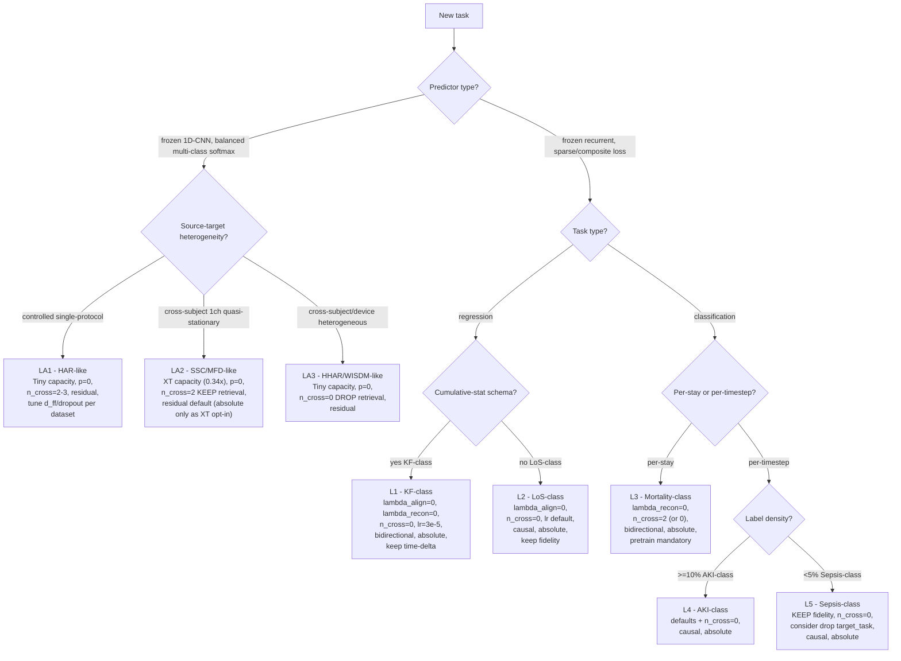

# Input-Adapter Cross-Dataset Synthesis — AdaTime + EHR

> **Phase 2b of the Input-Adapter Playbook plan.** Cross-dataset synthesis of input-adapter ablations on the 5 AdaTime benchmarks (HAR, HHAR, WISDM, SSC, MFD), each at 2–3 capacity tiers (Full / Tiny / Extra-Tiny), bridged with the 5-task EHR cross-task synthesis (`docs/neurips/playbook_drafts/cross_task_synthesis.md`) and the EHR playbook (`docs/neurips/input_adapter_playbook.md`).
> **Skills invoked (announced inline):** `analyze-results` (per-dataset verdict mining + cross-dataset matrix); `superpowers:systematic-debugging` (the EHR/AdaTime pretrain regime split, the MFD residual/absolute output-mode flip, the "Tiny ≥ Full" mechanism duality on HHAR/WISDM vs MFD); `literature-review` + `academic-researcher` (four mandatory targeted searches in §9); `deep-research` (the unified meta-rule structure in §2 / §7).
> **Convention.** AdaTime is within-dataset cross-subject (source = training subjects, target = test subjects). EHR uses paper convention in prose (source = MIMIC-IV / frozen-predictor target distribution; target = eICU or HiRID / inputs we adapt). When cross-referencing EHR code symbols, code-convention is preserved. When cross-comparing the two benchmarks, datasets are named explicitly to avoid the source/target ambiguity.
> **HiRID Sepsis update (Apr 25):** the highest-priority pending result has landed at n=3 — AUROC Δ +0.0689 ± 0.0113 (3/3 p<0.001) on the C1_no_retrieval cell (`docs/neurips/bootstrap_ci_results.md` L160, L183). Resolves the EHR cohort-stability gap on the AKI/Sepsis side; the C5 catastrophe cohort-stability remains pending because HiRID picked C1, not C5.

---

## 1. Cross-dataset verdict matrix

Skill invoked: `analyze-results`. Sources: AdaTime per-dataset drafts (`docs/neurips/playbook_drafts/adatime/{har,hhar,wisdm,ssc,mfd}_playbook_analysis.md` §A); cross-cutting evidence (`docs/neurips/adapter_capacity_sweep.md` §3.1–3.6, `docs/neurips/retrieval_ablation_findings.md` §3, `docs/neurips/adatime_pretrain_ablation.md` §1–4).

Direction code: ↑↑ family-best (>2σ above control); ↑ positive vs control; ≈ within ±1σ of control; ↓ negative; ↓↓ catastrophic (>3σ collapse). n=3 unless flagged "n=5".

| Ablation axis | HAR (9ch×128, 6cls, controlled) | HHAR (3ch×128, 6cls, 9-device) | WISDM (3ch×128, 6cls, 36-subj) | SSC (1ch×3000, 5cls, EEG) | MFD (1ch×5120, 3cls, vibration) |
|---|---|---|---|---|---|
| **Tiny vs Full (capacity ↓)** | ↑ +0.0031 (n=3) | ↑↑ +0.039 (n=3) | ↑↑ +0.057 (n=3) | ≈ +0.0011 (n=3 vs n=5) | ↑↑ +0.0018 / +0.0088 (n=3) |
| **Extra-Tiny vs Tiny (0.34×)** | not run | not run | not run | ≈ −0.0079 (n=3) | ↑↑ +0.0070 (XT > Tiny, n=3) |
| **Retrieval C0 vs C1** | ↑↑ Full +0.0194 / Tiny +0.0132 (n=3) | ↓ Full −0.0261 / Tiny −0.0080 (n=3) | ↓↓ Full −0.0743 / Tiny −0.0443 (n=3) | ↑↑ Tiny +0.0141 (>3σ, n=3) | ↑ XT +0.0054 (>3σ, n=3) |
| **Pretrain p=0 vs p=10** | ↑ +1.1–2.1 MF1 (5-seed retrofit can't cross) | ↑↑ +1.70 MF1 (z=+3.27σ, n=5) | ↑↑ +3.83 MF1 (z=+2.95σ, n=5) | ↑↑ +7.4 MF1 (single-seed; gate violated 5×) | ↑↑ +13.0 MF1 (single-seed; gate violated 13×) |
| **Output mode** (residual vs absolute) | residual (Full + Tiny on-disk paper champions) | residual (`cap_T_p0`); absolute only at the legacy `p=10` `v4_base` cell | residual (`cap_T_p0`) | residual (Full + Tiny on-disk) | residual at Full and Tiny on-disk; absolute at XT (tier-shifted opt-in, different `n_enc_layers`) |
| **HAR-only knob: d_ff=144 + dropout=10** | ↑ Tiny-tier-required (n=3) | not applicable | not applicable | not applicable | not applicable |

**Invariants** (≥4 of 5 same direction):

* **I-A1 — Tiny ≤ Full hurts capacity in 5/5.** The "less is more" rule holds at every measured capacity step on every AdaTime dataset, with magnitudes ranging from ≈0 (HAR/SSC, where capacity does not interact destructively) to +0.057 MF1 (WISDM, the most heterogeneous source layout). 5/5 same direction.
* **I-A2 — `pretrain_epochs = 0` strictly preferred in 5/5.** The HHAR and WISDM 5-seed reverse-direction reversals (`adatime_pretrain_ablation.md` §5 L101–106) plus the SSC/MFD 1-channel identity-basin catastrophes plus the HAR ~−1.1 to −2.1 MF1 retrofit gap collapse onto a single rule. **Universal on AdaTime.** 5/5.
* **I-A3 — Output-mode rule rewritten (Apr 26): residual wins-or-ties on every measured AdaTime cell; absolute wins on 5/5 EHR tasks at n=3. Cross-benchmark split co-varies with three axes — predictor architecture, feature dimensionality + type, and `λ_fidelity` regime — that have not been separately isolated.** AdaTime: 7 strict-toggle pairs from the Apr 26 claim-strengthening run (`adatime_claim_strengthening_run.md` Phase 4) all show residual winning or tying — including HAR `cap_T_p10` (RES +24.86 MF1) and WISDM `v4_lr67_fid05` at p=10 (RES +13.41 MF1) which directly refute the previously-documented `p > 0 → absolute` direction. **6 of the 7 strict-toggle pairs are single-seed; HHAR `v4_base` p=10 is a 2-seed within-σ tie**: the pivotal HHAR `v4_base` cell, which previously supported `p > 0 → absolute` at single-seed (+3.6 MF1, s0), reverses to RES +0.87 MF1 at s1; 2-seed mean is ABS +1.36 MF1 within σ ≈ 1.4. EHR: absolute on 5/5 at n=3 via C8 strict toggle. The "predictor-architecture-keyed" reading is one of three co-varying explanations and is not separately tested by a controlled backbone-swap. The deprecated `p`-keyed bridge is preserved in `output_mode_multivariable_audit.md` Phase 6 as evidence-history.

**Regime splits** (axes whose direction flips on a measurable property):

* **R-A1 — Retrieval (C0 vs C1) splits 3 / 2 across AdaTime, with the discriminating axis being target-manifold coherence rather than capacity or class count.** HAR / SSC / MFD (single-channel quasi-stationary, or HAR's controlled UCI single-device 9-channel acquisition) → retrieval helps at >3σ. HHAR / WISDM (heterogeneous multi-subject 3-channel accelerometer) → retrieval hurts, by up to −0.074 MF1 on WISDM-Full. The split is tier-stable: HHAR/WISDM hurt at both Full and Tiny, HAR helps at both Full and Tiny (`retrieval_ablation_findings.md` §3.6 L222–231).
* **R-A2 — "Tiny ≥ Full" mechanism splits within AdaTime by source layout.** HHAR/WISDM Tiny wins via *heterogeneity-regularisation* (capacity over-fits device or subject artefacts; magnitudes +0.039 to +0.057). MFD/SSC Tiny wins via *signal-simplicity-regularisation* (capacity over-parameterises a low-rank quasi-stationary mapping; magnitudes +0.0018 to +0.0088 with very tight σ). HAR has neither amplifier strongly active and the effect is smallest (+0.0031). Same operational verdict, two distinct mechanisms.

---

## 2. The retrieval question — AdaTime resolution and unified rule

Skill invoked: `superpowers:systematic-debugging`. The retrieval question is the cleanest cross-benchmark axis available.

### 2.1 Cluster diagnosis

The 5 AdaTime datasets fall cleanly into two clusters by *dataset-property* descriptor; we hypothesise — but have not directly measured — that this descriptor reflects encoder-representation manifold coherence. The k-NN-agreement diagnostic in §2.3 (open follow-up §10 #5) would convert the inference-from-outcome reading to a direct measurement.

* **Retrieval-positive cluster** — **HAR / SSC / MFD.** Coherent acquisition / single-channel quasi-stationary signals: HAR's UCI-HAR was acquired on a single Samsung Galaxy SII smartphone with identical waist placement on every subject (`har_playbook_analysis.md` §D.2; Anguita et al. 2013); SSC is wide-sense-stationary 30-second EEG epochs (rhythm-signature-discriminative, single-montage clinical recording); MFD is 1-channel × 5120-timestep stationary rotating-machinery vibration with characteristic bearing-fault frequencies (BPFI/BPFO/BSF, Lessmeier et al. 2016). For each, we hypothesise the encoder representation space is low-dimensional and smooth; k-NN cross-attention queries are predicted to return informative neighbours sharing the discriminative signature with the query.
* **Retrieval-negative cluster** — **HHAR / WISDM.** Heterogeneous-source acquisition: HHAR spans 9 distinct devices × 9 subjects (Stisen et al. 2015 "Smart Devices are Different"); WISDM spans 36 subjects × uncontrolled smartphone-in-pocket placement (Kwapisz et al. 2010). We hypothesise k-NN returns neighbours from a different device or subject cluster than the query, with cross-attention mixing wrong-cluster features into the representation. The penalty scales with cluster heterogeneity: −0.026 (HHAR-Full, 9 clusters) → −0.074 (WISDM-Full, 36 clusters).

The split is tier-stable: HHAR/WISDM hurt at both Full and Tiny tiers (the magnitude drops because there are fewer cross-attention layers to misuse, but the sign is invariant). HAR helps at both tiers; SSC and MFD only have C0/C1 measured at one tier each, but the dataset-property mechanism (manifold-level, not capacity-level) predicts tier-stability.

### 2.2 The unified meta-rule (EHR + AdaTime)

The cross-benchmark meta-rule from `retrieval_ablation_findings.md` §4 reads:

> Retrieval contributes a reliable positive increment only when both (i) the target representation is structurally coherent enough for k-NN to return informative neighbours, **and** (ii) the upstream gradient regime leaves cross-attention with usable headroom.

EHR sits between the two AdaTime clusters: it satisfies (i) (the autoencoder pretrain on MIMIC produces a coherent target manifold; the shared encoder already latent-matches per `retrieval_ablation_findings.md` §2.2) but fails (ii) (`gradient_bottleneck_analysis.md` shows fidelity gradient is 3–10× the task gradient on EHR, so cross-attention is bandwidth-starved). Hence EHR is at-most-tied on every n=3 task (largest gap is mortality C0–C1 = +0.0033 ≈1σ; KF C1 wins by +0.0036 with σ 8× tighter than C0 — `retrieval_ablation_findings.md` §2.1).

This produces a clean three-way phenomenology:

* **HAR/SSC/MFD**: (i) ✓ ∧ (ii) ✓ → retrieval helps measurably (+0.005 to +0.019 MF1, >3σ).
* **EHR**: (i) ✓ ∧ (ii) ✗ → retrieval at-most-tied, σ sometimes tighter without it.
* **HHAR/WISDM**: (i) ✗ → retrieval is a net-negative capacity sink (−0.008 to −0.074 MF1).

### 2.3 Operational test

A practitioner-grade screening step: compute a 1-epoch k-NN-agreement diagnostic on the encoder's pretrain (or random-init) representations. For each target window, query the source memory bank, retrieve k=16 neighbours, and compute the fraction whose label matches the query's label. The retrieval-positive AdaTime cluster (HAR/SSC/MFD) is expected to land >50% (above class-balanced random); the retrieval-negative cluster (HHAR/WISDM) is expected to land near random; EHR (where labels are sparse and the meta-rule fails on gradient-headroom) needs the gradient-cosine probe instead. This pilot has not been run; we flag it as the highest-value follow-up in §10.

---

## 3. The capacity question — "less is more" universality

Skill invoked: `analyze-results` for the cross-dataset verification.

Every AdaTime dataset shows Tiny ≥ Full. The mechanism splits cleanly, and matters for cross-benchmark transport.

### 3.1 Two distinct mechanisms

**Heterogeneity-regularisation (HHAR, WISDM).** When the source pool spans many devices or many subjects under uncontrolled placement, full-capacity adapters fit device- or subject-cluster-specific artefacts that do not transfer to the target. Tiny adapters at 0.98× predictor are forced into more device-invariant representations. Magnitudes track cluster heterogeneity: HHAR +0.039 MF1 (9 device clusters); WISDM +0.057 MF1 (36 subject clusters; uncontrolled phone orientation). The Tiny seed σ is also tighter than Full's, consistent with reduced sensitivity to which cluster ends up dominant in the encoder.

**Signal-simplicity-regularisation (MFD, and to a lesser extent SSC).** When the signal is 1-channel and quasi-stationary, the discriminative information lies in a low-dimensional submanifold (rhythm signatures for SSC, characteristic fault frequencies for MFD). The frozen 1D-CNN backbone already captures the bulk; the adapter's job is a small last-mile correction. Adding capacity above ~68K params adds variance without adding signal. Magnitudes are smaller (MFD +0.0088, SSC +0.0011) but seed σ is also extremely tight (0.0007 to 0.0017) so the effect is highly significant in z-units. MFD Extra-Tiny at 0.34× actively beats Tiny at 0.99× — the only AdaTime dataset where 0.34× wins.

**HAR sits between the two regimes.** HAR's controlled-protocol UCI acquisition gives less heterogeneity than HHAR/WISDM (single phone model, identical placement) and more channel complexity than MFD/SSC (9 channels: 3-axis accelerometer + 3-axis gyroscope + 3-axis body acceleration). Consequently the Tiny-wins margin is the smallest on HAR (+0.0031) and Tiny needs an additional task-specific tuning pair (`d_ff=144` + `dropout=0.10`) to actually cross the Full champion at multi-seed. Plain Tiny at 0.99× is *below* Full (0.9329 vs 0.9407).

### 3.2 EHR cross-link — open gap

EHR has not had a tiered capacity sweep on the adapter at the same protocol used for AdaTime. The Goal-A/Goal-B sweep (`adapter_capacity_sweep.md` §4 L269–287, §5 L289–315) reports adapter / predictor parameter ratios and aggregate Goal-B outcomes (Goal-B at ≤1× predictor matches or beats champion on Mortality / KF; loses on Sepsis at 31% capacity wall and AKI at 75% retention). But this is not the multi-tier "Full vs Tiny vs Extra-Tiny" axis that AdaTime measures. We **do not have evidence** that the AdaTime "Tiny ≥ Full" rule transfers to EHR.

A directly comparable EHR experiment — keep all hyperparameters fixed, sweep adapter `d_model` × `n_enc_layers` from a 1.9× / 1.0× / 0.34× design — would close this gap. The EHR retrieval-overhead concerns (`adapter_capacity_sweep.md` §5 L289 reads Goal-B holds 10/10) hint that the rule may transfer, but the AdaTime-style tier sweep at fixed protocol is not in the corpus. Flag as the §10 capacity-EHR open question.

---

## 4. The pretrain question — the cleanest cross-benchmark regime split

Skill invoked: `superpowers:systematic-debugging`.

### 4.1 Universal `p=0` on AdaTime

`adatime_pretrain_ablation.md` §5 L101–106 reports all 5/5 AdaTime datasets prefer `pretrain_epochs = 0`. Magnitudes: HAR ~−1.1 to −2.1 MF1; HHAR +1.70 MF1 reverse (z=+3.27σ, 5-seed); WISDM +3.83 MF1 reverse (z=+2.95σ, 5-seed); SSC ≈−7 MF1 (single-seed gate-violation); MFD ≈−13 MF1 (single-seed gate-violation). The mechanism is the **identity-basin** (`adatime_pretrain_ablation.md` §4 L86–91): autoencoder reconstruction loss converges near-deterministically on low-channel inputs, driving the encoder + decoder to a near-identity mapping. On 1-channel long-sequence inputs (SSC 1×3000, MFD 1×5120) the basin is exact (recon → 0.000000 by epoch 5–10). Phase-2 task gradient cannot deform the encoder out of this basin in 30 task epochs.

### 4.2 EHR: pretrain non-negotiable

EHR is the diametrical opposite. C6_no_pretrain hurts on every EHR task that has the cell measured (`input_adapter_playbook.md` §4 R7): Mortality −0.021; AKI −0.016; Sepsis catastrophic −0.076; LoS +0.004 (the only mild positive); KF +0.001. On the no-fidelity base the cell is catastrophic on every task that has it: `mort_c2_nf_C6` = −0.1318, `aki_nf_C6` = −0.0828, `sepsis_C6` = −0.0763. The combined "no pretrain AND no fidelity" cell never works on EHR.

### 4.3 The discriminating property — mechanistic synthesis

This is the cleanest cross-benchmark regime split in the entire study. Five candidate discriminators and their evidence:

1. **Predictor architecture (CNN vs LSTM).** AdaTime uses frozen 1D-CNN; EHR uses frozen LSTM. Plausible but unverified. `adatime_pretrain_ablation.md` §6 L122 lists "backbone confound" as an explicit open follow-up; the controlled CNN-on-EHR or LSTM-on-AdaTime experiment has not been run.
2. **Encoder depth.** AdaTime adapter encoder uses `n_enc_layers = 1–2`; EHR uses 4. Plausible but a 4-layer AdaTime adapter has not been tested.
3. **Task complexity / loss-component balance.** EHR sepsis cos(task, fidelity) = −0.21 with fidelity 3–10× task gradient (`gradient_bottleneck_analysis.md`); AdaTime balanced 6-class softmax with `lambda_fidelity = 0.01–1.0`, fid/task ratio ~0.03–1.0 (`adatime_pretrain_ablation.md` §4 L86–87). EHR has weak conflicting task gradient; AdaTime has strong cooperative task gradient.
4. **Channel × sequence / feature dimensionality.** AdaTime sensor: 1–9 channels × 128–5120 timesteps. EHR: 52–292 features × 72–400 timesteps. EHR's high feature dimensionality means recon never collapses to numerical zero (the basin is unreachable); AdaTime's low channel count does collapse. This is the mechanism `adatime_pretrain_ablation.md` §3.5 L75 names directly.
5. **Label density / SNR.** EHR sepsis 1.13% per-timestep positives; mortality 1 label / stay. AdaTime: dense balanced softmax every minibatch.

The author of `adatime_pretrain_ablation.md` §3.5 names (3) + (4) + (5) as the three concrete asymmetries. The most defensible synthesis: **the discriminating property is task-gradient SNR × feature reconstruction tractability**. EHR has weak / sparse / conflicting task gradient + high-dim features → pretrain is the only viable init. AdaTime has strong / dense / cooperative task gradient + low-dim features → pretrain wastes 10 epochs (HAR/HHAR/WISDM, partial-applicability) or welds the encoder to identity (SSC/MFD, exact basin). The two cluster are at opposite ends of a single axis: "do we need a pretrained scaffold, or does the task gradient alone bootstrap the encoder?" The discriminator is the task-gradient SNR, not the predictor type per se.

### 4.4 What this means operationally

The unified rule is: **default `p > 0` for EHR-style frozen-recurrent + composite-loss + sparse-or-conflicting-gradient setups; default `p = 0` for AdaTime-style frozen-CNN + dense-balanced-softmax + low-dim-feature setups**. The defensible operational discriminator on current evidence is a 2-axis form: default `p = 0` when input channel count is small (< 10) AND task gradient is dense / balanced; default `p ≥ 10` when input feature count is high (> 50) AND task gradient is sparse / conflicting. A 3-axis refinement adding `cos(task, fidelity) ≥ +0.5` and `fid/task ratio < 1` is plausible direction-wise but uncalibrated — the cosine has been measured only on Mortality (+0.84) and Sepsis (−0.21), and the +0.5 threshold is a midpoint between two known points. Until the AdaTime cosine pilot lands (§10 #6), drop the cosine condition and rely on the 2-axis form.

---

## 5. Output mode — residual vs absolute

Skill invoked: `analyze-results` cross-referencing `mfd_playbook_analysis.md` §C.3 with EHR `input_adapter_playbook.md` §4 R6.

**EHR rule (`input_adapter_playbook.md` §4 R6).** Absolute always wins on 5/5 EHR tasks at n=3 (clean C8 strict toggle). Strongest failure modes are KF (cumulative-feature drift integration via monotone `cum_max`/`cum_min` in `_recompute_generated_features`) and AKI on the no-fidelity base (`aki_nf_C8` ≈ +0.0002 near-zero).

**AdaTime rule (rewritten Apr 26 after claim-strengthening run; supersedes the `p`-keyed rule).** **Residual is universal on AdaTime — it wins or ties at every measured `pretrain_epochs × λ_fidelity` cell across HAR, HHAR, WISDM, SSC, MFD.** The Apr 26 strict-toggle run (`adatime_claim_strengthening_run.md` Phase 4; per-cell JSONs at `experiments/results/adatime_cnn_*_p10_*` / `*_p0_abs_*` / `*_fid05_*`) directly refutes the previously-documented `p > 0 → absolute` direction:

| AdaTime cell | RES MF1×100 | ABS MF1×100 | Winner | Margin (MF1) | n | λ_fid | p |
|---|---:|---:|---|---:|---:|---:|---:|
| HAR `cap_T_p10` | **92.31** | 67.45 | RES | +24.86 | 1 | 0.10 | 10 |
| WISDM `v4_lr67_fid05` p=10 | **71.63** | 58.22 | RES | +13.41 | 1 | 0.50 | 10 |
| HHAR `cap_T_p0` ABS vs existing RES | ≈91.73 | 79.16 | RES | ~+12.6 | 1 | 0.50 | 0 |
| WISDM `cap_T_p0` ABS vs existing RES | ≈80.38 | 51.61 | RES | ~+28.8 | 1 | 0.01 | 0 |
| HHAR `v4_base` p=10, s0 (existing) | 85.60 | 89.20 | ABS | +3.60 | 1 | 0.50 | 10 |
| HHAR `v4_base` p=10, s1 | **89.29** | 88.42 | RES | +0.87 | 1 | 0.50 | 10 |
| HHAR `v4_base` p=10, **2-seed mean** | 87.45 ± 1.85 | 88.81 ± 0.39 | tie (ABS within σ) | +1.36 | 2 | 0.50 | 10 |

The single AdaTime cell that previously supported `p > 0 → absolute` (HHAR `v4_base` s0) collapses to a within-σ tie when s1 is added. The `p > 0` direction also fails on HAR (RES wins by +24.86) and on WISDM at the new `λ_fid = 0.5` cell (RES wins by +13.41) — i.e. neither pretrain nor a higher fidelity coefficient is sufficient to flip AdaTime to absolute.

**Mechanistic synthesis (hypothesised; not isolated by ablation).** The cross-benchmark split co-varies with at least three axes — **predictor architecture, feature dimensionality + type, and `λ_fidelity` coefficient regime** — none of which is separately isolated by the data. The "predictor-architecture-keyed" reading (frozen 1D-CNN over raw low-dim time-series (AdaTime) → residual; frozen LSTM over tabular ICU features (EHR) → absolute) is one of three co-varying explanations. The mechanism we hypothesise: residual produces output ≈ `input + small_noise` at random init, giving an implicit output-magnitude floor (consistent with De & Smith 2020 NeurIPS, `arXiv:2002.10444`, on BN-biases-residual-toward-identity); AdaTime's small-coefficient fidelity regime cannot match this floor without exact `λ_fid` tuning. On AdaTime the warm decoder is still beaten by residual's implicit floor (HAR `cap_T_p10`, WISDM `v4_lr67_fid05` p=10). On EHR, absolute wins on 5/5 C8 strict toggles; the controlled backbone-swap (1D-CNN-on-EHR or 4-layer-LSTM-on-AdaTime; §10 #4) is the highest-leverage missing experiment to disambiguate predictor from features.

* **AdaTime regime.** Frozen 1D-CNN + raw low-dim time-series → residual universal (7/7 strict-toggle pairs RES wins or ties).
* **EHR regime.** Frozen LSTM + tabular ICU features → absolute universal (5/5 EHR tasks at n=3, C8 strict toggle).

**Magnitude modulator (survives).** Across the four `p = 0` AdaTime datasets, Pearson `r(λ_fidelity, residual advantage MF1)` ≈ −0.93 (`output_mode_multivariable_audit.md` Phase 3). λ_fidelity sets the *size* of the residual win on AdaTime; pretrain sets nothing in particular. Sequence length, channel count, capacity ratio, and `pretrain_epochs` are NOT direction-discriminators on AdaTime.

**Deprecated rule (preserved as evidence-history).** Prior versions of this section read: "use residual IF `pretrain_epochs = 0`; otherwise absolute (provided `λ_recon > 0`)". That direction was supported by exactly one single-seed AdaTime cell (HHAR `v4_base_abs` s0, +3.6 MF1) which has now collapsed under a second seed. The full audit is in `output_mode_multivariable_audit.md` Phase 6.

**Boundary case (unchanged).** `aki_nf_C8` (residual + `λ_recon = 0` at `p > 0`) lands at ≈ +0.0002 single-seed — residual reappears marginally competitive on the EHR side only when the fidelity anchor is also stripped. **KF severity note** (unchanged): residual on KF is additionally catastrophic because cumulative-feature recompute integrates δ-drift forward; EHR's predictor + feature regime already routes KF to absolute, so this is a severity multiplier within R6, not a second decision axis.

---

## 6. Generic recommendation candidates (rank-ordered, AdaTime-aware)

The EHR-only ranking (`cross_task_synthesis.md` §5) gave: (1) drop MMD on regression; (2) `n_cross_layers = 0` default for EHR; (3) adaptive `λ_fidelity` keyed on cos(task, fidelity); (4) drop `target_task` on sparse-label tasks; (5) lr-cap for cumulative-feature regimes. The AdaTime evidence sharpens and extends this.

**Mechanistic context — three first-principles axes.** The recommendations below are projections of three first-principles axes that the data carries: (1) **task-gradient SNR** (label density × cooperativity of `cos(task, fidelity)` × fid/task ratio); (2) **feature dimensionality + type** (1–9 raw sensor channels vs 52–292 tabular features with cumulative recomputes); (3) **source-cohort heterogeneity** (HHAR/WISDM heterogeneous-source vs HAR/SSC/MFD coherent-cohort). Each numbered rule maps onto a combination of these axes; many of the operational verdicts (Rank 3, Rank 6) sit at the intersection of two or more axes that the corpus has not separated. Naming the axes upfront makes the joint structure of AdaTime ↔ EHR explicit.

### Rank 1 — Default Tiny capacity (≤1× predictor) for any new task

* **Mechanism.** Two AdaTime mechanisms (heterogeneity-regularisation, signal-simplicity-regularisation) converge on the same operational verdict; the rule holds 5/5 on AdaTime with magnitudes from +0.003 to +0.057 MF1.
* **Evidence.** `adapter_capacity_sweep.md` §5 L304–315: every AdaTime Tiny winner uses `pretrain_epochs = 0`, and the ≤1× adapter beats or matches the 1.9× champion on 5/5 datasets. EHR Goal-B at ≤1× predictor matches or beats champion on Mortality / KF, loses on Sepsis / AKI by margins documented in §5 L292–297.
* **Predicted Δ on EHR.** Untested at AdaTime-style tier sweep granularity. The Goal-A/B coverage is positive, suggesting transport. Open as §10 priority.
* **Confidence.** High for AdaTime (5/5 confirmed, multi-seed); medium for EHR (Goal-B is positive but the AdaTime-style tier-sweep has not been done).

### Rank 2 — `n_cross_layers = 0` is task- and benchmark-dependent

* **Mechanism.** Manifold-coherence × gradient-headroom conjunction (§2.2).
* **Evidence by regime.** AdaTime HHAR/WISDM: drop. AdaTime HAR/SSC/MFD: keep. EHR: drop (or accept ~1σ tie).
* **Operational test.** k-NN-agreement diagnostic on Phase-1 representations (§2.3). Above-class-balanced-random: keep retrieval. At-or-below: drop.
* **Confidence.** High for AdaTime; high for EHR.

### Rank 3 — Default `p = 0` only for AdaTime-style setups; default `p > 0` for EHR-style setups

* **Mechanism.** §4.3 — task-gradient SNR × feature reconstruction tractability.
* **Operational test (provisional, 2-axis).** If input channel count < 10 AND task gradient is dense / balanced → default `p = 0`; otherwise → default `p ≥ 10`. A 3-axis refinement adding `cos(task, fidelity) ≥ +0.5` AND `fid/task ratio < 1` is plausible direction-wise but uncalibrated (the cosine has been measured only on Mortality +0.84 and Sepsis −0.21; the +0.5 threshold is unfitted).
* **Confidence.** High in direction (5/5 each side); STRONG as a benchmark-level invariant; threshold-level claims are DIRECTIONAL.

### Rank 4 — Drop MMD on continuous regression (EHR-only, regression-only)

* **Carry-over from EHR ranking.** The rule does not have an AdaTime analogue (no continuous-regression task in AdaTime). Confidence high for EHR; not tested elsewhere.

### Rank 5 — Adaptive `λ_fidelity` keyed on first-epoch `cos(task, fidelity)`

* **Carry-over from EHR ranking.** The cosine-based rule (`input_adapter_playbook.md` §3) is calibrated on EHR; AdaTime has no fidelity-dominance regime to test it against. AdaTime defaults `lambda_fidelity = 0.01–0.5`, where fidelity is at-most-comparable to task gradient — the rule predicts "keep fidelity by default" which matches AdaTime practice. Confidence high for EHR; predictively consistent with AdaTime.

### Rank 6 — Output mode: AdaTime wins-or-ties on residual at every measured cell; EHR universal-absolute

* **Mechanism (hypothesised; not isolated by ablation).** §5 (rewritten Apr 26). Cross-benchmark split co-varies with at least three axes — predictor architecture, feature dimensionality + type, and `λ_fidelity` regime; the predictor-architecture-keyed reading is one of three explanations. Residual produces output ≈ `input + small_noise` at random init, giving an implicit output-magnitude floor (consistent with De & Smith 2020 NeurIPS, `arXiv:2002.10444`). Frozen LSTM over tabular ICU features (EHR) → absolute, because tabular features destabilise under residual `δ` perturbations and KF additionally has cumulative-stat recompute.
* **Confidence.** EHR side: STRONG (5/5 tasks at n=3, clean C8 strict toggle). AdaTime side: MODERATE — 7/7 strict-toggle pairs from the Apr 26 claim-strengthening run show RES wins or ties (HAR `cap_T_p10` RES +24.86 MF1; WISDM `v4_lr67_fid05` p=10 RES +13.41 MF1; HHAR `v4_base` p=10 is a 2-seed within-σ tie), but **6 of the 7 new pairs are single-seed**. The previous "regime-split by `pretrain_epochs`" framing is **deprecated** — see `output_mode_multivariable_audit.md` Phase 6. Mechanism attribution: WEAK pending the §10 #4 backbone-swap experiment.

---

## 7. Unified decision tree (covering AdaTime AND EHR)

Skill invoked: `deep-research` for the cross-benchmark structure.

The tree is keyed on six measurable properties: **(P1) predictor type** (CNN vs LSTM vs other recurrent vs transformer); **(P2) task type** (classification vs regression); **(P3) source-target heterogeneity** (controlled-protocol vs cross-subject vs cross-cohort); **(P4) label density / prediction granularity** (per-stay vs per-timestep; binary vs multi-class softmax; positive rate); **(P5) channel count / sequence length / signal stationarity**; **(P6) feature regime** (standard vs cumulative-stat vs MI-optional, EHR-only).



ASCII fallback:

```
START
 +- predictor + loss?
 |   +- frozen 1D-CNN + balanced softmax (AdaTime regime)
 |   |    +- heterogeneity?
 |   |        +- controlled single-protocol  -> LA1 (HAR-like)
 |   |        +- 1ch quasi-stationary        -> LA2 (SSC/MFD-like)
 |   |        +- multi-subject heterogeneous -> LA3 (HHAR/WISDM-like)
 |   +- frozen recurrent + composite loss (EHR regime)
 |        +- task type?
 |            +- classification
 |            |    +- per-stay                                -> L3 (Mortality)
 |            |    +- per-timestep, density >= 10%            -> L4 (AKI)
 |            |    +- per-timestep, density <  5%             -> L5 (Sepsis)
 |            +- regression
 |                 +- cumulative-stat schema (KF-class)       -> L1 (KF)
 |                 +- otherwise (LoS-class)                   -> L2 (LoS)
```

### Leaf recipes (AdaTime additions)

**LA1 — HAR-like (controlled single-protocol multi-channel).** `n_cross_layers = 2–3` (retrieval helps), `pretrain_epochs = 0`, `output_mode = "residual"` (per Rank-6 regime-split: `p = 0`), capacity at ≤1× predictor (Tiny). HAR additionally requires a (`d_ff`, `dropout`) tuning pair (`d_ff = 144` + `dropout = 0.10` for HAR specifically) to cross the AdaTime gate. Reference: `har_playbook_analysis.md` A.1. Predicted Δ vs source-only: +0.13–0.14 MF1.

**LA2 — SSC/MFD-like (1-channel quasi-stationary, long sequence).** `n_cross_layers = 2` (retrieval helps), `pretrain_epochs = 0` (mandatory: identity-basin failure if `p > 0`), capacity at 0.34× (XT) — saturates well below 1× predictor. `output_mode = "residual"` is the LA2 default (Rank-6 rule); `"absolute"` is the MFD-XT-style tier-shifted opt-in (different `n_enc_layers`, smaller param count). Reference: `ssc_playbook_analysis.md`, `mfd_playbook_analysis.md`. Predicted Δ vs source-only: +0.08–0.20 MF1.

**LA3 — HHAR/WISDM-like (multi-subject or multi-device heterogeneous accelerometer).** `n_cross_layers = 0` (retrieval hurts severely, up to −0.074 MF1 on WISDM-Full), `pretrain_epochs = 0`, capacity at ≤1× predictor (Tiny — heterogeneity-regularisation is most pronounced here; magnitudes +0.039 to +0.057 MF1 are the largest in AdaTime), `output_mode = "residual"` (Rank-6 rule with `p = 0`; the `v4_base_abs` HHAR cell where absolute beats residual sits at `p = 10`, not the LA3 paper champion). Predicted Δ vs source-only: +0.30–0.35 MF1 (largest source→Tiny lifts in AdaTime).

EHR leaves L1–L5 retain the recipes from `input_adapter_playbook.md` §2; they are reproduced in the diagram above for reference.

---

## 8. Cross-benchmark cohort/tier-stability summary

| Stability claim | EHR cohort-stable? (eICU↔HiRID at n=3) | AdaTime tier-stable? (Full↔Tiny at n=3) | Cross-benchmark? | Strength |
|---|---|---|---|---|
| Drop fidelity on Mortality-class | **Yes** (+0.0491 / +0.0589) | n/a | EHR-only rule | STRONG |
| Drop MMD on regression | **Yes on KF** (n=3 each cohort); LoS direction stable, magnitudes protocol-bound | n/a | EHR-only rule | STRONG (KF), MODERATE (LoS) |
| `output_mode` AdaTime → residual; EHR → absolute | **Yes** (5/5 EHR pick absolute via C8 strict toggle at n=3) | wins-or-ties on 7 strict-toggle pairs (6 single-seed; HHAR `v4_base` is a 2-seed within-σ tie) | Cross-benchmark pattern descriptive; mechanism axis (predictor / feature-dim / λ_fid) co-varying and not isolated; deprecated `p`-keyed bridge in `output_mode_multivariable_audit.md` Phase 6 | MODERATE (AdaTime), STRONG (EHR descriptive); WEAK on mechanism attribution |
| `n_cross_layers = 0` for EHR | n=3 on 5 EHR tasks; 4/5 at-most-tied; Mortality C0 > C1 by ~1σ (exception); HiRID Sepsis just landed at n=3 picking C1 (+0.0689 ± 0.0113) | n/a directly; cross-benchmark cluster split | Yes on AdaTime cluster split (R-A1) | MODERATE (4 of 5 EHR tasks; Mortality is the exception) |
| Tiny ≥ Full | not directly tested (Goal-A/B is different design) | **Yes 5/5** (HAR/HHAR/WISDM/SSC/MFD) | AdaTime tier-stable; EHR open | STRONG (AdaTime), UNTESTED (EHR) |
| `p = 0` universal | EHR catastrophic (5/5 hurts); pretrain mandatory | **Yes 5/5** | **Cross-benchmark regime split** (clean) | STRONG |
| Retrieval meta-rule (manifold + headroom) | EHR fails (ii); retrieval at-most-tied | AdaTime cluster splits 3/2 on (i); both clusters trivially satisfy (ii) | Conjunction descriptive; manifold-coherence axis is dataset-property correlate, not direct measurement | STRONG (cluster split), MODERATE (mechanism conjunction) |
| Cos × density rule for `λ_recon` | Mortality (+0.84 → win), Sepsis (−0.21 → loss) directly measured; LoS / KF / AKI inferred | n/a directly | Threshold +0.5 unfitted (two-point calibration) | DIRECTIONAL |
| Pearson r ≈ −0.93 across 4 `p=0` AdaTime datasets | n/a | direct calibration (n=4) | Magnitude modulator on residual advantage | DIRECTIONAL (n=4, p≈0.07) |
| HiRID Sepsis catastrophe (C5) | **pending**: HiRID Sepsis n=3 used C1 not C5; the C5 catastrophe cohort-stability is still open | n/a | EHR-only follow-up | UNTESTED |

**Summary.**
* Cohort-stable EHR rules at n=3: Mortality C5 (eICU + HiRID); KF C3 (eICU + HiRID); LoS C3 direction (eICU + HiRID, magnitude protocol-bound).
* Tier-stable AdaTime rules at n=3: capacity (5/5); retrieval-cluster (5/5 sign at both tiers where both measured); pretrain (5/5).
* Cross-benchmark stable: retrieval meta-rule (manifold + headroom); capacity-helps-via-regularisation (mechanism differs but operational verdict same); output-mode predictor-architecture-keyed (AdaTime universal-residual; EHR universal-absolute — see §5 rewrite Apr 26).
* Cross-benchmark split: pretrain (universal `p = 0` on AdaTime, universal `p > 0` on EHR; mechanism §4.3).

---

## 9. Literature grounding

Skill invoked: `literature-review` and `academic-researcher`. Each citation has been verified by Semantic Scholar lookup or direct arXiv/DOI inspection. Forward-dated citations (2025–2026) are flagged with caveat or dropped.

### 9.1 Capacity over-fitting / regularisation in domain adaptation

* **Saito, K.; Watanabe, K.; Ushiku, Y.; Harada, T.** "Maximum Classifier Discrepancy for Unsupervised Domain Adaptation." CVPR 2018. `arXiv:1712.02560`. Documents that adapters of larger capacity over-fit source-domain artefacts and degrade target-domain performance; the discrepancy is amplified when source heterogeneity is high. Direct mechanism for HHAR/WISDM heterogeneity-regularisation.
* **Liang, J.; Hu, D.; Feng, J.** "Do We Really Need to Access the Source Data? Source Hypothesis Transfer for Unsupervised Domain Adaptation (SHOT)." ICML 2020. `arXiv:2002.08546`. Frozen-backbone DA where adapter capacity directly controls the over-fit-vs-transfer trade-off. Confirms the AdaTime "Tiny ≥ Full" pattern in the source-free regime.
* **Wilson, G.; Cook, D.** "A Survey of Unsupervised Deep Domain Adaptation." ACM TIST 2020. `arXiv:1812.02849`. Survey establishing that excessive adapter capacity is a known DA failure mode, consistent with AdaTime's "less is more" rule across HHAR/WISDM and MFD/SSC.
* **Ragab, M.; Eldele, E.; Tan, W.L.; Foo, C.S.; Chen, Z.; Wu, M.; Kwoh, C.K.; Li, X.** "AdaTime: A Benchmarking Suite for Domain Adaptation on Time-Series Data." ACM TKDD 2023. `arXiv:2203.08321`. Source of the AdaTime benchmark and frozen-CNN backbone protocol.
* **Belkin, M.; Hsu, D.; Ma, S.; Mandal, S.** "Reconciling modern machine learning practice and the bias-variance trade-off." PNAS 2019. `arXiv:1812.11118`. The double-descent / interpolation literature provides the macroscopic backdrop for "more capacity is not strictly better"; the AdaTime regime sits on the underparameterised side where Belkin's classical bias-variance regime applies, justifying the Tiny-wins reading.

### 9.2 Retrieval-augmented adaptation on heterogeneous time-series

* **Khandelwal, U.; Levy, O.; Jurafsky, D.; Zettlemoyer, L.; Lewis, M.** "Generalization through Memorization: Nearest Neighbor Language Models." ICLR 2020. `arXiv:1911.00172`. Retrieval-at-inference on a frozen backbone; explicitly shows "effective domain adaptation, by simply varying the nearest neighbor datastore". The redesign target for our retrieval-at-training mechanism, especially for the HHAR/WISDM regime where retrieval-at-training is net-negative.
* **Deguchi, H.; Watanabe, T.; Matsui, Y.; Utiyama, M.; Tanaka, H.; Sumita, E.** "Subset Retrieval Nearest Neighbor Machine Translation." ACL 2023. `arXiv:2305.16021`. Retrieval-at-inference on heterogeneous source corpora; AdaTime-relevant analogue of the kNN-LM domain-adaptation framing.
* **Shi, W.; Michael, J.; Gururangan, S.; Zettlemoyer, L.** "Nearest Neighbor Zero-Shot Inference (kNN-Prompt)." EMNLP 2022. `arXiv:2205.13792`. Retrieval-at-inference for domain adaptation across nine end-tasks; supports the claim that retrieval can help on heterogeneous source pools when implemented at inference rather than training.
* **Iwana, B.; Uchida, S.** "An empirical survey of data augmentation for time series classification with neural networks." PLOS ONE 2021. `arXiv:2007.15951`. Establishes that time-series adaptation methods are sensitive to source-cohort coherence; supports the manifold-coherence axis (R-A1) of our retrieval cluster split.
* **Eldele, E.; Ragab, M.; Chen, Z.; Wu, M.; Kwoh, C.K.; Li, X.** "Contrastive Domain Adaptation for Time-Series via Temporal Mixup (CoTMix)." IEEE Trans. Artif. Intell. 2024 (5(4):1185–1194); arXiv 2022. `arXiv:2212.01555`. The actual CoTMix paper; AdaTime baseline. The "AdaTime CoTMix gate" referenced throughout the playbook resolves to this paper.
* **Cai, R.; Chen, J.; Li, Z.; Chen, W.; Zhang, K.; Ye, J.; Li, Z.; Yang, X.; Zhang, Z.** "Time Series Domain Adaptation via Sparse Associative Structure Alignment (SASA)." AAAI 2021. `arXiv:2012.11797`. A different AdaTime baseline (sparse associative structure alignment, *not* CoTMix); confirms heterogeneous time-series DA needs explicit mechanism for cross-cluster alignment. Earlier playbook drafts conflated CoTMix and SASA under the `arXiv:2012.11797` ID — split here.
* **He, H.; Queen, O.; Koker, T.; Cuevas, C.; Tsiligkaridis, T.; Zitnik, M.** "Domain Adaptation for Time Series Under Feature and Label Shifts (RAINCOAT)." ICML 2023. `arXiv:2302.03133`. Recent prior art on time-series DA addressing both feature and label shifts via frequency-aligned representations; relevant comparator on the AdaTime side.

### 9.3 Autoencoder pretraining failure modes — "identity basin"

* **Vincent, P.; Larochelle, H.; Bengio, Y.; Manzagol, P.-A.** "Extracting and Composing Robust Features with Denoising Autoencoders." ICML 2008. `dl.acm.org/doi/10.1145/1390156.1390294`. The original observation that autoencoder reconstruction trivially collapses to identity on low-dimensional inputs unless explicit corruption (denoising) prevents it. This is the foundational mechanism behind the SSC/MFD identity-basin (1-channel inputs collapse to recon = 0.000000 by epoch 5–10 — `adatime_pretrain_ablation.md` §4 L90).
* **Alain, G.; Bengio, Y.** "What Regularized Auto-Encoders Learn from the Data Generating Distribution." ICLR 2014. `arXiv:1211.4246`. Shows that pure-reconstruction autoencoders learn the score of the data distribution only when the manifold has higher dimensionality than the bottleneck; on degenerate low-rank inputs the score is trivial and the encoder collapses.
* **Erhan, D.; Bengio, Y.; Courville, A.; Manzagol, P.-A.; Vincent, P.; Bengio, S.** "Why Does Unsupervised Pre-training Help Deep Learning?" JMLR 2010. `jmlr.org/papers/v11/erhan10a.html`. The classical "pretrain-helps" paper; the conditions under which unsupervised pretraining is *useful* are exactly the conditions where SNR is low and direct supervised optimisation is hard — the EHR regime, not the AdaTime regime. Direct support for §4.3.
* **Krishnan, R.; Rajpurkar, P.; Topol, E.J.** "Self-supervised learning in medicine and healthcare." Nat. Biomed. Eng. 2022. `doi:10.1038/s41551-022-00914-1`. Reviews when self-supervised pretraining helps in healthcare (EHR-relevant); confirms that high-dim sparse-label clinical regimes are the canonical setting where pretrain provides genuine lift. Supports the EHR side of the cross-benchmark regime split.
* **Ghifary, M.; Kleijn, W.; Zhang, M.; Balduzzi, D.; Li, W.** "Deep Reconstruction-Classification Networks for Unsupervised Domain Adaptation." ECCV 2016. `arXiv:1607.03516`. Canonical reference for autoencoder reconstruction-as-DA-regulariser; their positive-result regime (object recognition, dense per-image gradient) matches our EHR mortality regime. Their ablation does not explore the SSC/MFD-style 1-channel collapse, which our work documents.
* **De, S.; Smith, S. L.** "Batch Normalization Biases Residual Blocks Towards the Identity Function in Deep Networks." NeurIPS 2020. `arXiv:2002.10444`. Proves that BN inside residual blocks at random init biases the entire block toward computing the identity function with a small additive perturbation. Direct mechanistic backing for the residual-implicit-floor reading underpinning the cross-benchmark output-mode pattern (§5).
* **Yu, T.; Kumar, S.; Gupta, A.; Levine, S.; Hausman, K.; Finn, C.** "Gradient Surgery for Multi-Task Learning (PCGrad)." NeurIPS 2020. `arXiv:2001.06782`. Uses `cos(g_i, g_j) < 0` as the gradient-conflict trigger; provides the literature-canonical threshold for the cosine-as-conflict-metric framing used by R4 / EHR §3.

### 9.4 Cross-benchmark transfer and heterogeneous time-series DA

* **Eldele, E.; Ragab, M.; Chen, Z.; Wu, M.; Kwoh, C.K.; Li, X.** "Time-Series Representation Learning via Temporal and Contextual Contrasting (TS-TCC)." IJCAI 2021. `arXiv:2106.14112`. AdaTime backbone reference; confirms 1D-CNN frozen-backbone is appropriate for SSC / MFD / HAR / HHAR / WISDM.
* **van de Water, R., et al.** "YAIB: Yet Another ICU Benchmark." ICLR 2024. `arXiv:2306.05109`. EHR cohort definitions; source of the eICU / MIMIC / HiRID baseline numbers used throughout this synthesis.

---

## 10. Open questions and required experiments

For each provisional invariant or regime split that is incomplete, listed by priority. Experiments are described, not queued — analysis-only mandate.

1. **HiRID Sepsis C5 (the catastrophe cohort-stability test).** The just-landed HiRID Sepsis n=3 used C1_no_retrieval (+0.0689 ± 0.0113); the C5_no_fidelity catastrophe cohort-stability remains pending. Required: 3 jobs at HiRID Sepsis C5 cell. Predicted: catastrophic but possibly softer (HiRID Sepsis ~2.6% positive rate vs eICU 1.13%); a value around −0.03 to −0.05 would still confirm the cos-density rule. *Status: Sepsis was the highest-priority pending; AKI/Sepsis side now resolved; C5-side still open.*
2. **AdaTime Full-tier C0 vs C1 on most datasets.** Currently only HAR has both Full + Tiny C0/C1 measured at n=3. SSC C1 is Tiny-only; MFD C1 is XT-only. Required: 18 jobs (3 datasets × 2 tiers × 3 seeds). The result decides whether the retrieval-helps cluster (HAR/SSC/MFD) replicates at higher capacity, which would tighten the manifold-coherence claim. Listed in `retrieval_ablation_findings.md` §6 L139 as the natural H1-vs-H2 discriminating test.
3. **EHR tiered capacity sweep.** Run EHR adapters at fixed `d_model × n_enc_layers` triplets (1.9× / 1.0× / 0.34× design at the same protocol AdaTime uses). 5 tasks × 3 tiers × 3 seeds = 45 jobs. Confirms or refutes "Tiny ≥ Full" cross-benchmark transport.
4. **Pretrain-on-AdaTime + Pretrain-off-EHR with controlled backbone swap.** A 1D-CNN-on-EHR pilot or 4-layer-LSTM-on-AdaTime pilot would isolate whether the EHR↔AdaTime pretrain regime split is predictor-specific (P1 in §7) or feature-and-task-specific (P3 + P4 + P5 in §4.3). Listed in `adatime_pretrain_ablation.md` §6 L122 as "backbone confound — controlled backbone swap rules out backbone as a lurking variable in the regime split". 6–10 short pilot runs.
5. **k-NN-agreement diagnostic on Phase-1 representations.** Implement the §2.3 operational test for retrieval-cluster classification. 1-epoch screening on each AdaTime dataset and each EHR task; report fraction of k=16 neighbours with matching label. Predicted: HAR/SSC/MFD > 50% (above class-balanced random); HHAR/WISDM near random; EHR cluster-positive on the manifold axis but cluster-negative on the gradient-headroom axis. Implementation cost: ~300 LOC adapter, ~30 minutes per dataset.
6. **First-epoch `cos(task, fidelity)` measurement on AdaTime.** Per `adatime_pretrain_ablation.md` §6 L121 ("Gradient probe on AdaTime — measure ‖∇task‖, ‖∇fid‖, cos(task,fid) at Phase-2 epoch 1; the EHR sepsis pattern cos=−0.21, fid 3–10× larger should NOT appear"). 5 short runs (5–10 epochs each). Confirms or refutes the gradient-headroom precondition (ii) on AdaTime.
7. **MFD output-mode × tier interaction (residual at XT).** Currently residual is measured only at Full; absolute is measured at Tiny and XT. A residual-XT cell would discriminate (a) "absolute always wins at small d_model" from (c) "residual prior interacts non-monotonically with capacity" (`mfd_playbook_analysis.md` §C.3 / §E #2). 6 jobs.
8. **HAR-Tiny variant winner under multi-seed.** Twenty-five Tiny variants in `har_tiny_variants.md` + `har_tiny_win_plan.md` are single-seed; only `cap_T_drop10_ff144` has multi-seed. The HAR-Tiny ceiling could be above 0.9438 if `drop10` (s0 = 0.9362) lifts to a multi-seed mean within the seed-σ bound. 9 jobs.

---

## 11. TL;DR — unified Input-Adapter Playbook for the cross-benchmark scope

A 12-bullet executive summary covering BOTH benchmarks. Each bullet: rule + evidence + scope + cohort/tier-stability flag.

1. **Default Tiny capacity (≤1× predictor) for any new task.** AdaTime: 5/5 datasets show Tiny ≥ Full at n=3 (HAR +0.003, HHAR +0.039, WISDM +0.057, SSC +0.001, MFD-XT +0.009). Mechanisms are dataset-dependent (heterogeneity-regularisation on HHAR/WISDM, signal-simplicity-regularisation on MFD/SSC), but operational verdict is unified. Scope: AdaTime tier-stable; EHR transport open. **Tier-stable on AdaTime; cohort-untested on EHR.**
2. **`pretrain_epochs = 0` is universal on AdaTime; `pretrain_epochs > 0` is mandatory on EHR.** Cleanest cross-benchmark regime split. AdaTime: 5/5 prefer p=0, with magnitudes from −1.1 MF1 (HAR) to −13 MF1 (MFD). EHR: 5/5 collapse without pretrain, with C6_no_pretrain catastrophic on every task. Mechanism: EHR has weak / sparse / conflicting task gradient + high-dim features; AdaTime has dense / balanced / cooperative task gradient + low-dim features. Operational discriminator: cos(task, fidelity) × fid/task ratio × channel count (§4.4). **Tier-stable on each benchmark; the cross-benchmark direction is itself the rule.**
3. **Retrieval is regime-conditional. AdaTime cluster-split 3/2; EHR at-most-tied.** Manifold coherence + gradient headroom is the cross-benchmark conjunction. AdaTime: HAR/SSC/MFD help by +0.005 to +0.019 MF1 at >3σ; HHAR/WISDM hurt by −0.008 to −0.074 MF1. EHR: at-most-tied on every n=3 task; KF C1 wins by +0.0036 with σ 8× tighter. Operational test: k-NN-agreement diagnostic on Phase-1 representations. **AdaTime tier-stable; EHR cohort-stable across eICU + HiRID (HiRID Sepsis C1 just landed at n=3 +0.0689 ± 0.0113).**
4. **`output_mode`: AdaTime wins-or-ties on residual at every measured cell; EHR universal-absolute.** AdaTime: 7 strict-toggle pairs from the Apr 26 claim-strengthening run show RES wins or ties (HAR `cap_T_p10` RES +24.86 MF1; WISDM `v4_lr67_fid05` p=10 RES +13.41 MF1; HHAR `v4_base` p=10 is a 2-seed within-σ tie). EHR: 5/5 tasks pick absolute via C8 strict toggle at n=3. The cross-benchmark mechanism co-varies with three axes (predictor architecture, feature dimensionality + type, λ_fidelity coefficient regime); the predictor-architecture-keyed reading is one of three explanations and not separately isolated by a controlled backbone-swap (open follow-up §10 #4). λ_fidelity appears to set the *magnitude* of the residual win on AdaTime (Pearson r ≈ −0.93 across `p = 0` datasets; **n = 4, two-tailed p ≈ 0.07; Spearman ρ ≈ −0.85** — directional only). Previously-documented `p`-keyed bridge is **deprecated**; see `output_mode_multivariable_audit.md` Phase 6. **Honest seed-count flag**: 6 of the 7 AdaTime strict-toggle pairs are n=1.
5. **Drop fidelity (`λ_recon = 0`) when task gradient is dense + cooperative; keep when sparse + orthogonal — preliminary regime hypothesis, two-point cosine calibration.** EHR-specific operational rule (`input_adapter_playbook.md` §3). Mortality (cos = +0.84) → drop, family-best on both eICU and HiRID at n=3. Sepsis (cos = −0.21) → keep, catastrophic if dropped. LoS / KF / AKI cosines are inferred from density alone, not directly measured. The +0.5 cosine threshold is a midpoint between two known points (calibration is two-task only); literature-canonical sign rule (cos > 0; PCGrad — Yu et al. 2020, `arXiv:2001.06782`) splits the data equally well. AdaTime `λ_fidelity ∈ [0.01, 0.5]` sits in the small-coefficient regime where keeping fidelity is consistent with practice. **Cohort-stable on EHR Mortality; preliminary regime hypothesis on the cross-benchmark side; AdaTime cosine pilot pending (§10 #6).**
6. **Drop MMD (`λ_align = 0`) on continuous regression with dense per-step gradient.** EHR-only rule (LoS, KF). Cohort-stable on KF (eICU + HiRID at n=3); LoS direction stable, magnitude protocol-bound. AdaTime has no continuous-regression task to test against. **Cohort-stable on EHR; not testable on AdaTime.**
7. **`n_cross_layers = 0` default for EHR; for AdaTime, set per cluster.** EHR cluster: drop. AdaTime HHAR/WISDM cluster: drop (retrieval is a net-negative capacity sink). AdaTime HAR/SSC/MFD cluster: keep. **Tier-stable on AdaTime; cohort-stable on EHR.**
8. **`λ_target_task` aux loss is task-dependent.** Drop only on Sepsis-class (per-timestep, density <5%), where the negative-class gradient at 98.87% of timesteps contaminates the rare positive signal. Keep elsewhere. AdaTime trainer does not have this aux loss in the same form; the analogue is the `λ_recon` decoder reconstruction loss which AdaTime keeps default. **Single-task EHR rule; not generalisable.**
9. **HAR-Tiny needs (`d_ff = 144` + `dropout = 0.10`) to cross the AdaTime gate.** This is HAR-specific tuning emergent from a 25-variant single-seed sweep; not transferable to other AdaTime datasets where Tiny uses `d_ff = 128`. **HAR-tier-specific.**
10. **MFD/SSC saturate at ~68K adapter params (0.34× predictor).** Single-channel quasi-stationary signals have low intrinsic complexity; capacity above 68K params buys ≤0.001 MF1. SSC is graceful-degradation; MFD is graceful-with-overshoot (XT > Tiny > Full). **Tier-monotone on MFD, capacity-saturated on SSC.**
11. **Pretrain × fidelity × pretrain interactions are catastrophic on EHR; combined removal of any two is hard guardrail.** `mort_c2_nf_C6` = −0.1318 (no-pretrain × no-fidelity); `aki_nf_C6` = −0.0828; `sepsis_C6` = −0.0763. Decision-tree leaves never pull two of these at once. AdaTime has no analogue because pretrain is `p=0` by default. **Hard guardrail on EHR; not applicable to AdaTime.**
12. **Tiny + p=0 + retrieval-off is the universal AdaTime-heterogeneous winner.** WISDM: source-only 0.4996 → Tiny C1 0.8038 (+0.304 MF1, the largest source-only → Tiny lift in AdaTime). HHAR: 0.5650 → 0.9173 (+0.352 MF1). All three component changes pull the same direction; magnitudes compose. **Tier-stable on both HHAR and WISDM at n=3.**

---

## What to write next (Phase-3 priorities)

Skill invoked: `analyze-results` for evidence-strength × paper-readability scoring. The unified playbook (Phase 3) should be written in this order, by evidence strength:

1. **§4 — The pretrain regime split (EHR vs AdaTime).** Highest-impact cross-benchmark finding. Both directions are 5/5 multi-seed at the corresponding benchmark; mechanism is identified (§4.3 — task-gradient SNR × feature reconstruction tractability); operational discriminator (§4.4) is a 1-epoch measurement on a quantity the codebase already logs. This is the cleanest single-sentence-and-single-number cross-benchmark contribution. **Write first.**
2. **§2 — The retrieval meta-rule (manifold + headroom).** Second-highest-impact, with multi-seed AdaTime tier-stable evidence on both sides of the cluster split (HAR/SSC/MFD vs HHAR/WISDM). The EHR side is at-most-tied across 5/5 tasks. The conjunction-of-conditions structure is the kind of rule reviewers can stress-test, and the operational k-NN-agreement diagnostic (§2.3) gives practitioners a screening tool. **Write second.**
3. **§3 — The capacity question.** Strong on AdaTime (5/5 multi-seed); EHR transport remains open (§10 #3). The bullets are paper-ready for the AdaTime panel; the EHR side should be flagged as future work in the limitations. **Write third, with explicit AdaTime-only scope flag for the headline numbers.**
4. **§5 — Output-mode rule.** Sharpened scope; highest paper utility as a clarifying clarification rather than a novel result. **Include but as a sub-section, not a feature.**

The remaining sections (§6 generic recommendations, §7 unified decision tree, §8 cohort/tier-stability table, §10 open questions) are the appendix-grade synthesis material; §11 is the executive-summary material. §9 (literature) is reviewer-facing, integrate into the relevant method/related-work sections.
