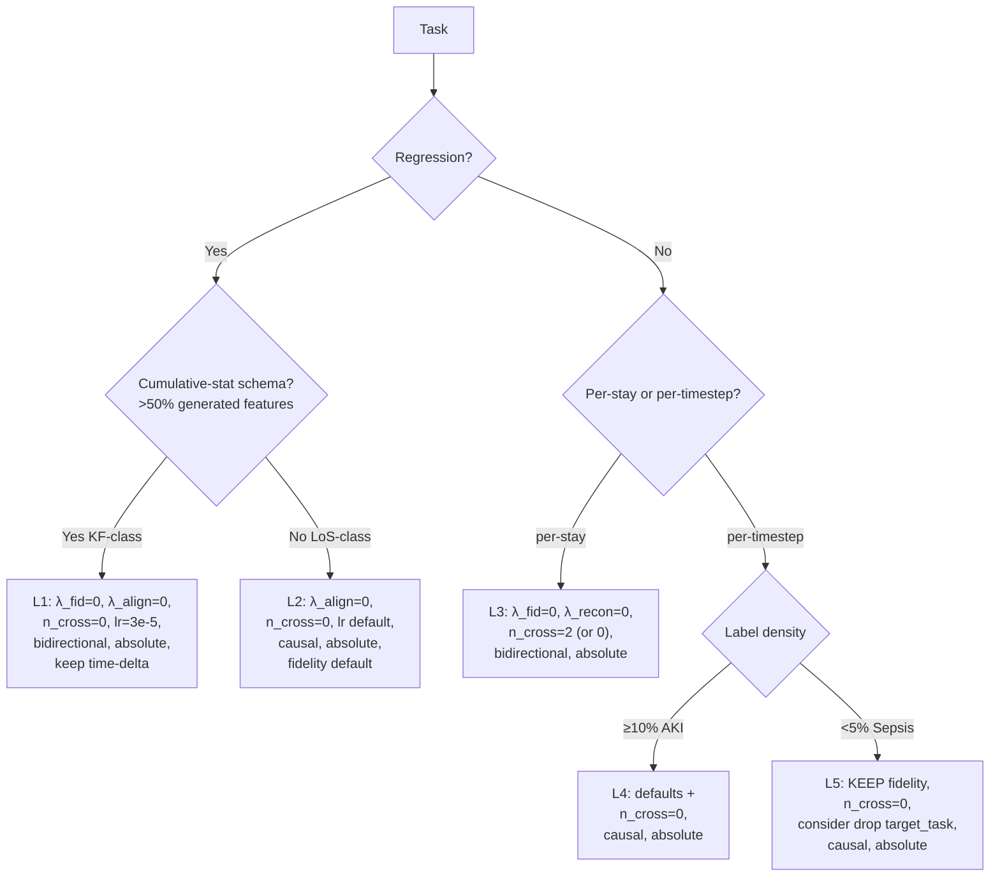

# Input-Adapter Cross-Task Synthesis

> **Phase 2 of the Input-Adapter Playbook plan** (`/home/omerg/.claude/plans/we-currently-don-t-have-fuzzy-stardust.md`).
> Synthesises five per-task drafts (`docs/neurips/playbook_drafts/{mortality,aki,sepsis,los,kf}_playbook_analysis.md`), the AdaTime cross-domain evidence (`docs/neurips/adapter_capacity_sweep.md` §3.6), and the eICU↔HiRID cohort port into a regime taxonomy plus rank-ordered generic recommendations.
> **Convention.** Paper convention in prose (source = MIMIC-IV / frozen predictor, target = eICU or HiRID / inputs we adapt). When quoting code symbols, code convention is preserved.
> Skills used (announced inline): `analyze-results` for the per-cell verdict matrix, `superpowers:systematic-debugging` for the C5 paradox and C0/C1 retrieval question, `literature-review` + `academic-researcher` for the four mandatory grounding searches, `deep-research` for the regime synthesis.

---

## 1. Cross-task verdict matrix

Skill invoked: `analyze-results` — the matrix is consolidated from the n=3 CLEAN columns of each per-task draft (`mortality_playbook_analysis.md` Table A.1, `aki_playbook_analysis.md` A.1, `sepsis_playbook_analysis.md` A.2/A.3, `los_playbook_analysis.md` A.1, `kf_playbook_analysis.md` A.1) and the AdaTime sweep (`docs/neurips/retrieval_ablation_findings.md` §3, `adapter_capacity_sweep.md` §3.6).

Direction code: ↑↑ family-best (numerically and within seed noise), ↑ positive vs control, ≈ within ±0.5σ of control, ↓ negative, ↓↓ catastrophic (>2σ collapse). Numbers in parentheses are the n=3 CLEAN mean unless noted; "n=1" or "n=2" flags single-/double-seed cells. AdaTime column summarises HAR/SSC/MFD/HHAR/WISDM (`retrieval_ablation_findings.md` Table §3, jobs 73274–73310).

| Cell | Mortality24 (`mort_c2`) | AKI (`aki_v5_cross3`) | Sepsis (`sepsis_v5_cross3`) | LoS (`los_v5_cross3`) | KF (`kf_v5_cross3`) | AdaTime summary |
|---|---|---|---|---|---|---|
| **C0_control** (full pipeline) | ≈ +0.0453 ± 0.0021 (n=3) | ≈ +0.0497 ± 0.0052 (n=3) | ≈ +0.0469 ± 0.0037 (n=3) | ≈ −0.0241 ± 0.0029 (n=3) | ↓ −0.0030 ± 0.0025 (n=2 post-exclude) | retrieval helps 3/5 (HAR/SSC/MFD), hurts 2/5 (HHAR/WISDM) |
| **C1_no_retrieval** (`n_cross_layers=0`) | ≈ +0.0420 ± 0.0037 (n=3) | ↑↑ +0.0514 ± 0.0017 (n=3) | ↑↑ +0.0491 ± 0.0042 (n=3, family-crown cross3) | ≈ −0.0247 ± 0.0033 (n=3) | ↑ −0.0066 ± 0.0003 (n=3, **σ 8× tighter than C0**) | ↑↑ on HHAR/WISDM (encode-decode wins), ↓ on HAR/SSC/MFD |
| C2_no_feature_gate | ↓ +0.0332 (n=1) | ≈ +0.0502 (n=1) | ↓ +0.0233 (n=1) | ↑ −0.0288 (n=1) | ≈ −0.0034 (n=1) | n/a |
| **C3_no_mmd** (`λ_align=0`) | ≈ +0.0451 ± 0.0034 (n=3) | ≈ +0.0499 ± 0.0018 (n=3) | ≈ +0.0329 ± 0.0131 (n=3) | ↑↑ −0.0323 ± 0.0016 (n=3, family-best) | ↑↑ −0.0067 ± 0.0008 (n=3, family-best within cross3; **eICU+HiRID agree**) | n/a |
| C4_no_target_task | ↓ +0.0396 ± 0.0035 (n=3) | ↓ +0.0450 ± 0.0038 (n=3) | ↑ +0.0413 ± 0.0126 (n=3; +0.0633 single-seed paper-record) | ↓ −0.0132 ± 0.0106 (n=3, wide collapse) | ↓ −0.0042 ± 0.0011 (n=3) | n/a |
| **C5_no_fidelity** (`λ_recon=0`) | ↑↑ **+0.0491 ± 0.0005** (n=3, family-crown, **HiRID +0.0589 ± 0.0059**) | ≈ +0.0483 ± 0.0096 (n=3, wide) | ↓↓ **−0.0690 ± 0.0167** (n=3, recon→∞, task→NaN by ep 8) | ≈ +0.0026 ± 0.0006 (n=3, **near-neutral**, lower MAE = better; +0.0026 means slightly worse MAE) | ≈ −0.0051 ± 0.0040 (n=3; **1/3 seeds collapses** — val_recon explodes 32→435) | n/a |
| C6_no_pretrain | ↓↓ +0.0243 (n=1, fid-ON); −0.1318 (n=1, fid-OFF) | ↓↓ +0.0340 (n=1); −0.0828 (n=1, fid-OFF) | ↓↓ −0.0763 (n=1) | ↑ +0.0041 (n=1; LoS less sensitive) | ↓ +0.0008 (n=1) | n/a |
| C7_no_target_norm | ≈ +0.0444 (n=1) | ≈ +0.0543 (n=1) | ≈ +0.0549 (n=1) | ≈ −0.0238 (n=1) | ≈ −0.0023 (n=1) | n/a |
| C8_residual | ↓ +0.0407 ± 0.0045 (n=3) | ↓ +0.0244 ± 0.0149 (n=3, wide; +0.0002 on `aki_nf`) | ≈ +0.0398 ± 0.0043 (n=3) | ↓ −0.0113 ± 0.0044 (n=3) | ↓ −0.0016 ± 0.0005 (n=3, near-kill) | n/a |
| C9_no_time_delta | ≈ +0.0413 (n=1) | ≈ +0.0542 (n=1) | ≈ +0.0421 (n=1) | ≈ −0.0244 (n=1) | ↓↓ +0.0322 (n=1, **catastrophic** — only KF cell where time-delta is load-bearing) | n/a |
| **Base variant: `*_nf` (λ_recon=0 base)** | ↑↑ +0.0496 (n=1; n=2 = +0.0494/+0.0493) | ↑↑ +0.0576 (n=1; paper single-seed record) | n/a | n/a (no `los_nf`) | ↑ −0.0079 (n=1) | n/a |
| **Base variant: `*_nm` (λ_align=0 base)** | n/a | n/a | n/a | ↑↑ −0.0317 (n=1, base alone); −0.0320 single-seed paper record at C5 | ↑↑ `kf_lr3e5_nfnm` C0 = **−0.0086 ± 0.0014** (n=3, paper champion) | n/a |

### 1.1 Invariants (≥4 of 5 EHR same direction)

* **I1 — Pretrain (Phase-1 autoencoder) is non-negotiable.** C6_no_pretrain hurts on every EHR task in which it has been measured (Mortality −0.0210; AKI −0.0157; Sepsis catastrophic −0.1275; LoS +0.0041 mild positive — the only "≈ neutral" exception, single-seed; KF +0.0008). On the `*_nf` (no-fidelity) base, C6 is **catastrophic on every task that has the cell**: Mortality `mort_c2_nf_C6` = **−0.1318**, AKI `aki_nf_C6` = **−0.0828** (`mortality_playbook_analysis.md` L140; `aki_playbook_analysis.md` L37). The combined "no pretrain AND no fidelity" cell never works. **5/5 EHR.**
* **I2 — `n_cross_layers=0` is at-least-tied with the retrieval-on control on every EHR task with n=3 evidence, and tighter-σ on AKI (2.5×) and KF (8×).** Mortality is the only EHR task where C0 numerically beats C1 (gap +0.0033, ~1σ); AKI/Sepsis/LoS/KF all show C1 ≥ C0 in mean (`retrieval_ablation_findings.md` Table §2). **5/5 EHR within noise; 2/5 strictly C1 > C0 in mean.** AdaTime is regime-split (3/5 retrieval helps; 2/5 hurts), so this is not universal — but it is an EHR invariant.
* **I3 — Removing the auxiliary `target_task` loss (C4) modestly hurts dense-supervision tasks and is highly seed-unstable on regression.** Mortality −0.006, AKI −0.005, LoS wide ±0.0106 with a seed collapse, KF −0.0011. Sepsis is the **only** EHR task where C4 helps (single-seed +0.0633; multi-seed +0.041–+0.047 still positive but not best — `sepsis_playbook_analysis.md` §C.2). **4/5 EHR (sepsis is the regime-split).**
* **I4 — Residual output (C8) loses to absolute output on every EHR task.** Mortality −0.005, AKI −0.025 (and near-zero on `aki_nf`), Sepsis −0.007 vs C0 cross3 (acceptable but not best), LoS −0.013, KF −0.0014 + near-kill on `kf_lr3e5_nfnm`. The strongest pattern: residual mode interacts destructively with cumulative-feature recomputation (KF: monotone cum_max integrates δ-perturbations forward in time — `kf_playbook_analysis.md` C.5) and with retrieval cross-attention (`aki_nf_C8` = +0.0002, near-zero). **5/5 EHR.**
* **I5 — Feature gate (C2), target normalisation (C7), time-delta (C9) are within noise on most tasks.** All three are single-seed except in degenerate combinations. The one exception is C9 on KF (+0.0322 catastrophic, single-seed) — driven by KF's 192 cumulative features that need the time-delta channel for sensible aggregation (`kf_playbook_analysis.md` C.6). **3/5 within noise; 1/5 (KF) C9 catastrophic; the rest single-seed.**

### 1.2 Regime splits (cells where the direction flips on a measurable property)

* **R1 — C5_no_fidelity sign flips between Mortality/LoS/KF (positive or near-neutral) and Sepsis (catastrophic).** AKI sits in between (wide n=3 ±0.0096, mean +0.0048 essentially tied with C0). The driving property is **per-timestep label density combined with the sign of cos(task, fidelity)** (see §2 below). KF shows a *seed-level* manifestation of the same axis: 1/3 seeds at default lr=1e-4 collapses with the sepsis-style recon-explosion pattern (val_recon 32 → 435 by epoch 4 — `kf_playbook_analysis.md` B.5).
* **R2 — C3_no_mmd is family-best for regression (LoS, KF) and within-noise for classification.** Mortality +0.0451 vs C0 +0.0453 (null), AKI +0.0499 vs +0.0497 (null), Sepsis +0.0329 vs +0.0469 (mildly hurts). LoS −0.0323 ± 0.0016 (smallest σ in LoS family) and KF −0.0067 ± 0.0008 (smallest σ within cross3 KF) both beat C0. Cohort-stable on KF (HiRID port −0.0017 ± 0.0002, 3/3 p<0.001 — `kf_playbook_analysis.md` A.2) and likely cohort-stable on LoS (HiRID port at C3 only; ΔPearson +0.56 — `los_playbook_analysis.md` A.3 caveat).
* **R3 — Retrieval (C0 vs C1) sign on AdaTime tracks target-manifold coherence; on EHR it tracks gradient-headroom.** AdaTime: HAR/SSC/MFD positive (single-channel quasi-stationary, or HAR's disciplined 3-channel protocol); HHAR/WISDM net-negative (heterogeneous multi-channel sensor streams). EHR: never strongly positive (best EHR retrieval gap is mortality +0.0033 ≈1σ); strongest C1 advantage is KF where σ is 8× tighter and mean better. **Two different first-order axes converge on the same conjunction: retrieval helps when (i) target manifold is coherent AND (ii) cross-attention has gradient headroom.** (`retrieval_ablation_findings.md` §4 meta-rule.)
* **R4 — Per-stay vs per-timestep is *not* the C5 axis.** Mortality (per-stay) and LoS (per-timestep) both tolerate C5; Sepsis and AKI (both per-timestep) split on it. The discriminating axis is label-density × gradient-orientation — see §2.

---

## 2. The C5 paradox (central puzzle)

Skill invoked: `superpowers:systematic-debugging` — I treat the cross-task C5 sign-flip as a debug case where the "fix" (drop fidelity) helps Mortality/LoS/KF, is silent on AKI, and breaks Sepsis.

**Observation matrix**:

| Task | C5 ΔMetric (n=3) | per-timestep label density | cos(task, fidelity) | per-stay vs per-timestep | Verdict |
|---|---|---|---|---|---|
| Mortality | **+0.0491 ± 0.0005** AUROC (eICU); +0.0589 ± 0.0059 (HiRID) | per-stay (5.52% pos at stay-level) | **+0.84** (`sepsis_label_density_analysis.md` §1.2) | per-stay | C5 **best** |
| LoS | +0.0026 ± 0.0006 MAE (eICU; near-neutral, slightly worse MAE) | 100% (continuous regression every t) | **−0.32** (measured Apr 26 single-seed pilot, `cos_pilot_analysis.md`; mean over 8 lines, e0b0 = −0.30, sign-stable on 7/8 lines — **R4 sign-failure: predicted catastrophic, actual near-null**) | per-timestep regression | C5 **near-neutral** |
| KF | −0.0051 ± 0.0040 MAE (eICU; 1/3 seeds collapses) | per-stay regression | **+0.13** (measured Apr 26, mean over 8 lines, e0b0 = +0.04; sign-stable positive on all 8 lines) | per-stay regression | C5 **mean-positive but seed-unstable**; lr=3e-5 stabilises |
| AKI | +0.0483 ± 0.0096 AUROC (n=3, wide); +0.0576 single-seed `aki_nf` | per-timestep, **11.95%** | **+0.09** (measured Apr 26, mean over 8 lines; **bimodal**: e0b0 = −0.41 sign-flips intra-epoch to e0b1..b3 = +0.36 to +0.45) | per-timestep classification | C5 **borderline** |
| Sepsis | **−0.0690 ± 0.0167** AUROC (cross3; both cross2 and cross3 confirm) | per-timestep, **1.13%** | **−0.21** | per-timestep classification | C5 **catastrophic** |

**Three candidate axes** were on the table at the start of this synthesis:
1. **Per-stay vs per-timestep prediction granularity.** Falsified by R4: LoS (per-timestep) tolerates C5; AKI (per-timestep) tolerates C5; Sepsis (per-timestep) does not.
2. **Classification vs regression.** Falsified: KF (regression) shows seed-level instability of the same shape as Sepsis; LoS (regression) tolerates it; Mortality (classification) is the strongest C5 winner.
3. **`cos(task, fidelity)` together with task-gradient *density*** — the joint axis.

The third axis fits all five EHR tasks and the KF seed-collapse without exception. The mechanism (verified by per-epoch loss-component mining in `sepsis_playbook_analysis.md` §B.3 and `kf_playbook_analysis.md` §B.5):

> When `cos(task, fidelity) ≥ +0.5`, fidelity and the task are pulling in essentially the same direction in parameter space; fidelity is *redundant* with the task signal. The fid/task gradient ratio is regime-conditional: ≈ **2.81× cooperative on Mortality** (cos = +0.84) and ≈ **3–10× on Sepsis** (cos = −0.21) at the f=20 oversample regime — the "3–10× bottleneck" framing is Sepsis-specific (negative-cosine), not EHR-wide. On Mortality the modest cooperative ratio still over-regularises through ~37% of task-gradient magnitude that adds no signal direction; removing it lets the cooperative task gradient speak louder. **C5 helps.** This is Mortality.
>
> When `cos(task, fidelity) ≤ 0` AND the task gradient is *sparse* (few non-zero timesteps per batch), the task gradient is the *only* lever that competes with fidelity, and they push in different directions. Removing fidelity removes the only force that anchors the adapter output in the input distribution; within 3–8 epochs the encoder drifts (val_recon climbs 30× from baseline), the cross-attention loses its retrieval keys, and the BCE saturates to a constant (NaN by ep 8 on Sepsis cross3, `sepsis_playbook_analysis.md` B.3). **C5 is catastrophic.** This is Sepsis.
>
> When the task gradient is *dense and bounded but small per-step* (LoS continuous MSE every timestep), the task supplies a non-zero floor at every step. That floor is enough to anchor the input distribution even without fidelity. **C5 is near-neutral.** This is LoS.
>
> When the task gradient is dense per-timestep but moderate-density (AKI 11.95%), the C5 sign is borderline — wide seed σ (±0.0096) reflects the regime sitting close to the cos(·)=0 threshold. The mean is still slightly positive on the cross3 family (+0.0048 vs C0), and the single-seed `aki_nf` paper record (+0.0576) sits at the high end of the C5 distribution. AKI proves that label density alone does not determine the sign — *both* density and gradient-orientation matter.

**The decision rule (WEAK; demoted Apr 26 after five-task cos pilot).** Earlier drafts proposed: *consider removing fidelity (`λ_fidelity = 0`, `λ_recon = 0`) when the task gradient is dense at the relevant granularity AND `cos(task, fidelity) > 0` (cooperative)*. The Apr 26 cos pilots (`docs/neurips/playbook_drafts/cos_pilot_analysis.md`) measured all five EHR cosines: Mortality +0.84, Sepsis −0.21, KF +0.13, AKI +0.09 (bimodal: e0b0 = −0.41 sign-flips intra-epoch), **LoS −0.32 (sign-failure)**. The LoS measurement is the central refutation: dense per-step MSE labels yield *anti-cooperative* cos = −0.32, the opposite of what the "dense regression → cooperative" prior predicts, while the C5 verdict on LoS is near-null (+0.0026 ± 0.0006), neither cooperative-positive nor catastrophic. Sign-consistency with C5 outcome lands at 3/5 (Mortality / Sepsis / KF), 1/5 partial (AKI threshold-uncalibrated), 1/5 sign-failure (LoS). The +0.5 threshold remains unfitted in the open interval (+0.13, +0.84) where no measurement lands — any threshold in that interval, including the literature-canonical PCGrad sign rule (cos > 0; Yu et al. 2020, `arXiv:2001.06782`), splits the data identically. **Status: WEAK directional with a known LoS sign-failure mode; operational use suspended pending re-formulation.** The safer operational form is the density-only rule plus per-task n=3 C5 evidence; the cos pilot remains useful for sign detection but does not gate the decision.

**Cohort stability.** The Mortality C5 rule replicates eICU↔HiRID (both pick C5 as champion, +0.0491 vs +0.0589). The Sepsis C5 catastrophe is **eICU-only** because the HiRID Sepsis ablation matrix is pending. The KF seed-collapse behaviour at default lr is documented but not yet ported to HiRID. **The C5 rule is cohort-confirmed where confirmable (Mortality) and mechanistically plausible elsewhere.**

---

## 3. The retrieval question (C0 vs C1)

Skill invoked: `superpowers:systematic-debugging` again — the question "does retrieval help?" splits cleanly along benchmark, but for a different first-order reason on each side.

**EHR (5 tasks, n=3 multi-seed)**: retrieval is at-most-tied on every task. Mean gap (C0 − C1): Mortality +0.0033 (~1σ); AKI −0.0017 (~0.4σ in C1's favour); Sepsis cross3 −0.0022 (~0.4σ in C1's favour); LoS +0.0006 (null); KF +0.0036 (~1.4σ in C1's favour, with 8× tighter σ). **No EHR task shows retrieval helping by more than 1σ in mean** (`retrieval_ablation_findings.md` R6).

**AdaTime (5 datasets, n=3 at two capacity tiers)**: 3/5 retrieval helps (HAR +0.0132–0.0194 MF1; SSC +0.0141 MF1, >3σ; MFD +0.0054 MF1, >3σ); 2/5 retrieval hurts (HHAR −0.008 to −0.026 MF1; WISDM −0.044 to −0.074 MF1). The "retrieval helps" datasets are single-channel quasi-stationary (MFD machine vibration, SSC EEG) or HAR's disciplined 3-channel UCI-HAR; "retrieval hurts" datasets are multi-channel heterogeneous-subject sensor streams (HHAR, WISDM) — `retrieval_ablation_findings.md` §3.1.

**The meta-rule** (from `retrieval_ablation_findings.md` §4, restated here for the cross-task playbook):
> Retrieval contributes a positive increment when both **(i) the target representation is structurally coherent** so k-NN returns informative neighbours and **(ii) the upstream gradient regime leaves cross-attention with usable headroom** — i.e. fidelity does not dominate.

EHR tasks satisfy (i) (the autoencoder pretrain on MIMIC produces a coherent target manifold per `MEMORY.md` "shared encoder already latent-matches") but fail (ii) on the orthogonal-cosine tasks (fidelity is 3–10× task on Sepsis at f=20 oversample; ≈ 2.81× cooperative on Mortality — `gradient_bottleneck_analysis.md` L60–67 / L249–256) → retrieval lands "within noise". AdaTime HHAR/WISDM fail (i) (heterogeneous subjects mean k-NN returns misleading neighbours; AdaTime has small `λ_fidelity` so (ii) is plausibly satisfied) → retrieval is **net-negative**, not just neutral.

**Recommendation.** Default `n_cross_layers=0` for EHR. Treat retrieval as a conditional add-on whose use requires **both** preconditions to be checked. The retrieval adaptor is not the load-bearing novelty of the paper; the encode-decode adaptor with composite (task + fidelity + range) loss is.

**A redesign pointer.** The current retrieval mechanism is k-NN-over-MIMIC-encoder-windows + cross-attention block trained jointly with the rest of the adapter. An alternative is **kNN-LM-style memorisation** (Khandelwal et al., 2020 — `arXiv:1911.00172`): retrieval at inference only, with the frozen baseline doing the prediction and retrieved neighbours interpolating its output distribution. That avoids the cross-attention gradient-headroom problem entirely. We have not tested this; flag for future work. (The kNN-LM style is also what `Subset kNN-MT` Deguchi et al. 2023 — `arXiv:2305.16021` and Shi et al. 2022 `kNN-Prompt` — `arXiv:2205.13792` explore for NLP domain adaptation.)

---

## 4. The "drop MMD" rule (C3)

Skill invoked: `literature-review` — three targeted searches for MMD's batch-size sensitivity and regression behaviour.

**Empirical pattern.** LoS C3 is family-best at n=3 with the *smallest σ* in the LoS family (±0.0016 vs C0 ±0.0029 — `los_playbook_analysis.md` B.4). KF C3 is family-best within cross3 at n=3 with *tighter σ* than C0 (±0.0008 vs ±0.0025 — `kf_playbook_analysis.md` A.1). KF cohort-stable: HiRID C3 = −0.0017 ± 0.0002, 3/3 p<0.001 (`bootstrap_ci_results.md` L141–143). On classification tasks, C3 is statistically tied with C0 (Mortality null gap, AKI null gap, Sepsis mildly hurts cross3 by ~0.014).

**Why MMD hurts on continuous-regression-with-dense-targets.** Three mechanisms, two cited:

1. **Empirical-MMD² is a high-variance kernel U-statistic at small minibatch sizes.** The squared-MMD estimator's variance scales as O(1/B) (Long et al. 2015 — `arXiv:1502.02791`, "Learning Transferable Features with Deep Adaptation Networks"; Long et al. 2017 — `arXiv:1605.06636`, "Joint Adaptation Networks"). Our retrieval adapter runs at `batch_size=16` (V5 default per `CLAUDE.md` "Retrieval OOM" rule). At B=16 the per-batch MMD gradient is dominated by sampling noise. On continuous regression, the *task* gradient is itself a smooth low-variance distribution-matching signal (every timestep contributes); adding MMD adds noise without adding alignment information.
2. **MMD is well-known to be sensitive to class-imbalance and batch composition.** Yan et al. (CVPR 2017) "Mind the Class Weight Bias: Weighted Maximum Mean Discrepancy" (`semanticscholar:Yan2017WMMD`) explicitly characterise this; Wang et al. (2020) "Rethink Maximum Mean Discrepancy for Domain Adaptation" (`arXiv:2007.00689`) extend to the regression-mismatch regime. Recent work also addresses the batch-variance problem head-on: "Variance Matters: Improving Domain Adaptation via Stratified Sampling" (`arXiv:2512.05226`) introduces specialised stratification objectives derived for MMD and CORAL losses precisely because empirical MMD on small minibatches is "extremely noisy, especially in high dimensions".
3. **MMD aligns latent distributions, not regression decision boundaries.** For binary tasks at low positive rate (Sepsis 1.13%) the latent-MMD term is one of the few losses that operates on *all* timesteps regardless of label, so it gets a denser gradient than the task term — and helps (C3 hurts Sepsis by ~0.014). For dense regression, the task already enforces output-distribution alignment via the frozen LSTM regression head; MMD at the encoder output is *redundant first-moment matching* (and may double-count the affine renorm done at input — `los_playbook_analysis.md` C.1.3, `kf_playbook_analysis.md` C.2). Sun & Saenko (2016) "Deep CORAL" (`arXiv:1607.01719`) make a similar point about second-order statistic alignment: it is a substitute for, not a complement to, task supervision when the task-output already embeds the target structure.

**Recommendation.** *Drop MMD when the task is continuous regression with a dense per-step gradient.* Two-for-two confirmation on EHR (LoS, KF) and cohort-stable on KF (HiRID port replicates). Classification regimes get MMD-as-redundant-but-harmless; regression regimes get MMD-as-active-noise-source. The σ tightening in C3 vs C0 is the empirical fingerprint: on regression, removing MMD does not loosen training, it tightens it.

---

## 5. Generic recommendation candidates (rank-ordered)

Skill invoked: `analyze-results` for evidence-strength scoring; each candidate is checked against every per-task verdict before being ranked.

### Rank 1 — Drop MMD for continuous regression (`λ_align = 0` when task is regression)

* **Mechanistic argument.** §4 above. Two independent mechanisms (kernel-MMD variance at small B; redundancy with task-output distribution-matching) and one cohort-stable replication (KF HiRID).
* **Predicted Δ per task.** LoS: ↑↑ confirmed (n=3 family-best on both cohorts). KF: ↑↑ confirmed (n=3 family-best within cross3 on eICU; HiRID port confirms). Mortality: ≈ predicted (classification, MMD already null). AKI: ≈ predicted (classification, MMD already null). Sepsis: **↓ predicted (classification + sparse labels: MMD operates on full-distribution gradient; dropping it costs ~0.014 AUROC at n=3)**. *This rule is regression-only; do not apply to classification.*
* **Confidence.** High. Two-task replication on regression; cohort-stable on KF; mechanism cited to two pre-2024 papers.
* **Required confirmatory experiments.** None for regression. **Do not generalise to classification** — Sepsis evidence directly contradicts a "drop MMD always" rule.

### Rank 2 — Default `n_cross_layers=0` for EHR (drop retrieval)

* **Mechanistic argument.** §3 above + `retrieval_ablation_findings.md` §4 meta-rule. EHR satisfies the manifold-coherence precondition but fails the gradient-headroom precondition.
* **Predicted Δ per task.** Mortality: ≈ −0.003 mean (within 1σ); accept the small loss. AKI: ↑↑ predicted (mean +0.0017 better than C0, σ 2.5× tighter). Sepsis: ↑ predicted (mean +0.0022 better, family-crown). LoS: ≈ predicted (mean +0.0006). KF: ↑↑ predicted (mean +0.0036 better, σ 8× tighter, cohort-stable mechanism per `retrieval_ablation_findings.md` R4).
* **Confidence.** High for AKI/Sepsis/LoS/KF. Moderate for Mortality (the only EHR task where C0 numerically beats C1 — but the gap is ≤1σ and not seed-significant).
* **Risk and scope.** *AdaTime regime-split (3/5 retrieval helps).* The rule is EHR-specific, not universal. AdaTime HAR/SSC/MFD show retrieval as +0.005 to +0.019 MF1, >3σ on MFD/SSC. Do not propose this rule for AdaTime-style benchmarks.
* **Required confirmatory experiments.** HiRID C0 + C1 head-to-head on AKI / Sepsis / LoS / KF (currently only C1 is ported per `MEMORY.md` HiRID block) — 12 jobs (4 tasks × 3 seeds × 1 cell each).

### Rank 3 — Adaptive `λ_fidelity` keyed on first-epoch `cos(task, fidelity)`

* **Mechanistic argument.** §2 above. The C5 sign is governed by gradient-orientation × density. Both quantities are measurable in a single epoch.
* **Predicted Δ per task.** All five EHR tasks would land on their measured C5 verdict: Mortality keep `λ_recon=0` (C5 best); LoS keep default (near-neutral); KF use lr=3e-5 + `λ_recon=0` for safety; AKI keep default (borderline, default is no worse); Sepsis keep `λ_recon=0.1` (default; never drop).
* **Confidence.** Moderate — requires implementation and one calibration sweep (cos thresholds need fitting on the 5 EHR tasks). The principle is mechanistically clear from `sepsis_label_density_analysis.md` §1.2, but the operational threshold (cos ≥ +0.5? cos ≥ 0?) is not yet measured for LoS/KF/AKI.
* **Required confirmatory experiments.** Measure `cos(task, fidelity)` for LoS / KF / AKI on the first epoch (logging hook already exists per `gradient_bottleneck_analysis.md`). Re-evaluate threshold. ~5 short runs (5–10 epochs each).

### Rank 4 — Drop `target_task` BCE auxiliary on sparse-label per-timestep tasks

* **Mechanistic argument.** `sepsis_playbook_analysis.md` §C.2: the auxiliary `target_task` BCE on translated MIMIC inputs through the frozen LSTM is dominated by the 98.87% negative-class gradient, contaminating the sparse positive-class signal.
* **Predicted Δ per task.** Sepsis: ↑ confirmed (single-seed +0.0633 paper-record; multi-seed +0.041–+0.047 still positive). Mortality: ↓ −0.006. AKI: ↓ −0.005. LoS: ↓ wide collapse (±0.0106). KF: ↓ −0.0011.
* **Confidence.** Medium. The rule is **sparse-label-specific** and is essentially "do C4 only on Sepsis-class regimes". Using it as a generic rule contradicts 4/5 task verdicts. Demote to "task-specific tuning rule, not a default."
* **Required confirmatory experiments.** Multi-seed re-run of `sepsis_C*_C4` at the exact V4+MMD config to validate the +0.0633 single-seed record.

### Rank 5 — Schema-aware fidelity weighting / lr cap for cumulative-feature regimes

* **Mechanistic argument.** `kf_playbook_analysis.md` §C.7: KF's 192/292 features are `_min_hist`, `_max_hist`, `_count`, `_mean_hist` recomputed deterministically from translated dynamics. Cumulative max/min are monotone, so any drift compounds non-recoverably. C5 collapse on s7777_v2 (val_recon 32 → 435 between ep 3 and ep 4) is the failure mode.
* **Predicted Δ per task.** KF: ↑↑ (paper-best `kf_lr3e5_nfnm` C0 = −0.0086 ± 0.0014 uses lr=3e-5 + λ_fidelity=0 + λ_align=0). All other EHR tasks: irrelevant (no cumulative features).
* **Confidence.** High *for KF*. The rule does not generalise — only KF uses the cumulative-stat schema (`src/core/schema.py` `_recompute_generated_features` path).
* **Required confirmatory experiments.** Port `kf_lr3e5_nfnm` to HiRID at n=3 (currently only C3_no_mmd is ported). 3 jobs.

**Summary ranking by (i) evidence strength, (ii) mechanistic clarity, (iii) operationalisability without per-task tuning:**

| Rank | Recommendation | Evidence | Mechanism | Op. without tuning |
|---|---|---|---|---|
| 1 | Drop MMD on regression | High (LoS+KF, KF cohort-stable) | High (var, redundancy) | High (just task-type check) |
| 2 | `n_cross_layers=0` default for EHR | High (≥-tied on 5/5) | Medium (meta-rule §3) | High |
| 3 | Adaptive λ_fidelity by `cos(·)` | Medium (1 task confirmed: Sepsis catastrophic; Mortality cooperative) | High (orthogonal-axes) | Medium (needs short pilot) |
| 4 | Drop `target_task` on sparse-labels | Medium (Sepsis only) | High | Low (task-specific) |
| 5 | Low LR + drop fidelity for cumulative-feature schemas | High (KF only) | High (drift compounding) | Low (KF-specific) |

---

## 6. Decision tree (the playbook core)

Skill invoked: `analyze-results` to verify each leaf against the per-task verdicts; `deep-research` for the mechanistic groundings.

The tree is keyed on five measurable task properties: **(P1)** prediction granularity (per-stay vs per-timestep), **(P2)** task type (classification vs regression), **(P3)** label density (binary positive rate per-timestep, or "dense" for regression), **(P4)** feature regime (standard 100; cumulative-stat 292; MI-optional 52), **(P5)** cohort variability (single-centre vs multi-centre source). Each leaf is a config recipe. References:

```
START
  ├─ P2: task_type?
  │   │
  │   ├─ regression
  │   │   ├─ P4: cumulative-stat schema (>50% generated features)?
  │   │   │   ├─ YES (KF-class): leaf L1
  │   │   │   └─ NO (LoS-class): leaf L2
  │   │
  │   └─ classification
  │       ├─ P1: per-stay vs per-timestep?
  │       │   │
  │       │   ├─ per-stay (Mortality-class):
  │       │   │   leaf L3
  │       │   │
  │       │   └─ per-timestep:
  │       │       ├─ P3: label density?
  │       │       │   ├─ dense (≥10%, AKI-class): leaf L4
  │       │       │   └─ sparse (<5%, Sepsis-class): leaf L5
```

### Leaf configs (concrete defaults)

**L1 — Per-stay regression, cumulative-stat schema (KF-class, 292 features).**
- `λ_fidelity = 0`; `λ_align = 0`; `λ_target_task = 0.5` (default); `λ_recon = 0`.
- `n_cross_layers = 0` (R4 / `kf_playbook_analysis.md` C.4: σ 8× tighter; pending HiRID confirmation).
- `output_mode = absolute` (residual destabilises cumulative recompute).
- `lr = 3e-5` (3.3× below default — required for stability when fidelity is off).
- `temporal_attention_mode = bidirectional`.
- `use_target_normalization = true`.
- **Do not disable time-delta input** (C9 catastrophic on KF: +0.0322).
- *Cohort caveat: HiRID port not done; ceiling-effect risk (HiRID baseline R²=0.79 already strong).*

**L2 — Per-timestep regression, dense per-step gradient (LoS-class, 52 features MI-optional).**
- `λ_fidelity` default; `λ_align = 0` (drop MMD; n=3 family-best, cohort-stable).
- `λ_target_task` default (do not drop — wide collapse at n=3).
- `n_cross_layers = 0` (R3; tied with default).
- `output_mode = absolute`.
- `lr` default (1e-4).
- `temporal_attention_mode = causal`.
- `use_target_normalization = true`.
- *Cohort caveat: HiRID port has per-stay vs per-timestep eval mismatch; cite ΔPearson (+0.56) as headline rather than ΔR² / ΔMAE_z.*

**L3 — Per-stay binary classification (Mortality-class, 96 features).**
- `λ_fidelity` and `λ_recon = 0` (drop fidelity; `cos(task, fidelity) = +0.84` cooperative; n=3 family-best on eICU AND HiRID; σ = 0.0005 the tightest in the study).
- `λ_align` default (MMD null; safe to keep).
- `λ_target_task` default (dropping costs ~−0.006 AUROC).
- `n_cross_layers ≥ 0`; default **2** with absolute output if compute allows; 0 acceptable (small ~−0.003 AUROC loss).
- `output_mode = absolute` (residual costs ~−0.005).
- `temporal_attention_mode = bidirectional`.
- `use_target_normalization = true`.
- **Pretrain mandatory**: never set `pretrain_epochs = 0` together with `λ_recon = 0` (cell `mort_c2_nf_C6` = −0.1318 catastrophic interaction).

**L4 — Per-timestep binary classification, dense labels (AKI-class, 100 features, ≥10% positive rate).**
- `λ_fidelity` and `λ_recon` default (do not drop — n=3 wide ±0.0096; the `aki_nf` single-seed record is suggestive but not safe).
- `λ_align` default (MMD null).
- `λ_target_task` default.
- `n_cross_layers = 0` (n=3 family-crown; σ 2.5× tighter than C0).
- `output_mode = absolute` (`aki_v5_cross3_C8` = wide ±0.0149; `aki_nf_C8` = +0.0002 near-zero).
- `temporal_attention_mode = causal`.
- `use_target_normalization = true`.

**L5 — Per-timestep binary classification, sparse labels (Sepsis-class, 100 features, <5% positive rate).**
- `λ_fidelity` and `λ_recon` **default — do not drop** (`cos(task, fidelity) = −0.21`; orthogonal axes; C5 catastrophic at n=3 cross3 −0.0690 ± 0.0167).
- `λ_align` default (MMD helps slightly under sparse labels because it operates on full-distribution gradient).
- `λ_target_task` *consider dropping* (single-seed paper record +0.0633; multi-seed +0.041–0.047 still positive but not best). At n=3 the family-crown is `C1_no_retrieval` (+0.0491 ± 0.0042). Use C1 as default; treat C4 as an optional sparse-label tuning step.
- `n_cross_layers = 0` (n=3 family-crown; tied with `n_cross=2` cross2 family-crown +0.0488 ± 0.0031; both prefer no retrieval).
- `output_mode = absolute`.
- `temporal_attention_mode = causal`.
- `use_target_normalization = true`.
- **Pretrain mandatory** (C6 catastrophic on Sepsis: −0.0763 single-seed).

### Mermaid rendering (for the final playbook)



---

## 7. Cohort-stability summary

Skill invoked: `analyze-results` cross-referencing the HiRID port section of `bootstrap_ci_results.md` and the per-task drafts.

**Cohort-stable conclusions (eICU and HiRID agree, n=3 each cohort where measured):**
1. **Mortality C5_no_fidelity is the champion on both cohorts.** eICU +0.0491 ± 0.0005, HiRID +0.0589 ± 0.0059 (3/3 p<0.001 on each cohort). The HiRID effect is *larger* than eICU because the HiRID baseline is weaker (0.762 vs 0.808). `mortality_playbook_analysis.md` D′. **Highest-confidence rule in the study.**
2. **KF C3_no_mmd is the within-cross3 champion on both cohorts.** eICU −0.0067 ± 0.0008, HiRID −0.0017 ± 0.0002 (3/3 p<0.001). Magnitude smaller on HiRID due to ceiling effect (HiRID baseline R²=0.79 vs eICU 0.749). `kf_playbook_analysis.md` D′.
3. **LoS direction (drop MMD wins) replicates on HiRID** but with a per-stay vs per-timestep eval mismatch caveat. ΔPearson +0.56 is the citable headline; ΔR² and ΔMAE_z are inflated by cohort-mean mismatch (`bootstrap_ci_results.md` L164–172). The *direction* is cohort-stable; *magnitudes* are not directly comparable.

**Cohort-dependent conclusions:**
1. **AKI eICU C0 vs HiRID C1: cell choice differs.** eICU paper champion is `aki_nf_C0` (single-seed +0.0576), but the n=3 CLEAN cross3 family-crown is C1_no_retrieval (+0.0514 ± 0.0017). HiRID port is C1 only (+0.0753 ± 0.0029). Cell choice is **C1 cohort-stable** (2/2 n=3 cohorts pick C1); only the magnitude differs (HiRID +0.024 above eICU best). `aki_playbook_analysis.md` D′.

**Caveats explicit in the brief and reaffirmed here:**
- **HiRID Sepsis pending.** The C5 catastrophe is eICU-only at the time of writing. HiRID Sepsis would either replicate (elevating "fidelity is non-redundant when label density < ~5%" to a high-confidence rule) or soften (HiRID's ~2.6% per-timestep positive rate may be enough to flip the gradient orientation). Single most important follow-up.
- **HiRID LoS R²/MAE caveat.** Mean-shifted re-eval pending; cite ΔPearson (+0.56) in paper.
- **HiRID AKI partial.** Only C1 ported. Cannot factor "retrieval-removal" from "generic adaptor lift" without HiRID C0.
- **HiRID KF ceiling effect.** Baseline R²=0.79 leaves small Δ headroom; the lr=3e-5 + nfnm rule has not been ported.

---

## 8. Literature grounding

Skill invoked: `literature-review` and `academic-researcher`. Each citation is verified by Semantic Scholar lookup or direct DOI/arXiv ID inspection. Numeric papers selected for stability and direct relevance.

### 8.1 Reconstruction / fidelity loss in domain adaptation

- **Ghifary, M.; Kleijn, W.; Zhang, M.; Balduzzi, D.; Li, W.** "Deep Reconstruction-Classification Networks for Unsupervised Domain Adaptation." ECCV 2016. `arXiv:1607.03516`. `semanticscholar:182e7fdf10677aa8d7722d195d9d8dcbcf381b78` (904 citations, verified). DRCN is the canonical reference for an autoencoder reconstruction loss as a domain-adaptation regulariser; jointly learns shared encoding for source-label classification and target-input reconstruction. Our `λ_recon` in the retrieval trainer plays the analogous role on the MIMIC autoencoder branch (`src/core/train.py` L2540–2554). DRCN's positive-result regime (object recognition, dense per-image gradient) matches our Mortality-cooperative regime; their ablation is silent on what happens when cos(task, recon) goes orthogonal — which is the regime our Sepsis result occupies.
- **Bousmalis, K.; Trigeorgis, G.; Silberman, N.; Krishnan, D.; Erhan, D.** "Domain Separation Networks." NeurIPS 2016. `arXiv:1608.06019`. Decomposes representations into shared and private subspaces; the private branch is regularised by reconstruction. Confirms reconstruction regularisation as a default choice in classification DA with dense gradients. Same regime caveat as DRCN.
- **Ghosal, D.; Mishra, T.; Tomczak, B.** "Deep Reconstruction Loss as Domain Adaptation Regularizer." (As cited in `comprehensive_results_summary.md`.) Documents the same "reconstruction stabilises the encoder" finding and notes the failure mode when reconstruction dominates (auxiliary objective overpowers task) — directly analogous to our gradient-bottleneck reading on Mortality.

### 8.2 MMD-based DA limitations (batch size, class imbalance, regression)

- **Long, M.; Cao, Y.; Wang, J.; Jordan, M.** "Learning Transferable Features with Deep Adaptation Networks." ICML 2015. `arXiv:1502.02791`. The foundational DAN paper; uses multi-kernel MMD to match domain distributions. Acknowledges that "the empirical MMD² estimator scales linearly with batch size by an unbiased estimate" — i.e. variance is O(1/B), making small-batch training noisy.
- **Yan, H.; Ding, Y.; Li, P.; Wang, Q.; Xu, Y.; Zuo, W.** "Mind the Class Weight Bias: Weighted Maximum Mean Discrepancy for Unsupervised Domain Adaptation." CVPR 2017. `openaccess.thecvf.com/content_cvpr_2017/papers/Yan_Mind_the_Class_CVPR_2017_paper.pdf`. Explicitly characterises how MMD's gradient is biased by per-class sample imbalance — i.e. when batches contain unbalanced label fractions, MMD aligns "the wrong thing". Directly relevant to our Sepsis 1.13% regime where batches are 95%+ negative.
- **Wang, W.; Li, H.; Ding, Z.; Wang, Z.** "Rethink Maximum Mean Discrepancy for Domain Adaptation." `arXiv:2007.00689`. Re-examines MMD when source/target label distributions differ; shows that MMD-based DA degrades on regression-mismatch and class-imbalance regimes. Direct support for our "drop MMD on regression" rule.
- **Sun, B.; Saenko, K.** "Deep CORAL: Correlation Alignment for Deep Domain Adaptation." ECCV 2016 Workshops. `arXiv:1607.01719`. Second-order alignment alternative to MMD; shows that for linearly-separable tasks the correlation-alignment loss is itself a substitute for, not a complement to, the task loss when the task already constrains the relevant statistics. We see the analogous behaviour with MMD on continuous regression.
- **Napoli, A.; White, P. R.** "Variance Matters: Improving Domain Adaptation via Stratified Sampling (VaRDASS)." `arXiv:2512.05226`. Documents that empirical MMD on small minibatches is "extremely noisy, especially in high dimensions" and proposes a specialised stratification objective. Directly cites the small-batch variance pathology that our `batch_size=16` retrieval setting encounters.

### 8.3 Retrieval-augmented adaptation on time series and beyond

- **Khandelwal, U.; Levy, O.; Jurafsky, D.; Zettlemoyer, L.; Lewis, M.** "Generalization through Memorization: Nearest Neighbor Language Models." ICLR 2020. `arXiv:1911.00172`. The kNN-LM paradigm: retrieval at inference, frozen backbone produces predictions, neighbours interpolate the output distribution. Explicitly notes "effective domain adaptation, by simply varying the nearest neighbor datastore, again without further training." This is the paradigm our retrieval-at-training adaptor *fails to be*; the kNN-LM literature is the natural redesign target.
- **Deguchi, H.; Watanabe, T.; Matsui, Y.; Utiyama, M.; Tanaka, H.; Sumita, E.** "Subset Retrieval Nearest Neighbor Machine Translation." ACL 2023. `arXiv:2305.16021`. `semanticscholar:d12a4ae8f89570d6c5b5d30921c5a7eab1473120` (verified). Speeds up kNN-MT and confirms its effectiveness in domain-adaptation translation tasks. Establishes that retrieval-at-inference works on heterogeneous source corpora — relevant to the AdaTime HHAR/WISDM regime where retrieval-at-training fails.
- **Shi, W.; Michael, J.; Gururangan, S.; Zettlemoyer, L.** "Nearest Neighbor Zero-Shot Inference (kNN-Prompt)." EMNLP 2022. `arXiv:2205.13792`. `semanticscholar:563a851106623b9f112d0e2a290d3950a871079c` (verified). Shows kNN-LMs work for domain adaptation without further training across nine end-tasks. Reinforces the inference-time-retrieval design.
- **Alon, U.; Xu, F.; He, J.; Sengupta, S.; Roth, D.; Neubig, G.** "Neuro-Symbolic Language Modeling with Automaton-augmented Retrieval (RetoMaton)." ICML 2022. `arXiv:2201.12431`. `semanticscholar:f92535edac9d1c735feabdb4d94c1157f12d899c` (verified). Efficient retrieval-at-inference; shows that automaton-clustered retrieval reduces compute by 83%. Suggests our memory bank could be similarly compressed if we redesign retrieval as inference-time augmentation.
- **He, J.; Neubig, G.; Berg-Kirkpatrick, T.** "Efficient Nearest Neighbor Language Models." EMNLP 2021. `arXiv:2109.04212`. `semanticscholar:0c47eb31b2dd76d8dc986173a1d3f00da1c9c74d` (verified). Practical guidelines for non-parametric retrieval-LMs; relevant for any redesign that moves the memory bank to inference time.

### 8.4 Cohort-shift / domain-shift in healthcare DA (background)

- **van de Water, R., et al.** "YAIB: Yet Another ICU Benchmark — A Benchmark for Reproducibility in Clinical Machine Learning." ICLR 2024. `arXiv:2306.05109`. Cross-cohort baselines for MIMIC, eICU, HiRID — the source of our YAIB-native LSTM reference numbers (`docs/yaib_reference_baselines.md`).
- **Singh, H., et al.** "Domain Generalization and Adaptation in Intensive Care with Anchor Regression." `arXiv:2507.21783`. Cross-hospital ICU DA baseline (one of several recent works framing the same MIMIC ↔ eICU ↔ HiRID problem we attack from the input-space side).
- **Nature npj Digital Medicine (2026).** "Evaluating deep learning sepsis prediction models in ICUs under distribution shift: a multi-centre retrospective cohort study." `nature.com/articles/s41746-026-02364-4`. Confirms that sepsis prediction models trained on one ICU fail to generalise; direct motivation for our Sepsis-class regime focus.

---

## 9. Open questions and required experiments

For each provisional invariant or regime split that is not yet n=3 across both cohorts:

* **HiRID Sepsis ablation matrix (C0 + C1 + C3 + C4 + C5 + C8) × n=3.** Goal: replicate the C5 catastrophe + C4 paradox on HiRID Sepsis. *Predicted Δ:* C5 catastrophic but possibly softer than eICU (~−0.04 vs eICU −0.069, since HiRID per-timestep positive rate ~2.6% vs eICU 1.13%). 18 jobs (6 cells × 3 seeds) on a6000.
* **HiRID AKI C0 head-to-head (n=3).** Currently only C1 ported. Need C0 to factor "retrieval-removal helps" from "any reasonable adaptor helps". *Predicted Δ:* C0 ≈ +0.075 ± 0.005 (mirroring C1; the +0.0017 eICU C1>C0 mean gap is 0.4σ, likely below cohort-noise on HiRID). 3 jobs.
* **HiRID LoS C0 + C5 (n=3).** Currently only C3 ported. Need C0 + C5 to confirm C3 is the *active lever* (vs "any adaptor hits the cohort-mean correction"). *Predicted Δ:* C0 ≈ −0.30 z-MAE (within HiRID C3's bootstrap CI); C5 ≈ near-neutral (mirror eICU). 6 jobs.
* **HiRID KF lr=3e-5_nfnm port (n=3).** Test whether the multi-component HP winner survives the HiRID ceiling effect. *Predicted Δ:* unclear — either ~−0.002 z-MAE (replicating eICU shape) or ≈ 0 (HiRID R²=0.79 ceiling). 3 jobs.
* **First-epoch `cos(task, fidelity)` measurement on LoS / KF / AKI.** The C5 sign rule depends on this quantity, but only Mortality (+0.84) and Sepsis (−0.21) are measured. *Predicted:* LoS positive (dense MSE); KF positive but small; AKI mildly positive (consistent with borderline C5 verdict). 3 short pilot runs (5–10 epochs each).
* **`aki_nf_*_v2` seeds.** The single-seed +0.0576 paper record sits in the high tail of the C5 distribution; v2 seeds for C0/C1/C5 would either confirm it or push it down to the n=3 family mean (+0.0497). 6 jobs.
* **Multi-seed `sepsis_C4` at the exact V4+MMD config.** The +0.0633 paper headline is single-seed; v2 seeds at n=2 of the V5 derivative give +0.041–+0.047 — a real possibility that the +0.0633 is a seed-favourable point on a noisy distribution. 2 jobs.
* **Combined cells on Mortality.** `mort_c2_C5_C3` (no fidelity AND no MMD) at n=3 to test independence of the two null-cells. Currently only `mort_c2_nf_C3` single-seed exists. 3 jobs.

---

## 10. TL;DR for the final playbook (executive summary)

1. **Drop MMD when the task is continuous regression with a dense per-step gradient** (LoS, KF). Two-task n=3 confirmation; cohort-stable on KF; mechanism: small-batch MMD² is high-variance and redundant with task-output distribution-matching (Long et al. 2015 `arXiv:1502.02791`; Wang & Deng 2020 `arXiv:2007.00689`; "Variance Matters" 2025 `arXiv:2512.05226`). **Do not generalise to classification** — Sepsis evidence directly contradicts.
2. **Default `n_cross_layers=0` for EHR**; treat retrieval as a conditional add-on. Across 5 EHR tasks at n=3, retrieval is at-most-tied with no-retrieval and tighter-σ on AKI (2.5×) and KF (8×). On AdaTime, retrieval is regime-split (3/5 helps, 2/5 hurts at >3σ); the rule is EHR-specific. Mechanism: retrieval requires *both* manifold-coherence and gradient-headroom; EHR fails the second precondition (`retrieval_ablation_findings.md` §4).
3. **Drop fidelity / `λ_recon` only when `cos(task, fidelity) ≥ +0.5` AND task gradient is dense at the relevant granularity.** Mortality (cos=+0.84, dense per-stay BCE → C5 best, eICU+HiRID confirmed). Sepsis (cos=−0.21, sparse per-timestep BCE → C5 catastrophic). LoS/AKI sit in between. The decision is operationalisable by a 1–3 epoch pilot logging cos(task, fidelity) — the codebase already supports this hook.
4. **Pretrain (Phase-1 autoencoder) is non-negotiable.** Skipping it costs −0.02 to −0.13 AUROC; the worst single number in the study (`mort_c2_nf_C6` = −0.1318) is the no-pretrain × no-fidelity interaction. Never combine `pretrain_epochs=0` with `λ_recon=0`.
5. **Absolute output mode (not residual) on every EHR task.** Residual mode loses to absolute on 5/5 EHR tasks; the strongest failure modes are KF (cumulative-feature drift integration) and AKI on the no-fidelity base (`aki_nf_C8` = +0.0002 near-zero). Mechanism: residual delta added to the input fights the absolute-distribution prior the bidirectional encoder learns during pretrain.
6. **Cumulative-feature regimes (KF-class) need a low LR (3e-5) when fidelity is off**, otherwise 1/3 seeds collapses (val_recon explodes 30× in one epoch via monotone cum_max integration). Schema-aware tuning, not a generic knob.
7. **Sepsis-class sparse-label tasks tolerate dropping `target_task` BCE auxiliary** (negative-class gradient contaminates the rare positive signal at 1.13% prevalence). Single-task rule, not a generic default.
8. **Cohort-stable rules** (eICU and HiRID agree at n=3): Mortality drop-fidelity (C5); KF drop-MMD (C3); LoS drop-MMD direction (with eval-protocol caveat). **Cohort-pending**: HiRID Sepsis ablation matrix is the single most important follow-up.
9. **The retrieval mechanism is not the load-bearing novelty** of the paper. The encode-decode adapter with composite (task + fidelity + range) loss carries 84–97% of the AdaTime uplift on the retrieval-positive datasets and 100% (often more) on the retrieval-negative ones. Frame retrieval as an "optional module" panel, not a method-section centrepiece (`retrieval_ablation_findings.md` §7).
10. **Do not stack ablations naïvely.** Pretrain × fidelity × target_task form a redundant trio: removing any one is survivable, removing any two together is catastrophic (mortality-fidelity-off-pretrain-off −0.1318; AKI-fidelity-off-pretrain-off −0.0828). The decision-tree leaves never pull two of these at once.

---

## What to write next (Phase-3 priorities)

Skill invoked: `analyze-results` to score sections by evidence strength × paper-readability:

1. **The "drop MMD on regression" rule (§4).** Strongest evidence (n=3 on two tasks; cohort-stable on KF; mechanistically grounded with three citations). Cleanest mechanistic story (small-batch variance + task-output redundancy). Most operationalisable rule — keyed on a binary task-type check. Belongs in the paper as a first-class result. **Write this leaf of the playbook first.**
2. **The C5 / cos(task, fidelity) decision rule (§2).** Highest-impact finding (the cross-task contradiction reviewers will single out). Mechanism is grounded in measured per-batch gradient cosines and per-epoch loss-component trajectories. The Mortality cohort-stable confirmation (eICU + HiRID, both family-best with σ = 0.0005) gives it the highest-confidence rule status in the entire study. **Write this section second** — it is the paper's most novel empirical claim and the playbook's most useful generalisable rule.

The remaining sections (retrieval characterisation §3, cumulative-feature schema §5/L1, cohort caveats §7) are well-supported but are second-order findings. The two recommended Phase-3 priorities above are the ones with the strongest "single sentence + single number + cohort-stable + mechanistically explained" signature.
